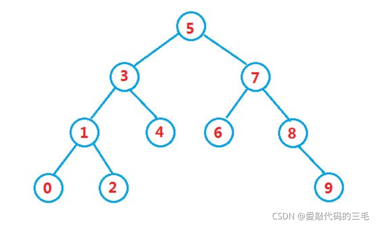
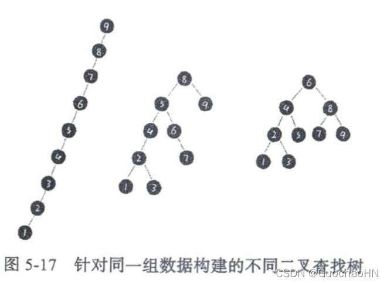
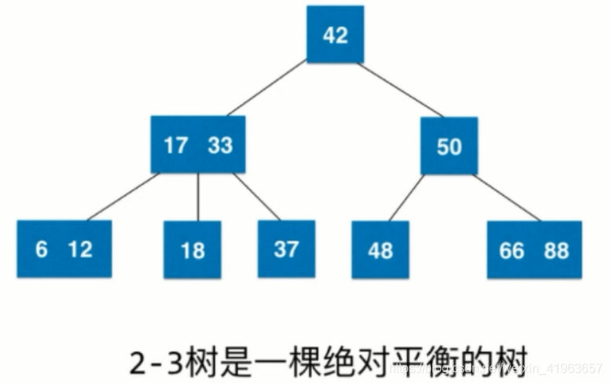
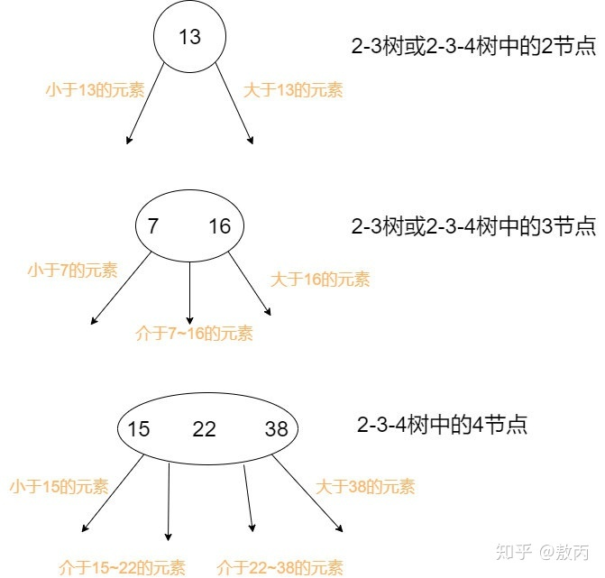
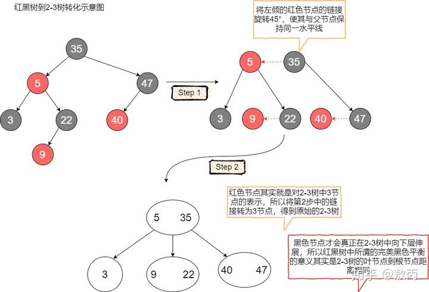
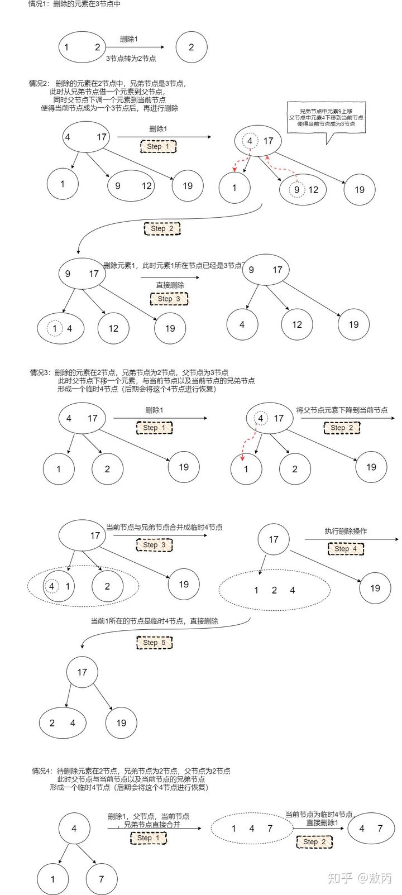

#### 应试
1. 审题
   - 注意题目给的数据范围，是否有特殊情况会如0，1会导致栈或堆溢出
   - 编程题答案不分组，用例少直接ifelse输出结果
   - 直接输出结果，比如贪心选最大值，不会的时候可以骗分数
   - 各种题型可能出现的场景
     - 数组：二分法，双指针
     - 链表：双指针
     - 字符串：双指针
     - 二分法：有序数组，无重复元素或者有重复时下标不唯一
     - 双指针：数组，链表，字符串
     - 哈希：uset用于判断判断一个元素是否出现集合里，或者一个元素是否出现过，或者取非重复的元素。umap用于映射
     - 栈：先进后出，用于对称匹配的场景
     - 队列：先进先出
     - 堆：取最大或者最小元素
     - 二叉树：递归或迭代，二叉搜索树中序遍历有序
     - 回溯：树形递归，递归纵向，for横向。当有递增层次的非常多的嵌套for循环时就可以考虑用回溯法。切割，子集，排列，棋盘。
     - 贪心：由局部最优达到全局最优，将问题分解为若干个子问题，没有状态转换。
     - 动态规划：重叠子问题，但是有状态转换。dp五要素。背包问题。
     - 单调栈：一般是一维数组，要寻找任一元素的右边或者左边第一个比自己大或者小的元素
2. string
   - 插入s.insert(s.begin() + i + 1, '.');
   - 删除s.erase(i + 1);
   - 数组内每个值为char类型。可以和char*类型相加，但不能和单独一个char相加
   - tolower(ch), toupper(ch)
      `char ch = toupper('a');`
   - 整数转string：to_string(n)
   - string转整数：stoi(str)
   - 取字符串str.substr(0, 8),起始位置下标为0，取8位
   - 通过数组映射字母hash[str[i] - 'a'];
   - string str;str内字母也可以按ASCII码排序。sort(str.begin(), str.end()); 
   - while(getline(ss, str, ' ')) 分割时如果有多个' '也会输入到str内，但是注意输入' '的string是为空的，即!empty()为true，可以通过这个来判断string内为空格的情况
   - swap(s[0], s[1]);交换字符串或者数组内元素
   - 扩容：s.resize(s.size() + count * 2);
   - 替换：return s.replace(" ","%20");
   - 采用streamstring流来做，默认streamstring流使用空格分隔，不需要使用getline(ss, s, " ")
   - 需要固定规律一段一段去处理字符串的时候，要想想在在for循环的表达式上做做文章
      `for(int i = 0; i < s.size(); i += 2 * k)`
3. map，set，unordered_map,unordered_set
   - 默认排序key由小到大
   - 利用vector赋值unordered_set<int> nums_set(nums1.begin(), nums1.end());
   - set插入数据：uset.insert(num)，前提 if(uset.count(ch) == 0)
   - map遍历for(auto it = mp.begin(); it != mp.end(); ++it) {}
   - map迭代器数据访问： cout << it->first << " " << it->second << endl;
   - 映射
      ```
      unordered_map<int, int> umap; // key:下标元素，value：下标
      for (int i = 0; i < nums1.size(); i++) {
         umap[nums1[i]] = i;
      }
      ```
   - set常用于查看某元素是否在某个集合或数组中      
   - 查看映射中是否存在对应value
      `umap.count(key) > 0`
   - 查看集合中是否存在对应value
      `uset.find(2) != uset.end()`
      `uset.count(value) > 0` 
   - map中元素向vector中转换
      ```
      vector<pair<int, int>> vec;
      pair<int, int> pr(1, 2);
      cout << pr.first << " " << pr.second << endl;
      vec.push_back(pr);
      vec.push_back({2, 4});
      map<int, int> mp;
      mp[3] = 4;
      mp[5] = 6;
      for(auto it = mp.begin(); it != mp.end(); ++it) {
         cout << it->first << endl;
         vec.push_back(*it);
      }
      for(auto it = vec.begin(); it != vec.end(); ++it) {
         cout << it->first << endl;
      }          
      ```
4. vector
   - 数组头部加入元素：`heights.insert(heights.begin(), 0);` 
   - 使用迭代遍历的方式是!=vec.end();  
   - 利用set给vector赋值`vector<int>(result_set.begin(), result_set.end());` 
   - 回溯中用于删除末端元素：pop_back()
   - 清空vector数组，使其中元素都失效：vec.clear()
   - vector数组末尾的元素，vec.back()
   - vector插入数据（需要扩容时效率非常低！）：vec.insert(vec.begin() + position, people[i]);
5. list
   - 适用于频繁插入数据的情况，可以先在list内插入数据，再将数据一次性复制给vector，避免了vector频繁插入的开销
      `vector<vector<int>> vec(list1.begin(), list2.begin());`
   - 插入数据
      `list1.insert(it, people[i]);`
6. priority_queue
   - 需要自定义仿函数比较时的定义：`priority_queue<pair<int, int>, vector<pair<int, int>>, cmp> pri_que;`
   - pop(), top()
7. 自定义排序
   - sort()
     - sort()函数是类似于快速排序的方法，时间复杂度为**nlog2(n)**，执行效率较高
     - sort()并非只是普通的快速排序，除了对普通的快速排序进行优化，它还结合了**插入排序和堆排序**。当数据量较大时采用快速排序，分段递归。一旦分段后的数据量小于某个阀值，为避免递归调用带来过大的额外负荷，便会改用插入排序。而如果递归层次过深，有出现最坏情况的倾向，还会改用堆排序。
     - sort(begin, end, cmp)
     - 默认由小到大，由大到小：greater<int>()
     - 自定义比较函数
       - 函数形式
       - sort()中的比较函数compare要声明为**静态成员函数或全局函数**,不能作为普通成员函数,否则会报错
         调用：sort(a.begin(), a.end(), cmp)**注意没有()**
         ```
         bool cmp(int &a, int &b) {
            return a > b;
         }
         ```
       - 类内操作符重载operator()
         调用：sort(a.begin(), a.end(), compare())**注意有()**
         ```
         struct compare {
            bool operator()(const int &a, const int &b) const{
               return a > b;
            } 
         };         
         ```
   - map,set
     - 注意map，set**不能用sort排序**，因为底层是红黑树，修改key会严重破坏红黑树结构
     - 默认由小到大，由大到小：greater<int>()，set<int, greater<int>> s;
     - 自定义比较函数(仿函数（类）)
         调用：set<int, cmp> st; **注意没有()**
         ```
         struct cmp {
            bool operator()(const int a, const int b) const{ //注意几个const位置，不能省略！
               return a > b;//由大到小
            } 
         }
         ```
   - priority_queue
     - 初始化priority_queue<int, vector<int>, compare> pq (vec.begin(), vec.end());
     - 不支持迭代器遍历：cout << pq.top() << endl;
     - 设置优先级
       - **priority_queue<int, vector<int>, less<int>>pq;**
            大顶堆：less< int > 表示数字大的优先级大，堆顶为最大的数字
            小顶堆：greater< int >表示数字小的优先级大，堆顶为最小的数字
       - 自定义排序
            **大顶堆: < 小于号**
            **小顶堆: > 大于号**
            ```
            struct cmp1
            {
                 bool operator()(int x,int y)
                 {
                      return x>y;//小的优先级高 ,从小到大排 
                 }
            }; 
            priority_queue<int,vector<int>,cmp1>pq1;
            ```
     - **sort的排序规则和优先队列的排序规则是相反的**
8. stack,queue.deque
   - stack:top(),pop(),push(),empty()
   - queue:front(),pop(),push(),empty()
   - deque:pop_front(), push_back()
9. 二进制相关
    - bitset<32> bt(n);
10. 二叉树
    - 二叉搜索树BST
    - 平衡二叉搜索树AVL
    - 数组表示树
      层次遍历，i：根节点，2i + 1左节点，2i + 2右节点
    - 调用某个节点时要考虑需要不需要判断是否为空
    - 递归时涉及的判断为空的情况：左节点是否为空，右节点是否为空，左右节点都为空，左右节点都不为空
    - 涉及构造树时，递归函数返回的都是节点指针TreeNode*
11. 动态规划
   找规律，有一大段描述的可能就可以使用dp
12. 找规律题型
   背后有数学规律，如奇偶，写出多次结果就可以看出规律。
   杨辉三角
13. 杂
    - 对于成对的数据可以用pair<int, int>（在<utility>内）导入，或者定义struct来导入
    - 大数据范围定义：uint64_t 
    - 进制转换：str[i] >= '0' && str[i] <= '9'
    - % 取余， / 整除
    - 质数因子小于等于根号n，1不是质数
    - 一个数的约数必然小于等于 n / 2，可以用来优化穷举
    - int(a)强制转换
    - 迭代器循环 for(auto it = mp.begin(); it != mp.end(); ++it) {}
    - 取反reverse(str.begin(), str.end())
    - 循环内按间隔取值for(int i = 0; i < n; i+=8) {}
    - 数学库“math.h”， “cmath”
      double log (double); 　　　　 以e为底的对数
      double log10 (double);　　　　以10为底的对数
      double pow(double x,double y);计算x的y次幂
      double exp (double);　　　　　求取自然数e的幂
      double sqrt (double);　　　　 开平方
      int 　 abs(int i); 　　　　　 求整型的绝对值
      double fabs (double);　　　　 求实型的绝对值
    - 迭代器支持
      
    - switch用法
      ```
      switch(str[0]) {
         case:'A'
            ...
            break;
         default:
            ...
            break;
      }
      ```
    - 按规格输出答案后，记得补一个cout << endl;
    - 对于三角形数组的情况，可以创建一个二维数组，寻找数字递增的方向，再进行赋值
      ```
      1 3 6 10 15
      2 5 9 14
      4 8 13
      7 12
      11
      for(int i = 0; i < n; i++) {
         for(int j = 0; j <= i; j++) {// i为行列坐标和，一次斜线内不变
            nums[i - j][j] = num++;
         }
      }
      ```
    - 取一个整数每一位的值
      ```
      while (n) {
         sum += (n % 10) * (n % 10);
         n /= 10;
         }
      ```
    - 在一个循环内从前遍历数组，从后遍历数组
      `for(int i = 0, j = vec.size() - 1; i < vec.size(), j >= 0; ++i， --j)`
    - 交换值/指针
      swap(a, b)
### ACM模式
#### C++输入输出
1. cin >>
   - 以空格、tab或换行作为分隔符。但是会保留最后一个换行在缓冲区中。同时也不会读取最后一个空格。
        cin>>a>>b>>c;
   - 也可以接受一个字符串，遇 tab/space/enter 结束
   - int a; cin >> a; 输入字符'1'，a结果也为int类型1
2. getline()
   - 用来处理字符串的，输入的必须是字符串。可用于按照特定间隔符分割字符串 
   - 可以读入' '，遇到'\n'停止读取；且读取完成后会丢弃末尾的换行符，所以getline()默认在处理单行数据时是不以空格为分割的，会全部输入
   - 在标准输入中连续使用cin>>, getline()时要用getchar()清除前一个cin>>留下的换行。注意如果缓冲区中h还有空格也会被读取出来(但是如果用了stringstream流就不需要写getchar())   
   - cin.getline()属于istream流，而getline()属于string流，所以需包含“#include<string>”，是不一样的两个函数
3. getchar()
   - 用来读取换行符
#### C语言输出语句
1. printf()
   - %d, %ld:int, long long
      `printf("%d\n", a);`
   - %f, %lf:float, double
   - %s, 字符串
   - %c, 字符
#### 注意要点
1. 定义输入变量时一定要先初始化，否则会有随机值
2. 对于一些单次输入，要求输出的结果在循环外初始化，但必须要记得在循环内每次都要清空。
3. 每次循环内要清空标记数组，如map，set， vector， string，cin，stringstream
      - cin.sync();
      - str.clear();
      - ss.clear();
4. 看清楚结果的输出格式，例如循环输出了cout << str << ' ';，但要记得最后还要补加一个**cout << endl**;来区分不同的结果
5. 在处理单组多个字符串时，如果是以空格为分割，用cin结合getchar()就可以了，但如果以其他符号分割，就必须用getline()结合stringstream
6. 审题时一定要注意数据范围，否则结果溢出即使思路对答案也是错误的！
      ```
      int                        [-2^31,2^31-1] ~ 2 * 10 ^ 9
      unsigned                   [0,2^32-1]
      long long                  [-2^63,2^63-1]
      unsigned long long         [0,2^64-1]
      char                       [-128,127]
      double        [-2^1024,2^1023] 即 [-1.7E+308,1.7E+308] 精度为16位左右
      long double   [-1.2e4932,1.2e4932] 精度不低于 double
      ```
7. 一些头文件
   - #include<bits/stdc++.h>：所有c++标准库的头文件
   - #include <iostream>：cin，cout
   - #include <sstream>：stringstream输入输出流
   - #include <algorithm>：一些算法，如sort()
   - #include <string>:字符串string
#### 针对特定输入数据的处理模板
1. 输入数据有多组, 每行表示一组输入数据，没有指明每行有几个数据
   0 1 2 3 4 
   5 6 7 
   ```
   #include <iostream>
   using namespace std;

   int main() {
      int ele = 0;
      while(cin >> ele) {
         cin.sync();
         int sum = ele;
         while(getchar() != '\n') {
               cin >> ele;
               sum += ele;
         }
         cout << sum << endl;
      }
   }
   ```
2. 输入数据有多组，第一行表述数据组数，接下来每行第一个整数表示数据数目，其余表示数据
   3
   3 1 2 3
   2 1 2 
   3 1 3 4
   ```
   #include <iostream>
   using namespace std;

   int main() {
      int t = 0;
      cin >> t;
      int n = 0;
      while(cin >> n) {
         cin.sync();
         int sum = 0, tmp = 0;
         for(int i = 0; i < n; i++) {
               cin >> tmp;
               sum += tmp;
         }
         cout << sum << endl;
      }
   }
   ```

3. 输入数据有多组， 输入的为字符串，以空格为分隔，每行为一组数据
   abc efg hijk
   opq rstu vwxyz
   ```
   #include <iostream>
   #include <algorithm>
   #include <vector>
   #include <string>
   using namespace std;

   int main() {
      vector<string> strs;
      string str;
      while(cin >> str) {
         cin.sync();
         strs.clear();
         strs.push_back(str);
         while(getchar() != '\n') {
               cin >> str;
               strs.push_back(str);
         }
         sort(strs.begin(), strs.end());
         for(auto& str : strs) {
               cout << str << ' ';
         }
         cout << endl;
      }
   }
   ```

4. 输入数据有多组， 输入的为字符串，以','为分隔，**每行为一组数据(包括空格)**
   abcdem,qwe,asd
   eqw,sdf,sf
   qwe,sdg,wseft
   ```
   #include <iostream>
   #include <sstream>
   #include <algorithm>
   #include <vector>
   #include <string>
   using namespace std;

   int main() {
      vector<string> strs;
      string str;
      while(getline(cin, str)) {
         strs.clear();
         stringstream ss(str);
         while(getline(ss, str, ',')) {
               strs.push_back(str);
         }
         sort(strs.begin(), strs.end());
         for(int i = 0; i < strs.size() - 1; i++) {
               cout << strs[i] << ',';
         }
         cout << strs[strs.size() - 1] << endl;
      }
      
   }
   ```
5. 数据范围： 0 < a,b < 2 x 10 ^ 10
   ```
   #include <iostream>
   using namespace std;

   int main() {
      long long a = 0, b = 0;
      while(cin >> a >> b) {
         cout << a + b << endl;
      }
   }
   ```

###  重要的常见算法
#### 十大排序算法
1. 算法的稳定性
   - 含义
     - 稳定性是指，在需要进行排序操作的数据中，如果存在值相等的元素，在排序前后，相等元素之间的排列顺序不发生改变。
     - 具体看实现，能够保证稳定性的算法不一定是稳定的，比较的时候运算符使用的是 " < " 还是 ” <= “，这就会对 实现的排序算法稳定性产生影响
   - 意义
     - 对于简单的元素如数字，稳定性没有什么意义
     - 但是当每个对象可能具有多个数字属性且每个数字属性的排序都是有意义的。所以在排序时，我们需要关注每个数字属性的排序是否会对其他属性进行干扰。如果确保了稳定性，就可以避免在一个属性相同时，还需要再对其他属性进行排序一次。
   - 稳定的排序：冒泡排序，插入排序，归并排序，基数排序，计数排序，桶排序
   - 不稳定的排序：堆排序，快速排序，希尔排序，选择排序
2. 各种排序的适用场景与改进
   
   - 总结
      - sort()并非只是普通的快速排序，除了对普通的快速排序进行优化，它还结合了**插入排序和堆排序**。当数据量较大时采用快速排序，分段递归。一旦分段后的数据量小于某个阀值，为避免递归调用带来过大的额外负荷，便会改用插入排序。而如果递归层次过深，有出现最坏情况的倾向（选取基准值就是最大或最小值），还会改用堆排序。
      - 当n比较小时，可采用直接插入排序和直接选择排序。
           当记录规模较小时，考虑直接插入排序较好；否则因为直接选择移动的记录数少于直接插入，应选直接选择排序为宜
      - 若文件初始状态基本有序(指正序)，则应选用直接插入排序、冒泡排序或随机的快速排序为宜
      - 若n较大，则应采用时间复杂度为O(nlgn)的排序方法：快速排序、堆排序或归并排序
         (1)快速排序是目前基于比较的内部排序中被认为是最好的方法，当待排序的关键字是随机分布时，快速排序的平均时间最短；
         (2)堆排序所需的辅助空间少于快速排序，并且不会出现快速排序可能出现的最坏情况。这两种排序都是不稳定的。
         (3)若要求排序稳定，则可选用归并排序。但前面介绍的从单个记录起进行两两归并的排序算法并不值得提倡，通常可以将它和直接插入排序结合在一起使用。先利用直接插入排序求得较长的有序子序列，然后再两两归并之。因为直接插入排序是稳定 的，所以改进后的归并排序仍是稳定的。
      - 希尔排序是对直接插入排序的一种优化，可以用于大型的数组，希尔排序比插入排序和选择排序要快的多，并且数组越大，优势越大。
      - 处理大数据，适合用堆排序，在数据量特别大的时候效果明显
   - 冒泡排序
      O(n^2),O(1),稳定
      应用场景：优化后的冒泡排序可用于当数据已经基本有序，且数据量较小时。
      优化措施：设置一个标志，每轮比较时，如果发现没有进行交换操作，说明数组已经有序，退出循环，停止比较。
   - 插入排序
      O(n^2),O(1),稳定
      应用场景：若数组基本有序且数据规模较小时，选用插入排序较好.
      优化措施：由于每次插入是向已排序数组中插入，可使用二分查找查找到相应位置进行插入.
   - 希尔排序
      O(nlogn) ~ O(n^2),O(1),不稳定
      应用场景：数据量较小且基本有序时
      **注意以上三种排序，最好情况即已经是有序数组的情况下时间复杂度为O(1)**
   - 选择排序
      O(n^2),O(1),不稳定
      应用场景：当数据规模较小时，选择排序性能较好
   - 归并排序
      O(nlogn),O(n),稳定
      应用场景：数据量较大且要求排序稳定时
      优化措施：由于使用递归，递归深度太深容易造成内存溢出，所以可使用非递归版本归并排序
   - 快速排序
      O(nlogn),O(1),不稳定
      应用场景：快速排序适合处理大量数据排序时的场景
      优化措施：如果原数组有序，导致每次选取基准元素时都选到了最小或最大的元素，会导致快排时间复杂度很高，所以可以随机选取基准元素，能有效的提高排序的平均性能，防止时间复杂度达到O(n2)
   - 堆排序
      O(nlogn),O(1),不稳定
      应用场景：堆排序适合处理数据量大的情况，数据呈流式输入时用堆排序也很方便
      优化措施：建立堆的时候不需要对叶子结点进行维护堆性质操作，因此只需要对n/2个数进行维护堆操作
   - 计数排序
      Ο(n+k)或者**O(n)**（其中k是整数的范围）,O(k),稳定
      应用场景：
         适用于：在数据范围不⼤的场景中，避免占用空间过大。
         不适用于：1.当数列最大最小值差距过大时 2.当数列元素不是整数
   - 桶排序
      Ο(n+k)或者**O(n)**（其中k是整数的范围）,O(k),稳定 
      应用场景：
      适用于：在数据范围不⼤的场景中避免，占用空间过大。以及满足数据服用均匀分布的条件
      不适用于：1.当数列最大最小值差距过大时 2.当数列元素不是整数 3. 不是均匀分布，退化到O(n^2)
   - 基数排序
      Ο(n+k)或者**O(n)**（其中k是整数的范围）,O(k),稳定
      应用场景：同计数排序
      **注意以上三种均为线性非比较排序方法**
3. 原地排序
   原地排序（Sorted in place）。原地排序算法，就是特指空间复杂度是 O(1) ,的排序算法；因为只需要定义变量来交互值，所以为O(1)。
4. 冒泡排序
   - 思路
     - 比较相邻的元素。如果第一个比第二个大，就交换他们两个。
     - 对每一对相邻元素作同样的工作，从开始第一对到结尾的最后一对。这步做完后，最后的元素会是最大的数。
     - 针对所有的元素重复以上的步骤，除了最后一个。
     - 持续每次对越来越少的元素重复上面的步骤，直到没有任何一对数字需要比较
   - 代码
      ```
      void bubbleSort(vector<int> &vec) {
         int n = vec.size() - 1;
         bool order = false;
         for(int i = 0; i <= n && !order; ++i) {
            order = true;
            for(int j = 0; j < n - i; ++j) {
                  if(vec[j] > vec[j + 1]) {
                     order = false;
                     swap(vec[j], vec[j + 1]);
                  }
            }
         }
      }
      ```
5. 插入排序
   - 思路
      - 分为已排序和未排序 初始已排序区间只有⼀个元素 就是数组第⼀个 遍历未排序的每⼀个元素在已排序区间⾥找到合适的位置插⼊并保证数据⼀直有序。
      - i之前为已排序，i之后包括i本身为未排序。数组默认第一位已排序。
   - 代码
      ```
      void InsertSort(vector<int> &vec) {
         int n = vec.size() - 1;
         for(int i = 1; i <= n; i++) {
            int temp = vec[i];
            for(int j = i; j > 0 && temp < vec[j - 1]; --j) {
                  vec[j] = vec[j - 1];
                  vec[j - 1] = temp;
            }
         }
      }
      ```
   - 插入排序比冒泡排序好在哪里？
      逆序度相同的情况下，冒泡排序的需要三次赋值，而插入排序只需要一次赋值，效率更高 
6. 希尔排序
   - 思路
      是对插入排序的改进。
      通过将⽐较的全部元素分为⼏个区域来提升插⼊排序的性能。这样可以让⼀个元素可以⼀次性地朝最终位置前进⼀⼤步。然后算法再取越来越⼩的步⻓进⾏排序，算法的最后⼀步就是普通的插⼊排序，但是到了这步，需排序的数据⼏乎是已排好的
   - 代码
      ```
      void shellSort(vector<int> &vec) {
         int n = vec.size() - 1;
         for(int gap = n / 2; gap > 0; gap /= 2) {
            for(int i = gap; i <= n; i++) {
                  for(int j = i; j >= gap &&  vec[j] < vec[j - gap]; j-=gap) {
                     swap(vec[j - gap], vec[j]);
                  }
            }
         }
      }
      ```     
7. 选择排序
   - 思路
      - 在未排序序列中找到最小（大）元素，存放到排序序列的末尾
      - 从剩余未排序元素中继续寻找最小（大）元素，然后放到已排序序列的末尾
      - 以此类推，直到所有元素均排序完毕
   - 代码
      ```
      void selectionSort(vector<int> &vec) {
         int n = vec.size() - 1;
         int min;
         for(int i = 0; i < n; ++i) {
            min = i;
            for(int j = i + 1; j <= n; ++j) {
                  if(vec[min] > vec[j]) {
                     min = j;
                  }
            }
            swap(vec[min], vec[i]);
         }
      }
      ```
8. **归并排序**
   - 思路
      归并算法的核心思想是分治法，就是将一个数组一刀切两半，递归切，直到切成单个元素，然后重新组装合并，单个元素合并成小数组，两个小数组合并成大数组，直到最终合并完成，排序完毕。
   - 归并排序的时间复杂度与空间复杂度
     - 空间复杂度：每次递归需要用到的临时复杂度O(n)
     - 时间复杂度：
         归并排序总时间=分解时间+子序列排序时间+合并时间
         分解时间直接折中分解，时间为O(1)
         T(n) = 2 * T(n/2) + n, T(n)为排序时间， n为比较即合并时间
         T(n/2)=2 * T(n/4) + n/2
         而归并算法相当于一个二叉树，递归到最后一层，拥有n个节点的完全二叉树层数为(log2n)+1
         而T(1) = 0, 所以T(n)=n * T(1) + (log2n) * n = nlog2n
   - 代码
      ```
      void merge(int *arr, int n) {
         int temp[n];//n为数组长度
         int i = 0;
         int mid = n / 2;
         int left = 0, right = mid;
         while(left < mid && right < n) { //没有'='
            if(arr[left] < arr[right]) {
                  temp[i++] = arr[left++];
            }else {
                  temp[i++] = arr[right++];
            }
         }
         while(left < mid) {
            temp[i++] = arr[left++];
         }
         while(right < n) {
            temp[i++] = arr[right++];
         }
         for(int i = 0; i < n; i++) {
            arr[i] = temp[i];
         }
      }

      void mergeSort(int *arr, int n) {
         if(n <= 1) return;
         else {
            mergeSort(arr, n / 2);//分
            mergeSort(arr + n / 2, n - n / 2);
            merge(arr, n);//治
         }
      }
      ```
9.  **快速排序**
    - 思路
      快速排序的核心思想也是分治法。其实快速排序的本质就是把基准数大的都放在基准数的右边,把比基准数小的放在基准数的左边,这样就找到了该数据在数组中的正确位置.以后采用递归的方式分别对前半部分和后半部分排序，当前半部分和后半部分均有序时该数组就自然有序了。当左右两部分都有序时，整个数据就完成了排序。
    - 复杂度分析
      分治+比较，时间复杂度也为nlogn,最坏情况是已排序数组O(n^2),最好提前打乱或者随机选取基准值
      空间复杂度为O(1)
    - 代码
      ```
      void quickSort(vector<int> &vec, int left, int right) {
         if(left >= right) return;
         int first = left;
         int last = right;
         int key = vec[first];
         while(first < last) { //不能有'='，不然多出一次循环
            while(first < last && vec[last] >= key) last--;
            if(first < last) vec[first++] = vec[last];//不能省略判断，否找对已排序
                                                       //的数组排序时，出错
            while(first < last && vec[first] <= key) first++;
            if(first < last) vec[last--] = vec[first];
         }
         vec[first] = key;
         quickSort(vec, left, first - 1);
         quickSort(vec, first + 1, right);
      }
      ```
10. **堆排序**
    - 思路
      利用大顶堆进行排序。大顶堆每个节点的值都大于或等于其子节点的值。每次取堆顶的值，取完后再重写构造堆，这样最后取出来的数就是有序的数据
      堆排序父i：子2i + 1和2i + 2，子i：父：i / 2 - 1
    - 复杂度
      时间：O(nlogn)，空间O(1).原地排序，不稳定。数据的交换次数要多于快排。
    - 代码
      ```
      void heapify(int *arr, int start, int end) {
         int father = start;
         int son = father * 2 + 1;
         while(son <= end) {
            if(son + 1<= end && arr[son] < arr[son + 1]) {
                  son++;
            }
            if(arr[father] > arr[son]) return; //如果父节点值大于子节点值，因为是由底到顶构造的，
            else {                             //那么父节点就大于所有子节点
                  swap(arr[father], arr[son]);//否则需要再循环查找子树
                  father = son;
                  son = father * 2 + 1;
            }
         }
      }

      void heapSort(int *arr, int n) {
         for(int i = n / 2 - 1; i >= 0; i--) { //由底到顶初始化子树
            heapify(arr, i, n - 1);
         }
         for(int i = n - 1; i > 0; i--) {//由顶到底取最大值
            swap(arr[0], arr[i]);
            heapify(arr, 0, i - 1);
         }
      }
      ```
11. 计数排序
    - 思路
      遍历无序数组找到最大值和最小值，确定计数范围。再建立一个对应大小的空数组，数组中的每一个值代表了数列中对于整数的出现次数。再次遍历无序数组填入出现次数。最后就直接遍历这个新建数组，按照记录的次数输出几次数组元素的下标。这样得到的就是有序的结果。
    - 复杂度
      时间：Ο(n+k)或者**O(n)**（其中k是整数的范围），空间：O(k), 稳定
    - 适用场景
         适用于：在数据范围不⼤的场景中。非正整数可以通过偏移量转化为非负整数
         不适用于：1.当数列最大最小值差距过大时 2.当数列元素不是整数
    - 代码
      ```
      void countSort(vector<int> &vec) {
         int n = vec.size();
         if(n == 0) return;
         int mx = vec[0], mn = vec[0];
         vector<int> tmp(vec);
         for(int i = 0; i < n; ++i) {
            mx = max(mx, tmp[i]);
            mn = min(mn, tmp[i]);
         }
         int k = mx - mn + 1;
         int count[k]  = {0};
         for(int i = 0; i < n; ++i) {
            ++count[tmp[i] - mn];
         }
         for(int i = 1; i < k; ++i) {
            count[i] += count[i - 1];
         }
         for(int i = n - 1; i >= 0; --i) {
            vec[--count[tmp[i] - mn]] = tmp[i];//从后往前填数字     
                                             //--count或者count--都可以都是先减再取值
                                                //因为count记录的是比自己小包括自己的数字的数目  
         }
      }
12. 桶排序
    - 思路
      将数组分到有限数量的桶⾥。每个桶再个别排序（有可能再使⽤别的排序算法或是以递归⽅式继续使⽤桶排序进⾏排序）
    - 复杂度
      时间：O(n), 空间：O(n)
    - 代码
      ```
      void bucketSort(vector<int> &vec) {
         int n = vec.size();
         if(n == 0) return;
         int mx = vec[0], mn = vec[0];
         for(int i = 0; i < n; i++) {
            mx = max(mx, vec[i]);
            mn = min(mn, vec[i]);
         } 
         int k = mx - mn + 1;
         vector<int> buckets(k, 0);
         for(int i = 0; i < n; i++) {
            ++buckets[vec[i] - mn];
         }
         int num = 0;
         for(int i = 0; i < k; i++) {
            for(int j = 0; j < buckets[i]; j++) {
                  vec[num++] = i + mn;
            }
         }
      }
      ```
13. 基数排序
    - 思路
      从低位到高位依次排序，这样排序完后就是有序数组。（举例写）相当于多次桶排序
    - 复杂度
      时间：O(n * k), 空间：O(n + k)
      空间占用率很高所以有一定的缺陷，所以使用链式结构会比较好
    - 代码
      ```
      void radixSort(vector<int> &vec) {
         int n = vec.size();
         int mx = vec[0];
         for(int i = 0; i < n; i++) {
            mx = max(mx, vec[i]);
         }
         int bit = 0;
         while(mx) {
            mx /= 10;
            ++bit;
         }
         int div = 1;
         for(int i = 0; i < bit; i++) {
            int count[10] = {0};
            vector<int> tmp(n, 0);
            for(int i = 0; i < n; i++) {
                  ++count[vec[i] / div % 10];
            }
            for(int i = 0; i < 10; i++) {
                  count[i] += count[i - 1];
            }
            for(int i = n - 1; i >= 0; i--) {
                  tmp[--count[vec[i] / div % 10 - 0]] = vec[i];//这里相当于数组内最小值为0，所以不能排序负数值
                                                            //如果要排序，则需要对数组整体加上一个偏移量，使得数组都为f非负整数，
                                                            //排序完成后再整体减去这个偏移量
            }
            div *= 10;
            vec = tmp;
         }
      }
      ```
#### 进制转换算法
1. n进制转10进制
   ```
   int ntoi(string &str, int radix) {
      int ans = 0;
      for(int i = 0; i < str.size(); ++i) {
         char ch = str[i];
         if(ch >= '0' && ch <= '9') {
               ans = ans * radix + ch - '0'; 
         }else {
               ans = ans * radix + ch - 'a' + 10;
         }
      }
      return ans;
   }
   ```
2. 10进制转n进制
   ```
   string iton(int n, int radix) {
      string ans;
      do {
         int t = n % radix;
         if(t >= 0 && t <= 9) {
               ans += t + '0';
         }else {
               ans += t - 10 + 'a';
         }
         n /= radix;
      }while(n != 0);//一开始n==0的情况也要计算,还有要记得加';'
      reverse(ans.begin(), ans.end());
      return ans;
   }
   ```
   ```
    string radix2 = "11001";
    string radix8 = "0144";    //0开头8进制
    string radix16 = "0x541";  //0x开头10进制
    string tmp = radix8.substr(1, radix16.size() - 1);    
    // string tmp = radix16.substr(2, radix16.size() - 2);
    int i = ntoi(tmp, 8);

    int n = 1345;
    cout << iton(n, 2) << endl;
    cout << "0x" + iton(n, 16) << endl
   ```
3. n进制转m进制
   先将n进制转到10进制，再将10进制转到n进制
#### 补充算法
1. LRU算法
- 思路
   - LRU算法是最近最少使用缓存算法
   - 使用哈希表+双向链表的方式实现
     - 双向链表按照被使用的顺序存储了这些键值对，靠近头部的键值对是最近使用的，而靠近尾部的键值对是最久未使用的
     - 哈希表即为普通的哈希映射（HashMap），通过缓存数据的键映射到其在双向链表中的位置
     - 双向链表的实现中，使用一个伪头部（dummy head）和伪尾部（dummy tail）标记界限，这样在添加节点和删除节点的时候就不需要检查相邻的节点是否存在
   - O(1)时间的get和put操作
     - 访问哈希表的时间复杂度为 O(1)，在双向链表的头部添加节点、在双向链表的尾部删除节点的复杂度也为O(1)
     - get后将一个节点移到双向链表的头部，可以分成「删除该节点」和「在双向链表的头部添加节点」两步操作，都可以在 O(1)O(1) 时间内完成
- 代码
   ```
   struct DLinkedNode {
      int key, value;
      DLinkedNode *prev;
      DLinkedNode *next;
      DLinkedNode():key(0), value(0), prev(nullptr), next(nullptr){}
      DLinkedNode(int _key, int _value):key(_key), value(_value), prev(nullptr), next(nullptr){}
   };

   class LRUCache {
      private:
         int size;
         int capacity;
         unordered_map<int, DLinkedNode*> cache;//这里的key就是节点中的key值，但value为指向节点的指针
         DLinkedNode *head;
         DLinkedNode *tail;
      
      public:
         LRUCache(int _capacity):capacity(_capacity), size(0){
               head = new DLinkedNode();
               tail = new DLinkedNode();
               head->next = tail;
               tail->prev = head;
         }

         int get(int key) {
               if(!cache.count(key)) {
                  return -1;
               }
               DLinkedNode *node = cache[key];
               moveToHead(node);//获取后移动到前端
               return node->value;
         }

         void put(int key, int value) {
               if(!cache.count(key)) {
                  DLinkedNode *node = new DLinkedNode(key, value);
                  cache[key] = node;
                  node->prev = head;
                  head->next->prev = node;
                  node->next = head->next;
                  head->next = node;//在前端添加新的节点
                  ++size;               
                  if(size > capacity) {
                     DLinkedNode *tmp = removeTail();
                     cache.erase(tmp->key); //在给链表添加或删除以及修改value时也要对cache做修改
                     delete tmp;
                     --size;

                  }            
               }else {
                  DLinkedNode *node = cache[key];
                  node->value = value;
                  moveToHead(node);//修改后移动到前端
               }

         }

         void moveToHead(DLinkedNode *node) {
               node->prev->next = node->next;
               node->next->prev = node->prev;
               
               node->prev = head;
               head->next->prev = node;
               node->next = head->next;
               head->next = node;
         }

         DLinkedNode *removeTail() {
               DLinkedNode *node = tail->prev;
               node->prev->next = node->next;
               node->next->prev = node->prev;
               return node;            
         }

   };
   ```
#### 二叉树知识点
1. 二叉搜索树（二叉排序树，二叉查找树）
   - 定义
      
      若它的左子树不为空，则左子树上所有节点的值都小于根节点的值
      若它的右子树不为空，则右子树上所有节点的值都大于根节点的值
      它的左右子树也分别为二叉搜索树
   - 特征
      二叉搜索树中序遍历的结果是有序增大的
   - 性能
     - 对于同一组数据，我们可以构建各种不同的二叉查找树，因此插入、删除和查找操作的执行效率也不同
     - 在最糟糕情况下，根节点的左右子树极度不平衡，已经退化为了链表，因此，查找的时间复杂度就变成了O(n)。在理想情况下（二叉查找树为满二叉树），查找的时间复杂度为O(logn)。
      
   - 删除
         将删除节点的左孩子放到删除节点的右子树的最左面节点的左孩子上，要删除的节点的右孩子为新的根节点
         同样适用于红黑树和AVL树
2. 为什么哈希表不能替代二叉查找树（哈希表和二叉树的应用场景）
   - 无序与有序
      哈希表中的数据是无序存储的，如果要输出有序数据序列，需要先进行排序，或者配合有序链表来使用。而对于二叉查找树，我们只需要进行中序遍历，就可以在O(n)的时间复杂度内，输出有序数据序列。
   - 稳定性
      哈希表扩容耗时很多，而且当遇到哈希冲突时，性能不稳定。而对于二叉查找树，如果用**平衡二叉树**就非常稳定，时间复杂度稳定在O(logn
   - 性能
      O(logn)的算法并不一定比O(1)的算法运行速度慢。尽管哈希表上操作的时间复杂度是常量级的，但因为哈希冲突的存在，再加上哈希函数的计算耗时，哈希表并不一定就比平衡二叉树效率高
   - 设计要素
      哈希表的构造比二叉查找树复杂，需要考虑的东西很多，如哈希函数的设计、冲突解决方法、扩容和缩容等。平衡二叉树只需要考虑如何维护平衡性
3. 平衡二叉查找树（AVL树）
   - 二叉树中任意一个节点的左右子树的高度相差不能大于1，且满足二叉查找树的特点
   - 用途：解决一般二叉查找树退化为链表，查找复杂度为O(n)的情况，使得整棵树尽量矮胖，最坏情况下也保持O(LogN)的时间复杂度实现查找
4. B树（BalanceTree，平衡多路查找树）
5. 2-3树
   是B树的一种，同时也是一颗绝对平衡的树，节点可以存放一个或两个元素,每个节点有2个或3个孩子
      
6. 2-3-4树
   阶数为4的B树
   二节点（孩子有2个，自己节点有1个元素），三节点，四节点
   
7. 红黑树
   - 红黑树其实就是对概念模型2-3树（或者2-3-4树）的一种实现
      - 2-3-4树
         2节点转化为红黑树中的黑节点，3节点可以表示为左倾红节点或者右倾红节点，4节点必须树平衡，一黑带两红
      - 2-3树(只考虑左倾红黑树)
         - 2节点转化为红黑树中的黑节点，3节点只表示为左倾红节点
         - 只要把左倾红黑树中的红色节点顺时针方向旋转45°使其与黑父平行，然后再将它们看作一个整体，就是一颗2-3树！（因为2-3是绝对平衡的，转一下就变成AVL树）
            
         - 2-3插入原则
              插入2节点，插入后变为3节点
              插入3节点，插入后变为4节点（临时），再分裂
              对应红黑树将插入的节点涂成红色与黑色父节点关联，形成概念模型2-3树中的3节点或者临时4节点
         - 2-3删除原则
              3节点直接删除
              2节点根据父节点和兄弟节点是2节点还是3节点分为3种情况
               
   - 左倾红黑树的好处
      - 左倾红黑树限制了如果在树中出现了红色节点，那么这个节点必须是左儿子。
      - 如果父节点为红色，就不用考虑其右倾兄弟的情况，将插入操作变得简单
   - 红黑树5条定义
      - 节点颜色有红色与黑色
           **2节点转化为红黑树中的黑节点，3节点可以表示为左倾红节点**
      - 根节点必为黑色
          2-3树中如果根节点为2节点，那么它本来就对应红黑树中黑节点；如果根节点为3节点，也可以用黑色节点表示较大的那个元素，然后较小的元素作为左倾红节点存在于红黑树中
      - 所有叶子节点（NIL）都是黑色
      - 任意节点到叶子节点经过的黑色节点数目相同
          红黑树中的红节点是和黑色父节点绑定的，在2-3树中本来就是同一层的，而只有黑色节点才会在2-3树中真正贡献高度，由于2-3树的任一节点到空链接距离相同，因此在红黑树中就是黑色完美平衡
      - 不会有连续的红色节点
          2-3中不会产生连续红节点
   - 红黑树的旋转
      右旋和左旋，以某个节点旋转，相当于先旋转该节点和其左右两个子节点，再分配子节点的节点
   - 红黑树的插入
      - 插入元素比黑父大
         插在了黑父的右边，而黑父左边是红色儿子。这种情况会导致在红黑树中出现右倾红节点。对应着2-3树中出现了临时4节点这个临时4节点分裂，左右元素各自形成一个2节点，中间元素上升到上层跟父节点结合。所以，我们在红黑树中的动作是，将原本红色的左右儿子染黑（左右分裂），将黑父染红（等待上升结合）。
     - 插入元素比红父小，且红父为左倾
         插在红父左边导致连续的红节点，先右旋，再左右互换颜色，再到情况1
     - 插入元素比红父大，且红父为左倾
         插在红父右边，形成右倾，先左旋，再按情况2处理
   - 红黑树的删除
      和一般二叉搜索树一样，当我们要删除某个节点的时候选择它的前驱节点或者后继节点元素来替代它，转而删除它的前驱/后继节点
      **太复杂了不看了**
8. 红黑树和AVL树的区别
   - 调整平衡的实现机制不同
     - 红黑树根据节点颜色(同一父节点出发到叶子节点，所有路径上的黑色节点数目一样)，一些约定和旋转实现；
     - AVL根据树的平衡因子(所有节点的左右子树高度差的绝对值不超过1)和旋转决定
   - 红黑树的插入效率更高
     - 红黑树是用**非严格的平衡**(黑色完全平衡，整体高度差可以大于1)来换取增删节点时候旋转次数的降低，任何不平衡都会在三次旋转之内解决，空间开销比较小，即维护成本低
     - 而AVL是**严格平衡树**，因此在增加或者删除节点的时候需要大量的旋转操作来保持平衡，因此空间开销大，即维护成本高
   - 使用场景不同
     - 若查询的频率远远大于（>）插入和删除，应该选择AVL树
     - 若查询的频率小于等于（<=）插入和删除的频率，应该选择RB树


### 算法性能分析

#### 时间复杂度$T(n)$
1. 时间复杂度
    - 假设算法的问题规模为n，那么操作单元数量便用函数f(n)来表示，随着数据规模n的增大，算法执行时间的增长率和f(n)的增长率相同，这称作为算法的渐近时间复杂度，简称时间复杂度，记为 $O(f(n))$
2. 大O
    - 大O用来表示上界，但业内默认规定大O表示一般情况而非最坏情况。
    - 面试中说道算法的时间复杂度是多少指的都是一般情况。但是如果面试官和我们深入探讨一个算法的实现以及性能的时候，就要时刻想着**数据用例的不一样，时间复杂度也是不同的**，这一点是一定要注意的。
3. 不同数据规模的差异
    - 一般时间复杂度是忽略常数项，是因为一般默认数据规模足够大
    - 算法不是时间复杂度越低的越好，当数据规模很小时且有常数项的情况下$O(n^2)$的算法比$O(n)$的更合适
    - 注意大常数项
    - $O(1)$常数阶 < $O(\log n)$对数阶（忽略底数） < $O(n)$线性阶 < $O(n^2)$平方阶 < $O(n^3)$立方阶 < $O(2^n)$指数阶

#### 算法超时
1. 一般OJ（online judge）的超时时间就是1s
2. 注意
    - CPU执行每条指令所需的时间实际上并不相同
    - 频繁访问相同地址的数据和访问不相邻元素所需的时间也不同
    - 计算机同时运行多个程序，每个程序里还有不同的进程线程在抢占资源

#### 递归算法的时间复杂度
1. 递归算法的时间复杂度 = 递归的次数 * 每次递归中的操作次数
2. 例：求x的n次方：$O(n)$——>$O(n)$——>$O(\log n)$
3. 满二叉树在递归算法中的应用

####  空间复杂度$S(n)$
1. 空间复杂度是考虑程序运行时占用内存的大小，而不是可执行文件的大小\
2. 空间复杂度是预先大体评估程序内存使用的大小,很多因素会影响程序真正内存使用大小，例如编译器的内存对齐，编程语言容器的底层实现等等这些都会影响到程序内存的开销。

#### 递归算法的空间复杂度
1. 递归算法的空间复杂度 = 每次递归的空间复杂度 * 递归深度
2. 递归调用栈最大的长度就是递归的深度
3. 例：二分法递归实现，时间复杂度是$O(\log n)$，空间复杂度为 $1 * logn = O(logn)$。但如果传递函数是拷贝整个数组而非拷贝地址时，空间复杂度为$O(n\log n)$

#### 代码的内存消耗
1. 不同语言的内存管理
   - C/C++这种内存堆空间的申请和释放完全靠自己管理
   - Java 依赖JVM来做内存管理
   - Python内存管理是由私有堆空间管理的，所有的python对象和数据结构都存储在私有堆空间中。程序员没有访问堆的权限，只有解释器才能操作
2. C++的内存管理
   - 栈区(Stack) ：由编译器自动分配释放，存放函数的参数值，局部变量的值等，其操作方式类似于数据结构中的栈
   - 堆区(Heap) ：一般由程序员分配释放，若程序员不释放，程序结束时可能由OS收回
   - 未初始化数据区(Uninitialized Data)： 存放未初始化的全局变量和静态变量
   - 初始化数据区(Initialized Data)：存放已经初始化的全局变量和静态变量
   - 程序代码区(Text)：存放函数体的二进制代码
3. C++数据类型大小
    
4. 内存对齐
    - 跨平台的编程语言(如C++，python，java)都需要
    - 原因
      - 平台原因：不是所有的硬件平台都能访问任意内存地址上的任意数据，某些硬件平台只能在某些地址处取某些特定类型的数据，否则抛出硬件异常。为了同一个程序可以在多平台运行，需要内存对齐
      - 硬件原因：经过内存对齐后，CPU访问内存的速度大大提升
    - 例:int型非内存对齐，读取需要两次寻址，一次合并，浪费内存自由
### 1. 二分法
1. 前提
   - 有序数组
   - 数组内无重复元素，有重复时下标不唯一
2. 循环不变量原则
   - [left,right]
   - [left,rigth)
3. 复杂度
    二分空间复杂度O(1),时间复杂度O(logn)
4. 解题
   - 注意[left,right]原则，while(left <= right),循环结束后left比right大1
   - 防止溢出:int middle = left + ((right-left)/2); 
   - 一些特殊情况，如数组大小为0或者为1时
5. 704二分查找
   - 最一般的二分
   - 题解
      ```
      int search(vector<int>& nums, int target) {
         int left = 0;
         int right = nums.size() - 1; // 定义target在左闭右闭的区间里，[left, right]
         while (left <= right) { // 当left==right，区间[left, right]依然有效，所以用 <=
               int middle = left + ((right - left) / 2);// 防止溢出 等同于(left + right)/2
               if (nums[middle] > target) {
                  right = middle - 1; // target 在左区间，所以[left, middle - 1]
               } else if (nums[middle] < target) {
                  left = middle + 1; // target 在右区间，所以[middle + 1, right]
               } else { // nums[middle] == target
                  return middle; // 数组中找到目标值，直接返回下标
               }
         }
         // 未找到目标值
         return -1;
      }      
      ```
6. 35搜索插入位置
   - 题解
      ```
      int searchInsert(vector<int>& nums, int target) {
         int n = nums.size();
         int left = 0;
         int right = n - 1; // 定义target在左闭右闭的区间里，[left, right]
         while (left <= right) { // 当left==right，区间[left, right]依然有效
               int middle = left + ((right - left) / 2);// 防止溢出 等同于(left + right)/2
               if (nums[middle] > target) {
                  right = middle - 1; // target 在左区间，所以[left, middle - 1]
               } else if (nums[middle] < target) {
                  left = middle + 1; // target 在右区间，所以[middle + 1, right]
               } else { // nums[middle] == target
                  return middle;
               }
         }
         // 分别处理如下四种情况
         // 目标值在数组所有元素之前  [0, -1]
         // 目标值等于数组中某一个元素  return middle;
         // 目标值插入数组中的位置 [left, right]，return  right + 1
         // 目标值在数组所有元素之后的情况 [left, right]， 因为是右闭区间，所以 return right + 1
         return right + 1;
      }      
      ```
7. 34在排序数组中查找元素的第一个和最后一个位置
    - 分别查找左右界，对于查找右界的情况，则左边界在nums[mid] == target的情况下也要右移，这样最后退出循环的右界就是左边界-1。左界同理。
    - 判断在前或者在后的情况：设定初值int rightBorder = -2;两个有一个为-2则说明只移动了左边界或者右边界，即范围内没有该目标值
    - 判断在范围内并且有：(rightBorder - leftBorder)>1，这时两个边界一个在左一个在右 
    - 最后一种情况就是在数组范围内，但没有该值，则左右边界直接相等，返回{-1,  -1}
    - 题解
      ```
      class Solution {
      public:
         vector<int> searchRange(vector<int>& nums, int target) {
            int leftBorder = getLeftBorder(nums, target);
            int rightBorder = getRightBorder(nums, target);
            // 情况一
            if (leftBorder == -2 || rightBorder == -2) return {-1, -1};
            // 情况三
            if (rightBorder - leftBorder > 1) return {leftBorder + 1, rightBorder - 1};
            // 情况二
            return {-1, -1};
         }
      private:
         int getRightBorder(vector<int>& nums, int target) {
            int left = 0;
            int right = nums.size() - 1;
            int rightBorder = -2; // 记录一下rightBorder没有被赋值的情况
            while (left <= right) {
                  int middle = left + ((right - left) / 2);
                  if (nums[middle] > target) {
                     right = middle - 1;
                  } else { // 寻找右边界，nums[middle] == target的时候更新left
                     left = middle + 1;
                     rightBorder = left;
                  }
            }
            return rightBorder;
         }
         int getLeftBorder(vector<int>& nums, int target) {
            int left = 0;
            int right = nums.size() - 1;
            int leftBorder = -2; // 记录一下leftBorder没有被赋值的情况
            while (left <= right) {
                  int middle = left + ((right - left) / 2);
                  if (nums[middle] >= target) { // 寻找左边界，nums[middle] == target的时候更新right
                     right = middle - 1;
                     leftBorder = right;
                  } else {
                     left = middle + 1;
                  }
            }
            return leftBorder;
         }
      };      
      ```     
8. 33搜索旋转排序数组
   按照[left, mid] 或者 [mid, right]查找，并且只查找这两个区间时有序的情况，要么左边有序要么右边有序，一直循环查找
9.  4寻找两个正序数组的中位数
    - 思路
      - 两个数组A,B大小：m,n;寻找中位数下标为(m+n)/2 或 (m+n)/2+1。即寻找第k小的值，k=(m+n)/2 + 1或 (m+n)/2+2，注意k代表的是第几个而不是下标!
      比较A[k/2−1]和B[k/2−1]，对于A[k/2−1]和B[k/2−1] 中的较小值，最多只会有(k/2-1)+(k/2−1)≤k−2 个元素比它小，那么它就不能是第k小的数了
      - 对于两种情况，排除了k/2个不可能是第k+1小的值，继续对剩下的元素二分
         A[k/2−1] <= B[k/2−1],排除A[0]到A[k/2−1]
         A[k/2−1] > B[k/2−1],排除B[0]到B[k/2−1]
      - 特殊情况
         - 越界时，k不能直接减去k/2
               int newIndex1 = min(index1 + k / 2 - 1, m - 1);
         - A或B排除完时，就直接从另一个数组内读取
         - k=1，即返回两个数组首元素的最小值
    - 注意
      偶数情况，要除以2.0而不是2！
11. 69x 的平方根 
    - 二分法，mid值连续逼近
      if(mid < x / mid)防止溢出
    - 牛顿迭代法，如果要保留小数的话就需要用牛顿迭代法O(logn)
      xi+1 = 1/2(xi + C / xi)
      当相邻两次迭代得到的交点非常接近1e-6时break
      fabs:<math.h>
      注意牛顿法定义值必须都定义为double，否则int相除还是为整数导致错误

11. 162寻找峰值
   因为nums[-1] = nums[n] = −∞，所以如果单调递增必有峰值，如果先增后减也必有峰值。如果nums[mid] > nums[mid + 1]则左边必有峰值，right = mid。而nums[mid] < nums[mid + 1]则右边必有峰值，left = mid + 1。当left == right时就是要返回的峰值。
12. 240搜索二维矩阵II
    - 二分法O(mlogn)
      对每行进行二分
    - z字法O(m + n)
      从右上角开始，如果当前值大于target则向左走即col--，如果小于则向下走即row++,直到遇到target


### 2. 链表
1. 链表节点定义
   - 注意next必须赋值为nullptr，否则会指向随机位置，导致循环无法结束
   ```
   struct ListNode {
      int val;
      ListNode* next;
      ListNode(int x) : val(x), next(nullptr) {}
   };
   ```
2. 虚拟头结点
   - 便于统一处理链表中的节点，针对的是**头节点**的情况。如果头节点要特殊处理了，就可以使用虚拟头节点来统一处理。
   - 遍历的时候使用while(cur->next)，这样最后循环退出时cur指向的就是最后一个节点
   ```
   ListNode* dummyNode = new ListNode(0);
   dummyNode->next = head;
   ListNode* cur = dummyHead;
   ```
3. ACM链表创建
   - 注意最后的`cout << endl;`
   ```
   void listInput() {
      // int values[] = {0, 1, 2, 3, 4, 5};
      // int num = sizeof(values) / sizeof(values[0]);
      // cout << num << endl;
      int value = -1;
      while(cin >> value) {
         ListNode *dummyNode = new ListNode(-1);
         ListNode *cur = new ListNode(value);
         dummyNode->next = cur;
         while(getchar() != '\n') {
            cin >> value;
            ListNode *tmp = new ListNode(value);
            cur->next = tmp;
            cur = tmp;
         }
         cur = dummyNode;
         while(cur->next) {        
            cur = cur->next;
            cout << cur->val <<' ';
         }
         cout << endl; //! 换行输出
         while(cur->next) {
            cur = cur->next;
            delete cur;
         }
      }
   }
   
   ```
4. 性能分析
   - 数组
   插入/删除时间复杂度O(n)，查询时间复杂度O(1),适用于数据量固定，查找频繁，较少增删的场景
   - 链表
   插入/删除时间复杂度O(1)，查询时间复杂度O(n),适用于数据量不固定，频繁增删，较少查询的场景
5. 203移除链表元素
   - 使用dummyNode，因为移除头结点和移除其他节点的操作是不一样的，链表的其他节点都是通过前一个节点来移除当前节点，而头结点没有前一个节点。
   - 最后返回实际的首节点 head = dummyHead->next;
   - 题解
      ```
      ListNode* removeElements(ListNode* head, int val) {
         ListNode* dummyHead = new ListNode(0); // 设置一个虚拟头结点
         dummyHead->next = head; // 将虚拟头结点指向head，这样方面后面做删除操作
         ListNode* cur = dummyHead;
         while (cur->next != NULL) {
               if(cur->next->val == val) {
                  ListNode* tmp = cur->next;
                  cur->next = cur->next->next;
                  delete tmp;
               } else {
                  cur = cur->next;
               }
         }
         head = dummyHead->next;
         delete dummyHead;
         return head;
      }      
      ```
6. 707设计链表
   - 注意是在class MyLinkedList再定义一个struct LinkedNode,并且MyLinkedList需要初始化dummyNode和size
   - 题解
      ```
      class MyLinkedList {

      private:
         int _size;
         LinkedNode* _dummyHead;

      }; 

      public:
         // 定义链表节点结构体
         struct LinkedNode {
            int val;
            LinkedNode* next;
            LinkedNode(int val):val(val), next(nullptr){}
         };

         // 初始化链表
         MyLinkedList() {
            _dummyHead = new LinkedNode(0); // 这里定义的头结点 是一个虚拟头结点，而不是真正的链表头结点
            _size = 0;
         }

         // 获取到第index个节点数值，如果index是非法数值直接返回-1， 注意index是从0开始的，第0个节点就是头结点
         int get(int index) {
            if (index > (_size - 1) || index < 0) {
                  return -1;
            }
            LinkedNode* cur = _dummyHead->next;
            while(index--){ // 如果--index 就会陷入死循环
                  cur = cur->next;
            }
            return cur->val;
         }

         // 在链表最前面插入一个节点，插入完成后，新插入的节点为链表的新的头结点
         void addAtHead(int val) {
            LinkedNode* newNode = new LinkedNode(val);
            newNode->next = _dummyHead->next;
            _dummyHead->next = newNode;
            _size++;
         }

         // 在链表最后面添加一个节点
         void addAtTail(int val) {
            LinkedNode* newNode = new LinkedNode(val);
            LinkedNode* cur = _dummyHead;
            while(cur->next != nullptr){
                  cur = cur->next;
            }
            cur->next = newNode;
            _size++;
         }

         // 在第index个节点之前插入一个新节点，例如index为0，那么新插入的节点为链表的新头节点。
         // 如果index 等于链表的长度，则说明是新插入的节点为链表的尾结点
         // 如果index大于链表的长度，则返回空
         // 如果index小于0，则置为0，作为链表的新头节点。
         void addAtIndex(int index, int val) {
            if (index > _size || index < 0) {
                  return;
            }
            LinkedNode* newNode = new LinkedNode(val);
            LinkedNode* cur = _dummyHead;
            while(index--) {
                  cur = cur->next;
            }
            newNode->next = cur->next;
            cur->next = newNode;
            _size++;
         }

         // 删除第index个节点，如果index 大于等于链表的长度，直接return，注意index是从0开始的
         void deleteAtIndex(int index) {
            if (index >= _size || index < 0) {
                  return;
            }
            LinkedNode* cur = _dummyHead;
            while(index--) {
                  cur = cur ->next;
            }
            LinkedNode* tmp = cur->next;
            cur->next = cur->next->next;
            delete tmp;
            _size--;
         }

         // 打印链表
         void printLinkedList() {
            LinkedNode* cur = _dummyHead;
            while (cur->next != nullptr) {
                  cout << cur->next->val << " ";
                  cur = cur->next;
            }
            cout << endl;
         }  
      ```
7. 206反转链表
   - 双指针法，tmp用于记录cur->next的地址，pre用于记录之前的地址
   - 递归法,ListNode* reverse(ListNode* pre, ListNode* cur),思路一致，通过递归实现赋值
   - 题解
      ```
      ListNode* reverseList(ListNode* head) {
         ListNode* temp; // 保存cur的下一个节点
         ListNode* cur = head;
         ListNode* pre = NULL;
         while(cur) {
               temp = cur->next;  // 保存一下 cur的下一个节点，因为接下来要改变cur->next
               cur->next = pre; // 翻转操作
               // 更新pre 和 cur指针
               pre = cur;
               cur = temp;
         }
         return pre;
      }      
      ```
8. 24两两交换链表中的节点
   - 画图模拟：tmp记录第一个真实节点，tmp1记录第三个真实节点，使用dummyNode方便遍历
   - 递归法，ListNode* swapPairs(ListNode* head)，每次递归返回交换**完成后**的子链表的头节点
   - 题解
      ```
      ListNode* swapPairs(ListNode* head) {
         ListNode* dummyHead = new ListNode(0); // 设置一个虚拟头结点
         dummyHead->next = head; // 将虚拟头结点指向head，这样方面后面做删除操作
         ListNode* cur = dummyHead;
         while(cur->next != nullptr && cur->next->next != nullptr) {
               ListNode* tmp = cur->next; // 记录临时节点
               ListNode* tmp1 = cur->next->next->next; // 记录临时节点

               cur->next = cur->next->next;    // 步骤一
               cur->next->next = tmp;          // 步骤二
               cur->next->next->next = tmp1;   // 步骤三

               cur = cur->next->next; // cur移动两位，准备下一轮交换
         }
         return dummyHead->next;
      }      
      ```  
9.  19删除链表的倒数第N个节点
   - 双指针法，slowIndex，fastIndex.注意slowIndex为了方便删除节点，指向的是被删除节点的上一个节点，所以循环为n + 1次
   - 题解
      ```
      ListNode* removeNthFromEnd(ListNode* head, int n) {
         ListNode* dummyHead = new ListNode(0);
         dummyHead->next = head;
         ListNode* slow = dummyHead;
         ListNode* fast = dummyHead;
         while(n-- && fast != NULL) {
               fast = fast->next;
         }
         fast = fast->next; // fast再提前走一步，因为需要让slow指向删除节点的上一个节点
         while (fast != NULL) {
               fast = fast->next;
               slow = slow->next;
         }
         slow->next = slow->next->next;
         return dummyHead->next;
      }      
      ``` 
10. 链表相交
    - 尾端对齐，开始比较
    - 通过swap固定lenA和curA总是针对最长链表的
    - 题解
      ```
      ListNode *getIntersectionNode(ListNode *headA, ListNode *headB) {
         ListNode* curA = headA;
         ListNode* curB = headB;
         int lenA = 0, lenB = 0;
         while (curA != NULL) { // 求链表A的长度
               lenA++;
               curA = curA->next;
         }
         while (curB != NULL) { // 求链表B的长度
               lenB++;
               curB = curB->next;
         }
         curA = headA;
         curB = headB;
         // 让curA为最长链表的头，lenA为其长度
         if (lenB > lenA) {
               swap (lenA, lenB);
               swap (curA, curB);
         }
         // 求长度差
         int gap = lenA - lenB;
         // 让curA和curB在同一起点上（末尾位置对齐）
         while (gap--) {
               curA = curA->next;
         }
         // 遍历curA 和 curB，遇到相同则直接返回
         while (curA != NULL) {
               if (curA == curB) {
                  return curA;
               }
               curA = curA->next;
               curB = curB->next;
         }
         return NULL;
      }      
      ```
12. 142环形链表II
    - 图：
    - 判断链表是否有环
      设置快慢指针，fast一次走两个节点，slow一次走一个节点，则一定会在环内相遇
    - 寻找入口
      从头结点出发一个指针，从相遇节点 也出发一个指针，这两个指针每次只走一个节点， 那么当这两个指针相遇的时候就是 环形入口的节点
    - 注意while(fast != nullptr && fast->next != nullptr)两个判断条件都必须有，否则如1->2的情况会报错
    - 题解
      ```
      ListNode *detectCycle(ListNode *head) {
         ListNode* fast = head;
         ListNode* slow = head;
         while(fast != NULL && fast->next != NULL) {
               slow = slow->next;
               fast = fast->next->next;
               // 快慢指针相遇，此时从head 和 相遇点，同时查找直至相遇
               if (slow == fast) {
                  ListNode* index1 = fast;
                  ListNode* index2 = head;
                  while (index1 != index2) {
                     index1 = index1->next;
                     index2 = index2->next;
                  }
                  return index2; // 返回环的入口
               }
         }
         return NULL;
      }      
      ```

### 3. 模拟题
1. 59螺旋矩阵II
   - 本题并不涉及到什么算法，就是模拟过程，但却十分考察对代码的掌控能力。
   - 按照左闭右开原则顺时针填充
      - 填充上行从左到右
      - 填充右列从上到下
      - 填充下行从右到左
      - 填充左列从下到上
   - 题解
      ```
      vector<vector<int>> generateMatrix(int n) {
         vector<vector<int>> res(n, vector<int>(n, 0)); // 使用vector定义一个二维数组
         int startx = 0, starty = 0; // 定义每循环一个圈的起始位置
         int loop = n / 2; // 每个圈循环几次，例如n为奇数3，那么loop = 1 只是循环一圈，矩阵中间的值需要单独处理
         int mid = n / 2; // 矩阵中间的位置，例如：n为3， 中间的位置就是(1，1)，n为5，中间位置为(2, 2)
         int count = 1; // 用来给矩阵中每一个空格赋值
         int offset = 1; // 需要控制每一条边遍历的长度，每次循环右边界收缩一位
         int i,j;
         while (loop --) {
               i = startx;//每次循环内重新确定起点
               j = starty;

               // 下面开始的四个for就是模拟转了一圈
               // 模拟填充上行从左到右(左闭右开)
               for (j = starty; j < n - offset; j++) {
                  res[startx][j] = count++;
               }
               // 模拟填充右列从上到下(左闭右开)
               for (i = startx; i < n - offset; i++) {
                  res[i][j] = count++;
               }
               // 模拟填充下行从右到左(左闭右开)
               for (; j > starty; j--) {
                  res[i][j] = count++;
               }
               // 模拟填充左列从下到上(左闭右开)
               for (; i > startx; i--) {
                  res[i][j] = count++;
               }

               // 第二圈开始的时候，起始位置要各自加1， 例如：第一圈起始位置是(0, 0)，第二圈起始位置是(1, 1)
               startx++;
               starty++;

               // offset 控制每一圈里每一条边遍历的长度
               offset += 1;
         }

         // 如果n为奇数的话，需要单独给矩阵最中间的位置赋值
         if (n % 2) {
               res[mid][mid] = count;
         }
         return res;
      }      
      ``` 


### 4. 哈希表

#### 4.1哈希表理论基础
1. 哈希表(散列表)Hash table
   - 哈希表是根据关键码的值而直接进行访问的数据结构
   - 底层实现是数组+链表或者数组+红黑树
   - **一般哈希表都是用来快速判断一个元素是否出现集合里，或者一个元素是否出现过**
2. 常见的三种哈希结构
   - 数组
   - 集合set
     - std::set
     - std::multiset
     - std::unordered_set
   - 映射map
     - std::map
     - std::multimap
     - std::unordered_map
   - 使用集合来解决哈希问题的时候，优先使用unordered_set，因为它的查询和增删效率是最优的，如果需要集合是有序的，那么就用set，如果要求不仅有序还要有重复数据的话，那么就用multiset
   - 虽然std::set、std::multiset 的底层实现是红黑树，不是哈希表，但是std::set、std::multiset 依然使用哈希函数来做映射，只不过底层的符号表使用了红黑树来存储数据，所以使用这些数据结构来解决映射问题的方法，我们依然称之为哈希法。 map也是一样的道理

#### 4.2 数组的映射
1. 数组可以作为简单哈希表,利用s[i] - 'a'即ASCII码的插值将字母映射到数组上
2. 242有效的字母异位词
   - 简单的字母映射
   - 题解
      ```
      bool isAnagram(string s, string t) {
         int record[26] = {0};
         for (int i = 0; i < s.size(); i++) {
               // 并不需要记住字符a的ASCII，只要求出一个相对数值就可以了
               record[s[i] - 'a']++;
         }
         for (int i = 0; i < t.size(); i++) {
               record[t[i] - 'a']--;
         }
         for (int i = 0; i < 26; i++) {
               if (record[i] != 0) {
                  // record数组如果有的元素不为零0，说明字符串s和t 一定是谁多了字符或者谁少了字符。
                  return false;
               }
         }
         // record数组所有元素都为零0，说明字符串s和t是字母异位词
         return true;
      }   
      ```
3. 383赎金信
   - 题解
      ```
      bool canConstruct(string ransomNote, string magazine) {
         int record[26] = {0};
         //add
         if (ransomNote.size() > magazine.size()) {
               return false;
         }
         for (int i = 0; i < magazine.length(); i++) {
               // 通过recode数据记录 magazine里各个字符出现次数
               record[magazine[i]-'a'] ++;
         }
         for (int j = 0; j < ransomNote.length(); j++) {
               // 遍历ransomNote，在record里对应的字符个数做--操作
               record[ransomNote[j]-'a']--;
               // 如果小于零说明ransomNote里出现的字符，magazine没有
               if(record[ransomNote[j]-'a'] < 0) {
                  return false;
               }
         }
         return true;
      }      
      ```
#### 4.3 unorder_set
- 349两个数组的交集
  - 题目要求可以无序且不唯一，那么就使用unordered_set；
  - 题解
      ```
      vector<int> intersection(vector<int>& nums1, vector<int>& nums2) {
         unordered_set<int> result_set; // 存放结果，之所以用set是为了给结果集去重
         unordered_set<int> nums_set(nums1.begin(), nums1.end());
         for (int num : nums2) {
            // 发现nums2的元素 在nums_set里又出现过
            if (nums_set.find(num) != nums_set.end()) {
                  result_set.insert(num);
            }
         }
         return vector<int>(result_set.begin(), result_set.end());
      }
      ```
- 202快乐数
  - 题目描述中“无限循环”，说明会有重复的sum出现,就可以用set判断该数是否出现过
  - 题解
      ```
      // 取数值各个位上的单数之和
      int getSum(int n) {
         int sum = 0;
         while (n) {
               sum += (n % 10) * (n % 10);
               n /= 10;
         }
         return sum;
      }
      bool isHappy(int n) {
         unordered_set<int> set;
         while(1) {
               int sum = getSum(n);
               if (sum == 1) {
                  return true;
               }
               // 如果这个sum曾经出现过，说明已经陷入了无限循环了，立刻return false
               if (set.find(sum) != set.end()) {
                  return false;
               } else {
                  set.insert(sum);
               }
               n = sum;
         }
      }      
      ```
#### 4.4 unorder_map
1. 1两数之和
   - 采用map的方式，key为数组内值，value为数组下标
   - 为了避免nums[i] + nums[i] = target的情况，以及num[i] + num[j] = target && nums[i] == num[j]的情况，所以要先判断是否存在对应值，没有该值再插入
   - 题解
      ```
      vector<int> twoSum(vector<int>& nums, int target) {
         unordered_map <int,int> map;
         for(int i = 0; i < nums.size(); i++) {
               // 遍历当前元素，并在map中寻找是否有匹配的key
               auto iter = map.find(target - nums[i]); 
               if(iter != map.end()) {
                  return {iter->second, i};
               }
               // 如果没找到匹配对，就把访问过的元素和下标加入到map中
               map[nums[i]] = i;
         }
         return {};
      }      
      ```
2. 454四数相加II
   - 先求num1,num2之和，将和作为key，和出现的次数作为value。注意不能用uset，因为uset都是唯一值，只记录是否出现，不记录出现次数
   - 题解
      ```
      int fourSumCount(vector<int>& A, vector<int>& B, vector<int>& C, vector<int>& D) {
         unordered_map<int, int> umap; //key:a+b的数值，value:a+b数值出现的次数
         // 遍历大A和大B数组，统计两个数组元素之和，和出现的次数，放到map中
         for (int a : A) {
               for (int b : B) {
                  umap[a + b]++;
               }
         }
         int count = 0; // 统计a+b+c+d = 0 出现的次数
         // 在遍历大C和大D数组，找到如果 0-(c+d) 在map中出现过的话，就把map中key对应的value也就是出现次数统计出来。
         for (int c : C) {
               for (int d : D) {
                  if (umap.find(0 - (c + d)) != umap.end()) {
                     count += umap[0 - (c + d)];
                  }
               }
         }
         return count;
      }      
      ```
- 三数之和 
   由于题意要求结果不重复，所以采用双指法才最优，方便去重
- 四数之和
   由于题意要求结果不重复，所以采用双指法才最优，方便去重
### 5. 字符串
1. 344反转字符串
   - 注意库函数的使用，在非解题核心思路处可以使用库函数
   - 题解
      ```
      void reverseString(vector<char>& s) {
         for (int i = 0, j = s.size() - 1; i < s.size()/2; i++, j--) {
               swap(s[i],s[j]);
         }
      }      
      ```
2. 541反转字符串II
   - 需要固定规律一段一段去处理字符串的时候，要想想在在for循环的表达式上做做文章
   - 自己设计reverse时，**注意传入的为引用**，string& s
   - 题解
      ```
      string reverseStr(string s, int k) {
         for (int i = 0; i < s.size(); i += (2 * k)) {
               // 1. 每隔 2k 个字符的前 k 个字符进行反转
               // 2. 剩余字符小于 2k 但大于或等于 k 个，则反转前 k 个字符
               if (i + k <= s.size()) {
                  reverse(s.begin() + i, s.begin() + i + k );
               } else {
                  // 3. 剩余字符少于 k 个，则将剩余字符全部反转。
                  reverse(s.begin() + i, s.end());
               }
         }
         return s;
      }      
      ```
3. 剑指Offer 05替换空格
   - 双指针法,**先扩容，再从后往前填充**
   - 数组填充类题目，都可以先预先给数组扩容带填充后的大小，然后在从后向前进行操作
   - 不用申请新数组，从后向前填充元素，避免了从前先后填充元素要来的 每次添加元素都要将添加元素之后的所有元素向后移动导致$T(n)=O(n^2)$
   - 题解
      ```
      string replaceSpace(string s) {
         int count = 0; // 统计空格的个数
         int sOldSize = s.size();
         for (int i = 0; i < s.size(); i++) {
               if (s[i] == ' ') {
                  count++;
               }
         }
         // 扩充字符串s的大小，也就是每个空格替换成"%20"之后的大小
         s.resize(s.size() + count * 2);
         int sNewSize = s.size();
         // 从后先前将空格替换为"%20"
         for (int i = sNewSize - 1, j = sOldSize - 1; j < i; i--, j--) {
               if (s[j] != ' ') {
                  s[i] = s[j];
               } else {
                  s[i] = '0';
                  s[i - 1] = '2';
                  s[i - 2] = '%';
                  i -= 2;
               }
         }
         return s;
      }      
      ```
4. 151翻转字符串里的单词
   - 采用streamstring流来做，默认streamstring流使用空格分隔，不需要使用getline(ss, s, " ")
   - 题解
      ```
      string reverseWords(string s) {
         stringstream ss(s);
         vector<string> strs;
         string res;
         while(ss >> s) {
               if(!s.empty()) {
                  strs.push_back(s);
               }
         }
         for(int i = strs.size() - 1; i > 0; --i) {
               res += strs[i] + " ";
         }
         res += strs[0];
         return res;
      }      
      ```
5. 剑指Offer58-II.左旋转字符串
   - 旋转题目：整体旋转+局部旋转
   - 题解
      ```
      string reverseLeftWords(string s, int n) {
         reverse(s.begin(), s.begin() + n);
         reverse(s.begin() + n, s.end());
         reverse(s.begin(), s.end());
         return s;
      }      
      ```
6. KMP算法 [暂略]
   1. 28实现strStr()
      - 核心是通过以及匹配过的内容，减少匹配的次数
      - 直接背吧，以后再来看。构造next[i]的步骤：初始化，处理前后缀不相同的情况，处理前后缀相同的情况
      - 具体实现（实际上是模式串自己和自己匹配的过程）
        - 定义j指向前缀起始位置，i指向后缀起始位置
        - j同时表示最长相等后缀
        - 前缀表减一了，相当于右移
        - next[i]表示 i（包括i）之前最长相等的前后缀长度（其实就是j）
        - next[i] = j; // 将j（前缀的长度）赋给next[i]
   2. 459重复的字符串
      - 数组长度减去最长相同前后缀的长度相当于是第一个周期的长度，也就是一个周期的长度，如果这个周期可以被整除，就说明整个数组就是这个周期的循环。

### 6. 双指针法
1. 应用场景
   - 双指针法（快慢指针法）在数组和链表的操作中是非常常见的，很多考察**数组、链表、字符串**等操作的面试题，都使用双指针法。
   - 使用双指针来提高效率，一般是将$O(n^2)$的时间复杂度，降为$O(n)$
2. 27移除元素
   - 题解
      ```
      int removeElement(vector<int>& nums, int val) {
         int slowIndex = 0;
         for (int fastIndex = 0; fastIndex < nums.size(); fastIndex++) {
               if (nums[fastIndex] != val) {
                  nums[slowIndex++] = nums[fastIndex];
               }
         }
         return slowIndex;
      }      
      ```
3. 977有序数组的平方
   - 由于是含负数的有序数组，则数组平方的最大值就在数组的两端，不是最左边就是最右边，不可能是中间
   - 题解
      ```
      vector<int> sortedSquares(vector<int>& A) {
         int k = A.size() - 1;
         vector<int> result(A.size(), 0);
         for (int i = 0, j = A.size() - 1; i <= j;) { // 注意这里要i <= j，因为最后要处理两个元素
               if (A[i] * A[i] < A[j] * A[j])  {
                  result[k--] = A[j] * A[j];
                  j--;
               }
               else {
                  result[k--] = A[i] * A[i];
                  i++;
               }
         }
         return result;
      }      
      ```
4. 209长度最小的子数组
   - 滑动窗口法，即变形的双指针法
   - for循环移动窗口的结束位置，循环内调整窗口的起始位置
   - 题解
      ```
      int minSubArrayLen(int s, vector<int>& nums) {
         int result = INT32_MAX;
         int sum = 0; // 滑动窗口数值之和
         int i = 0; // 滑动窗口起始位置
         int subLength = 0; // 滑动窗口的长度
         for (int j = 0; j < nums.size(); j++) {
               sum += nums[j];
               // 注意这里使用while，每次更新 i（起始位置），并不断比较子序列是否符合条件
               while (sum >= s) {
                  subLength = (j - i + 1); // 取子序列的长度
                  result = min(result, subLength);
                  sum -= nums[i++]; // 这里体现出滑动窗口的精髓之处，不断变更i（子序列的起始位置）
               }
         }
         // 如果result没有被赋值的话，就返回0，说明没有符合条件的子序列
         return result == INT32_MAX ? 0 : result;
      }      
      ```
5. 344反转字符串
6. 剑指Offer 05替换空格
7. 151翻转字符串里的单词
8. 206反转链表
9.  19删除链表的倒数第N个节点
10. 面试题 02.07.链表相交
11. 142环形链表II
12. 15三数之和
13. 18四数之和

### 7. 栈与队列
#### 7.1 栈与队列理论基础
1. 基本原理
    队列是先进先出，栈是先进后出
2. 栈不提供迭代器
    栈提供push 和 pop 等等接口，所有元素必须符合先进后出规则，所以栈不提供走访功能，也不提供迭代器(iterator)。 不像是set 或者map 提供迭代器iterator来遍历所有元素。
3. 栈不是容器
   - 栈是以底层容器完成其所有的工作，对外提供统一的接口。所以STL中栈往往不被归类为容器，而被归类为container adapter（容器适配器）。
   - 栈的底层实现可以是vector，deque，list 都是可以的， 主要就是数组和链表的底层实现
   -默认是以deque为缺省情况下栈的底层结构。
   - 指定vector为栈的底层实现：`std::stack<int, std::vector<int> > third;`
4. 队列
   - 队列中先进先出的数据结构，同样不允许有遍历行为，不提供迭代器, SGI STL中队列一样是以deque为缺省情况下的底部结构。
   - 指定list 为底层实现，初始化queue的语句如下`std::queue<int, std::list<int>> third; // 定义以list为底层容器的队列`

#### 7.2 栈
1. 232用栈实现队列
   - 使用输入栈和输出栈，两个栈实现队列
   - peek()复用pop()
   - 题解
      ```
      class MyQueue {
      public:
         stack<int> stIn;
         stack<int> stOut;
         /** Initialize your data structure here. */
         MyQueue() {

         }
         /** Push element x to the back of queue. */
         void push(int x) {
            stIn.push(x);
         }

         /** Removes the element from in front of queue and returns that element. */
         int pop() {
            // 只有当stOut为空的时候，再从stIn里导入数据（导入stIn全部数据）
            if (stOut.empty()) {
                  // 从stIn导入数据直到stIn为空
                  while(!stIn.empty()) {
                     stOut.push(stIn.top());
                     stIn.pop();
                  }
            }
            int result = stOut.top();
            stOut.pop();
            return result;
         }

         /** Get the front element. */
         int peek() {
            int res = this->pop(); // 直接使用已有的pop函数
            stOut.push(res); // 因为pop函数弹出了元素res，所以再添加回去
            return res;
         }

         /** Returns whether the queue is empty. */
         bool empty() {
            return stIn.empty() && stOut.empty();
         }
      };      
      ```

2. 225用队列实现栈
    - 使用一个队列即可模拟栈，只要每次弹出时，将队列头部的元素（除了最后一个元素外） 重新添加到队列尾部，此时在去弹出元素就是栈的顺序了
    - 题解
      ```
      class MyStack {
      public:
         queue<int> que;
         /** Initialize your data structure here. */
         MyStack() {

         }
         /** Push element x onto stack. */
         void push(int x) {
            que.push(x);
         }
         /** Removes the element on top of the stack and returns that element. */
         int pop() {
            int size = que.size();
            size--;
            while (size--) { // 将队列头部的元素（除了最后一个元素外） 重新添加到队列尾部
                  que.push(que.front());
                  que.pop();
            }
            int result = que.front(); // 此时弹出的元素顺序就是栈的顺序了
            que.pop();
            return result;
         }

         /** Get the top element. */
         int top() {
            return que.back();
         }

         /** Returns whether the stack is empty. */
         bool empty() {
            return que.empty();
         }
      };      
      ```

3. 20有效的括号
   - 栈适合做**对称匹配**的题目，遇到左括号向栈内push对应的右括号
   - 先清楚三种错误情况:右括号多余，左右不匹配，左括号多余，再进行处理
   - 题解
      ```
      bool isValid(string s) {
         if (s.size() % 2 != 0) return false; // 如果s的长度为奇数，一定不符合要求
         stack<char> st;
         for (int i = 0; i < s.size(); i++) {
               if (s[i] == '(') st.push(')');
               else if (s[i] == '{') st.push('}');
               else if (s[i] == '[') st.push(']');
               // 第三种情况：遍历字符串匹配的过程中，栈已经为空了，没有匹配的字符了，说明右括号没有找到对应的左括号 return false
               // 第二种情况：遍历字符串匹配的过程中，发现栈里没有我们要匹配的字符。所以return false
               else if (st.empty() || st.top() != s[i]) return false;
               else st.pop(); // st.top() 与 s[i]相等，栈弹出元素
         }
         // 第一种情况：此时我们已经遍历完了字符串，但是栈不为空，说明有相应的左括号没有右括号来匹配，所以return false，否则就return true
         return st.empty();
      }      
      ```

4. 1047删除字符串中的所有相邻重复项
   - 同样采用栈来对称匹配
   - 题解
      ```
      string removeDuplicates(string S) {
         stack<char> st;
         for (char s : S) {
               if (st.empty() || s != st.top()) {
                  st.push(s);
               } else {
                  st.pop(); // s 与 st.top()相等的情况
               }
         }
         string result = "";
         while (!st.empty()) { // 将栈中元素放到result字符串汇总
               result += st.top();
               st.pop();
         }
         reverse (result.begin(), result.end()); // 此时字符串需要反转一下
         return result;

      }      
      ```
5. 150逆波兰表达式求值
   - 逆波兰表达式指的是后缀表达式
      - 优点：去掉括号后表达式无歧义
      - 适合用栈操作运算，对计算机操作友好
      - 例子：( 1 + 2 ) * ( 3 + 4 ) ：1 2 + 3 4 + * 
   - 用栈匹配，遇到数字则入栈；遇到算符则取出栈顶两个数字进行计算，并将结果压入栈中
   - 注意string内为字符，需要stoi()转化为数字
   - 题解
      ```
      int evalRPN(vector<string>& tokens) {
         stack<int> st;
         for (int i = 0; i < tokens.size(); i++) {
               if (tokens[i] == "+" || tokens[i] == "-" || tokens[i] == "*" || tokens[i] == "/") {
                  int num1 = st.top();
                  st.pop();
                  int num2 = st.top();
                  st.pop();
                  if (tokens[i] == "+") st.push(num2 + num1);
                  if (tokens[i] == "-") st.push(num2 - num1);
                  if (tokens[i] == "*") st.push(num2 * num1);
                  if (tokens[i] == "/") st.push(num2 / num1);
               } else {
                  st.push(stoi(tokens[i]));
               }
         }
         int result = st.top();
         st.pop(); // 把栈里最后一个元素弹出（其实不弹出也没事）
         return result;
      }   
      ```

#### 7.3 队列
1. 239滑动窗口最大值
   - 使用单调队列记录滑动窗口内可能的最大值，目的是维持：在每次窗口移动时que.front()返回当前窗口的最大值。
   - 单调队列内数值由大到小排序，端口输出，段尾输入，通过pop()和push()来实现
   - pop(value)：如果窗口移除的元素value等于单调队列的出口元素，那么队列弹出元素，否则不用任何操作
   - push(value)：如果push的元素value大于入口元素的数值，那么就将队列入口的元素弹出，直到push元素的数值小于等于队列入口元素的数值为止
   - 题解
      ```
      class Solution {
      private:
         class MyQueue { //单调队列（从大到小）
         public:
            deque<int> que; // 使用deque来实现单调队列
            // 每次弹出的时候，比较当前要弹出的数值是否等于队列出口元素的数值，如果相等则弹出。
            // 同时pop之前判断队列当前是否为空。
            void pop(int value) {
                  if (!que.empty() && value == que.front()) {
                     que.pop_front();
                  }
            }
            // 如果push的数值大于入口元素的数值，那么就将队列后端的数值弹出，直到push的数值小于等于队列入口元素的数值为止。
            // 这样就保持了队列里的数值是单调从大到小的了。
            void push(int value) {
                  while (!que.empty() && value > que.back()) {
                     que.pop_back();
                  }
                  que.push_back(value);

            }
            // 查询当前队列里的最大值 直接返回队列前端也就是front就可以了。
            int front() {
                  return que.front();
            }
         };
      public:
         vector<int> maxSlidingWindow(vector<int>& nums, int k) {
            MyQueue que;
            vector<int> result;
            for (int i = 0; i < k; i++) { // 先将前k的元素放进队列
                  que.push(nums[i]);
            }
            result.push_back(que.front()); // result 记录前k的元素的最大值
            for (int i = k; i < nums.size(); i++) {
                  que.pop(nums[i - k]); // 滑动窗口移除最前面元素
                  que.push(nums[i]); // 滑动窗口前加入最后面的元素
                  result.push_back(que.front()); // 记录对应的最大值
            }
            return result;
         }
      };      
      ```

2. 347前K个高频元素
   - 先用map构建频率，再用优先队列即小顶堆对频率排序，而不是大顶堆。因为每次移动更新大顶堆的时候，每次弹出都把最大的元素弹出去了，无法保留下来前K个高频元素。而使用小顶堆，就可以每次将最小的元素弹出，最后小顶堆保留的才是前k个最大元素
   - 注意仿函数内：小顶堆 >，大顶堆 <
   - 时间复杂度：O(nlogk),空间复杂度：O(n)
   - 题解
      ```
      // 小顶堆
      class mycomparison {
      public:
         bool operator()(const pair<int, int>& lhs, const pair<int, int>& rhs) {
               return lhs.second > rhs.second;
         }
      };
      vector<int> topKFrequent(vector<int>& nums, int k) {
         // 要统计元素出现频率
         unordered_map<int, int> map; // map<nums[i],对应出现的次数>
         for (int i = 0; i < nums.size(); i++) {
               map[nums[i]]++;
         }

         // 对频率排序
         // 定义一个小顶堆，大小为k
         priority_queue<pair<int, int>, vector<pair<int, int>>, mycomparison> pri_que;

         // 用固定大小为k的小顶堆，扫面所有频率的数值
         for (auto it = map.begin(); it != map.end(); it++) {
               pri_que.push(*it);
               if (pri_que.size() > k) { // 如果堆的大小大于了K，则队列弹出，保证堆的大小一直为k
                  pri_que.pop();
               }
         }
         // 找出前K个高频元素，因为小顶堆先弹出的是最小的，所以倒序来输出到数组
         vector<int> result(k);
         for (int i = k - 1; i >= 0; i--) {
               result[i] = pri_que.top().first;
               pri_que.pop();
         }
         return result;

      }      
      ```
### 8. 二叉树
#### 8.1 二叉树理论基础
1. 二叉树的种类
   - 满二叉树
      深度为k，有2^k-1个节点的二叉树
   - 完全二叉树
     - 结点与相同深度的满二叉树中的结点完全编号一致的二叉树
     - 完全二叉树一定是平衡二叉树
     - 优先级队列为一个堆，而堆就是一颗完全二叉树，并同时保证父子节点的顺序关系。
     - 堆的排序是父节点大于（或小于）子节点，而搜索树是父节点大于左孩子，小于右孩子，所以堆不是平衡二叉搜索树。
   - 二叉搜索树（二叉排序树，二叉查找树）(BST)
     - 二叉搜索树是一个有序树，二叉搜索树是有数值的
     - 若它的左子树不空，则左子树上所有结点的值均小于它的根结点的值；
     - 若它的右子树不空，则右子树上所有结点的值均大于它的根结点的值；
     - 它的左、右子树也分别为二叉排序树
   - 平衡二叉搜索树AVL（Adelson-Velsky and Landis）树
     - 它是一棵空树或它的左右两个子树的高度差的绝对值不超过1，并且左右两个子树都是一棵平衡二叉树
2. 二叉树的存储方式
   - 链式存储
      通过指针把分布在散落在各个地址的节点串联一起
   - 顺序存储
      其实就是用数组来存储二叉树，父节点的数组下标是 i，那么它的左孩子就是 i * 2 + 1，右孩子就是 i * 2 + 2
   - 一般我们都是用链式存储二叉树
3. 二叉树的遍历方式
   - 深度优先遍历(DFS)
     - 先往深走，遇到叶子节点再往回走，左子树，根结点，右子树的访问次序
     - 前序遍历（递归法，迭代法）
     - 中序遍历（递归法，迭代法）：1.中序遍历左子树 2.访问根结点 3.中序遍历右子树
     - 后序遍历（递归法，迭代法）
   - 广度优先遍历(BFS)
     - 层次遍历（迭代法）
   - 深度优先遍历可以使用**递归**实现，也可以借助**栈**非递归实现（栈本身就是递归的一种实现结构）
   - 广度优先遍历一般使用**队列**来实现，这也是队列先进先出的特点所决定的，因为需要先进先出的结构，才能一层一层的来遍历二叉树
4. 二叉树节点定义
    ```
    struct TreeNode {
        int val;
        TreeNode* left;
        TreeNode* right;
        TreeNode(int x):val(x),left(nullptr),right(nullptr){}
    };
    ```
#### 8.2 二叉树的递归遍历
1. 递归算法三要素
   - **确定递归函数的参数和返回值**
      确定哪些参数是递归的过程中需要处理的，那么就在递归函数里加上这个参数， 并且还要明确每次递归的返回值是什么进而确定递归函数的返回类型。
   -  **确定终止条件**
      写完了递归算法, 运行的时候，经常会遇到栈溢出的错误，就是没写终止条件或者终止条件写的不对，操作系统也是用一个栈的结构来保存每一层递归的信息，如果递归没有终止，操作系统的内存栈必然就会溢出。
   -  **确定单层递归的逻辑**
       确定每一层递归需要处理的信息。在这里也就会重复调用自己来实现递归的过程。
2. **递归函数什么时候需要返回值？**
   - 如果需要搜索整棵二叉树且不用处理递归返回值，递归函数就不要返回值。
   - 如果需要搜索整棵二叉树且需要处理递归返回值，递归函数就需要返回值。 
   - 需要的返回值时候，往往遍历不需要遍历整课树，通过返回值来判断是否需要返回
3. 整个流程
   - 主函数内判断输入是否有误（有时可以放在调用的递归函数内），判断输入有误和递归终止条件的判断要分清楚，有时是同一个，有时不是
   - 递归函数判断递归终止条件，看情况之前是否要访问某个节点处理某些情况
   - 写入单次递归内容及左右子树的递归
   - 返回值
4. 注意
   - 遍历函数参数内result一定要带引用，因为result是传出参数！
   - 使用某个节点的值或者调用某个数据结构的值必须其不为空，要先判断,否则会报错
   - 根据题意，有时终止条件需要多个判断
5. 题解
   ```
   void traversal(TreeNode* cur, vector<int>& vec) {
      if (cur == NULL) return;
      vec.push_back(cur->val);    // 中
      traversal(cur->left, vec);  // 左
      traversal(cur->right, vec); // 右
   }

   void traversal(TreeNode* cur, vector<int>& vec) {
      if (cur == NULL) return;
      traversal(cur->left, vec);  // 左
      vec.push_back(cur->val);    // 中
      traversal(cur->right, vec); // 右
   }    

   void traversal(TreeNode* cur, vector<int>& vec) {
      if (cur == NULL) return;
      traversal(cur->left, vec);  // 左
      traversal(cur->right, vec); // 右
      vec.push_back(cur->val);    // 中
   }

   vector<int> preorderTraversal(TreeNode* root) {
      vector<int> result;
      traversal(root, result);
      return result;
   }

   ```
#### 8.3 二叉树的迭代遍历
1. 144前序遍历
   - 访问顺序与要处理的元素顺序一致，都是中间结点
   - 题解
    ```
      vector<int> preorderTraversal(TreeNode* root) {
         stack<TreeNode*> st;
         vector<int> result;
         if(root == nullptr) return result;
         st.push(root);
         while(!st.empty()) {
            TreeNode *tmp = st.top();
            st.pop();
            result.push_back(tmp->val);
            if(tmp->right) st.push(tmp->right);
            if(tmp->left) st.push(tmp->left);
         }
         return result;
      }       
    ```
2. 145后序遍历
   - 前序遍历输出顺序为中左右，则改为中右左，最后再反转结果为左右中
   - 题解
      ```
      vector<int> postorderTraversal(TreeNode* root) {
         stack<TreeNode*> st;
         vector<int> result;
         if (root == NULL) return result;
         st.push(root);
         while (!st.empty()) {
               TreeNode* node = st.top();
               st.pop();
               result.push_back(node->val);
               if (node->left) st.push(node->left); // 相对于前序遍历，这更改一下入栈顺序 （空节点不入栈）
               if (node->right) st.push(node->right); // 空节点不入栈
         }
         reverse(result.begin(), result.end()); // 将结果反转之后就是左右中的顺序了
         return result;
      }         
      ```
3. 94中序遍历
   - 访问顺序与处理的元素顺序不一致
   - 先访问到最底层左结点将其压入栈内
   - 题解
      ```
      vector<int> inorderTraversal(TreeNode* root) {
         vector<int> result;
         stack<TreeNode*> st;
         TreeNode* cur = root;
         while(cur != nulltr && !st.empty()) {
            if(cur) {
               st.push(cur);
               cur = cur->left;
            }else {
               cur = st.top();
               st.pop();
               result.push_back(cur->val);
               cur = cur->right;
            }
         }
         return result;
      }      
      ```
#### 8.4 二叉树的层序遍历
1. 队列queue模拟
   ```
    vector<vector<int>> levelOrder(TreeNode* root) {
      queue<TreeNode*> que;
      vector<vector<int>> result;
      if(root) que.push(root);
      while(!que.empty()) {
         vector<int> vec;
         int size = que.size();//不能使用动态变化的que.size()
         for(int i = 0; i < size; ++i) {
            TreeNode *tmp = que.front();
            que.pop();
            vec.push_back(tmp->val);
            if(tmp->left) que.push(tmp->left);
            if(tmp->right) que.push(tmp->right);
         }
         result.push_back(vec);
      }
      return result;
    }   
   ```
#### 8.5 二叉树的一般性质
1. 226翻转二叉树
   - 采用递归前序，swap翻转(交换)
   - 题解
      ```
      TreeNode* invertTree(TreeNode* root) {
         if (root == NULL) return root;
         swap(root->left, root->right);  // 中
         invertTree(root->left);         // 左
         invertTree(root->right);        // 右
         return root;
      }      
      ```
2. 101对称二叉树
   - 递归，比较的两个左右子树，而不是单个子树的左右节点
   - 题解
      ```
      bool compare(TreeNode* left, TreeNode* right) {
         // 首先排除空节点的情况
         if (left == NULL && right != NULL) return false;
         else if (left != NULL && right == NULL) return false;
         else if (left == NULL && right == NULL) return true;
         // 排除了空节点，再排除数值不相同的情况
         else if (left->val != right->val) return false;

         // 此时就是：左右节点都不为空，且数值相同的情况
         // 此时才做递归，做下一层的判断
         bool outside = compare(left->left, right->right);   // 左子树：左、 右子树：右
         bool inside = compare(left->right, right->left);    // 左子树：右、 右子树：左
         bool isSame = outside && inside;                    // 左子树：中、 右子树：中 （逻辑处理）
         return isSame;

      }
      bool isSymmetric(TreeNode* root) {
         if (root == NULL) return true;
         return compare(root->left, root->right);
      }      
      ```
3. 100相同的树
   - 递归，类似101对称二叉树
   - 注意每次判断的是两个树相同位置的节点，而不是分别判断p，q的左右结点
   - 题解
      ```
      bool isSameTree(TreeNode* p, TreeNode* q) {
         if(p == nullptr && q == nullptr) return true;
         if(p == nullptr && q != nullptr) return false;
         if(p != nullptr && q == nullptr) return false;
         if(p->val != q->val) return false;
         bool lSame = isSameTree(p->left, q->left);
         bool rSame = isSameTree(p->right, q->right);
         return lSame && rSame; 
      }      
      ```
4. 617合并二叉树
   - 前序遍历合并，通过返回值来连接节点
   - 题解
      ```
      TreeNode* mergeTrees(TreeNode* root1, TreeNode* root2) {
         if(root1 == nullptr) return root2;
         if(root2 == nullptr) return root1;
         root1->val += root2->val;
         root1->left = mergeTrees(root1->left, root2->left);
         root1->right = mergeTrees(root1->right, root2->right);
         return root1; 
      }  
      ```
5. 404左叶子之和
   - 审题！这里要的是左叶子之和而不是左节点之和
   - 左叶子要通过其根节点来判断，访问到根节点的时候就已经把对应的左叶子值加上了。如果该节点的左节点不为空，该节点的左节点的左节点为空，该节点的左节点的右节点为空，则找到了一个左叶子。
   - 题解
   ```
   int sumOfLeftLeaves(TreeNode* root) {
      int sumLeft = 0;
      if(root == nullptr) return 0;
      if(root->left && root->left->left == nullptr && root->left->right == nullptr) {
         sumLeft = root->left->val;
      }
      else {
         sumLeft = sumOfLeftLeaves(root->left); 
      }
      int sumRight = sumOfLeftLeaves(root->right);
      int sum = sumLeft + sumRight;
      return sum;
   }      
   ```
6. 513找树左下角的值
   - 迭代法层次遍历
   - 题解
      ```
      int findBottomLeftValue(TreeNode* root) {
         queue<TreeNode*> que;
         if (root != NULL) que.push(root);
         int result = 0;
         while (!que.empty()) {
               int size = que.size();
               for (int i = 0; i < size; i++) {
                  TreeNode* node = que.front();
                  que.pop();
                  if (i == 0) result = node->val; // 记录最后一行第一个元素
                  if (node->left) que.push(node->left);
                  if (node->right) que.push(node->right);
               }
         }
         return result;
      }      
      ```
7. 236二叉树的最近公共祖先
     - 求最小公共祖先，需要从底向上遍历，那么二叉树，只能通过后序遍历（即：回溯）实现从低向上的遍历方式
     - 思路是找到了p或q就一直return 对应值，如果有一个节点左右子树return的都不为nullptr，就说明其为公共子节点，return的值会一直随边传递
     - 题解
         ```
         TreeNode* lowestCommonAncestor(TreeNode* root, TreeNode* p, TreeNode* q) {
            if(root == q || root == p || root == nullptr) return root;
            TreeNode* lNode = lowestCommonAncestor(root->left, p, q);
            TreeNode* rNode = lowestCommonAncestor(root->right, p, q);
            if(lNode != nullptr && rNode != nullptr) return root;
            if(lNode != nullptr && rNode == nullptr) return lNode;
            if(lNode == nullptr && rNode != nullptr) return rNode;
            return nullptr;
         }         
         ```
#### 8.6 完全二叉树
1. 222完全二叉树的节点个数
   - 采用递归后序访问
   - 使用完全二叉树的性质，递归左右子树若为满二叉树，则其节点数目为2*树深度 - 1
   - 题解
      ```
      int countNodes(TreeNode* root) {
         return count(root);
      }
      int count(TreeNode* cur) {
         if(cur == nullptr) return 0;
         TreeNode* lnode = cur->left;
         TreeNode* rnode = cur->right;
         int lheight = 0, rheight = 0;
         while(lnode) {
               lnode = lnode->left;
               lheight++;
         }
         while(rnode) {
               rnode = rnode->right;
               rheight++;
         }
         if(lheight == rheight) {
               return pow(2,rheight + 1) - 1;
         }
         return count(cur->left) + count(cur->right) + 1;
      }      
      ```
#### 8.7 平衡二叉树
1. 110平衡二叉树
   - 通过后序访问求高度，当前节点高度为左右节点高度的最大值+1
   - 如果节点对应的子树已经不是平衡二叉树则返回-1，否则返回本节点高度
   - 题解
      ```
         bool isBalanced(TreeNode* root) {
            return !(getHeight(root) == -1);
         }
         int getHeight(TreeNode* cur) {
            if(cur == nullptr) return 0;
            int lheight = getHeight(cur->left);
            int rheight = getHeight(cur->right);
            if(lheight == -1) return -1;
            if(rheight == -1) return -1;
            int cut = abs(lheight - rheight);
            return cut > 1 ? -1 : max(lheight, rheight) + 1;
         }      
      ```
#### 8.8 二叉树深度问题
1. 二叉树中高度和深度的定义
   - 注意leetcode中强调的深度和高度是按照节点来计算的,整颗树的根节点深度为1，叶子节点高度为1
   - 深度可以从上到下去查，所以需要前序遍历（中左右）,也可以从下到上去查，即后序遍历，都一样
   - 高度只能从下到上去查，所以只能后序遍历（左右中）
   - 求根节点的高度时，由于根节点的高度就是这棵树的最大深度，所以才可以使用后序遍历。
2. 104二叉树的最大深度
   - 根节点的高度就是二叉树的最大深度
   - 后序访问，求分别求左右子树最大深度，结果为两者之中最大+1
   - 题解
      ```
      int getdepth(treenode* node) {
         if (node == NULL) return 0;
         int leftdepth = getdepth(node->left);       // 左
         int rightdepth = getdepth(node->right);     // 右
         int depth = 1 + max(leftdepth, rightdepth); // 中
         return depth;
      }
      int maxdepth(treenode* root) {
         return getdepth(root);
      }      
      ```
3. 559N叉树的最大深度
   - 递归：后序访问，通过循环取depth = max(depth,...);
   - 题解
    ```
      int depth(Node* cur) {
         if(cur == nullptr) return 0;
         int cdepth = 0;
         for(int i = 0; i < (cur->children).size(); i++) {
               cdepth = max(cdepth, depth(cur->children[i]));
         }
         return cdepth + 1;
      }       
    ``` 
4. 111二叉树的最小深度
   - 递归：后序访问，注意和求最大深度不同，需要分别判断左子树为空，右子树为空，左右子树都不为空的情况
   - 题解
      ```
      int getDepth(TreeNode* node) {
         if (node == NULL) return 0;
         int leftDepth = getDepth(node->left);           // 左
         int rightDepth = getDepth(node->right);         // 右
                                                         // 中
         // 当一个左子树为空，右不为空，这时并不是最低点
         if (node->left == NULL && node->right != NULL) { 
               return 1 + rightDepth;
         }   
         // 当一个右子树为空，左不为空，这时并不是最低点
         if (node->left != NULL && node->right == NULL) { 
               return 1 + leftDepth;
         }
         int result = 1 + min(leftDepth, rightDepth);
         return result;
      }

      int minDepth(TreeNode* root) {
         return getDepth(root);
      }      
      ```
#### 8.9 二叉树路径问题
1. 注意对于路径问题，要找到的是叶子节点，终止条件都为
    if (cur->left == NULL && cur->right == NULL) {
    终止处理逻辑
    }注意后面的代码其实控制了空节点不入循环
2. 257二叉树的所有路径
   - 采用递归，前序遍历，终止条件为找到叶子节点
   - 这里访问左右子树要用到回溯的思想，递归后即回溯
   - 题解
      ```
      void traversal(TreeNode* cur, vector<int>& path, vector<string>& result) {
         path.push_back(cur->val);
         // 这才到了叶子节点
         if (cur->left == NULL && cur->right == NULL) {
               string sPath;
               for (int i = 0; i < path.size() - 1; i++) {
                  sPath += to_string(path[i]);
                  sPath += "->";
               }
               sPath += to_string(path[path.size() - 1]);
               result.push_back(sPath);
               return;
         }
         if (cur->left) {
               traversal(cur->left, path, result);
               path.pop_back(); // 回溯
         }
         if (cur->right) {
               traversal(cur->right, path, result);
               path.pop_back(); // 回溯
         }
      }

      vector<string> binaryTreePaths(TreeNode* root) {
         vector<string> result;
         vector<int> path;
         if (root == NULL) return result;
         traversal(root, path, result);
         return result;
      }      
      ```
3. 112路径总和
   - 判断总和用减法，判断减后的值是否为0，因为这题只要有一条路径满足count == 0即可返回，所以有返回值
   - 这题要理清思路，每一层的返回，由哪返回，返回到哪
   - 题解
      ```
      bool traversal(treenode* cur, int count) {
         if (!cur->left && !cur->right && count == 0) return true; // 遇到叶子节点，并且计数为0
         if (!cur->left && !cur->right) return false; // 遇到叶子节点直接返回

         if (cur->left) { // 左
               count -= cur->left->val; // 递归，处理节点;
               if (traversal(cur->left, count)) return true;
               count += cur->left->val; // 回溯，撤销处理结果
         }
         if (cur->right) { // 右
               count -= cur->right->val; // 递归，处理节点;
               if (traversal(cur->right, count)) return true;
               count += cur->right->val; // 回溯，撤销处理结果
         }
         return false;
      }

      bool haspathsum(treenode* root, int sum) {
         if (root == null) return false;
         return traversal(root, sum - root->val);
      }      
      ```
4. 113路径总和II
   - 由于需要找出所有的满足条件的路径，所以不需要返回值
   - 题解
      ```
      vector<vector<int>> result;
      vector<int> path;
      // 递归函数不需要返回值，因为我们要遍历整个树
      void traversal(treenode* cur, int count) {
         if (!cur->left && !cur->right && count == 0) { // 遇到了叶子节点且找到了和为sum的路径
               result.push_back(path);
               return;
         }

         if (!cur->left && !cur->right) return ; // 遇到叶子节点而没有找到合适的边，直接返回

         if (cur->left) { // 左 （空节点不遍历）
               path.push_back(cur->left->val);
               count -= cur->left->val;
               traversal(cur->left, count);    // 递归
               count += cur->left->val;        // 回溯
               path.pop_back();                // 回溯
         }
         if (cur->right) { // 右 （空节点不遍历）
               path.push_back(cur->right->val);
               count -= cur->right->val;
               traversal(cur->right, count);   // 递归
               count += cur->right->val;       // 回溯
               path.pop_back();                // 回溯
         }
         return ;
      }

      vector<vector<int>> pathsum(treenode* root, int sum) {
         result.clear();
         path.clear();
         if (root == null) return result;
         path.push_back(root->val); // 把根节点放进路径
         traversal(root, sum - root->val);
         return result;
      }      
      ```
#### 8.10 二叉树构造问题
1. 106从中序与后序遍历序列构造二叉树
   - 中序与后序数组可以构造二叉树，先用后序数组的最后一个值切割中序数组，为中右左和中右，因为一个树的中序和后序数组长度一定一样，所以再用中左去切割后序数组，以此递归，返回根结点值
   - 通过root->left = traversal(...)与root->right = traversal(...)将节点连接起来
   - 每次切割使用左闭右开的循环不变量
   - 题解
      ```
      TreeNode* buildTree(vector<int>& inorder, vector<int>& postorder) {
         if(inorder.size() == 0 || postorder.size() == 0) return nullptr;
         return traversal(inorder, 0, inorder.size(), postorder, 0, postorder.size());
      }

      TreeNode* traversal(const vector<int>& inorder, int inBegin, int inEnd, const vector<int>& postorder, int postBegin, int postEnd) {
         if(postBegin == postEnd) return nullptr;
         int cutValue = postorder[postEnd - 1];
         TreeNode* root = new TreeNode(cutValue);
         int cutIndex;
         for(cutIndex = inBegin; cutIndex < inEnd; cutIndex++) {
               if(inorder[cutIndex] == cutValue) break; 
         }
         int lInBegin = inBegin;
         int lInEnd = cutIndex;
         int rInBegin = cutIndex + 1;
         int rInEnd = inEnd;

         int lPostBegin = postBegin;
         int lPostEnd = postBegin + cutIndex - inBegin;
         int rPostBegin = postBegin + cutIndex - inBegin;
         int rPostEnd = postEnd - 1;

         root->left = traversal(inorder, lInBegin, lInEnd, postorder, lPostBegin, lPostEnd);
         root->right = traversal(inorder, rInBegin, rInEnd, postorder, rPostBegin, rPostEnd);

         return root;
      }      
      ```
2. 105从前序与中序遍历序列构造二叉树
   - 这题思路和106一致，也是用前序数组切割中序数组，判断终止条件也是通过前序判断
   - 前序和后序不能唯一确定一棵二叉树！，因为没有中序遍历无法确定左右部分，也就是无法分割，例：左123和右123，对应前序后序完全相同，但是两颗树
   - 题解
      ```
      TreeNode* buildTree(vector<int>& preorder, vector<int>& inorder) {
         if(preorder.size() == 0 || inorder.size() == 0) return nullptr;
         return traversal(inorder, 0, inorder.size(), preorder, 0, preorder.size());
      }
      TreeNode* traversal(vector<int>& inorder, int inBegin, int inEnd, vector<int>& preorder, int preBegin, int preEnd) {
         if(preBegin == preEnd) return nullptr;
         int cutValue = preorder[preBegin];
         TreeNode* cur = new TreeNode(cutValue);

         int cutIndex;
         for(int i = inBegin; i < inEnd; i++) {
               if(inorder[i] == cutValue) cutIndex = i;
         }

         int lInBegin = inBegin;
         int lInEnd = cutIndex;
         int rInBegin = cutIndex + 1;
         int rInEnd = inEnd;

         int lPreBegin = preBegin + 1;
         int lPreEnd = lPreBegin + cutIndex - lInBegin;
         int rPreBegin = lPreBegin + cutIndex - lInBegin;
         int rPreEnd = preEnd;

         cur->left = traversal(inorder, lInBegin, lInEnd, preorder, lPreBegin, lPreEnd);
         cur->right = traversal(inorder, rInBegin, rInEnd, preorder, rPreBegin, rPreEnd);
         
         return cur; 
      }      
      ```
3. 654最大二叉树
   - 构造树一般采用的是前序遍历，因为需要先构造中间节点，然后递归构造左子树和右子树
   - 采用左闭右开的循环不变量
   - 注意**左右边界都不是恒定**的，是根据left, maxIndex, right划定的
   - 题解
      ```
         TreeNode* constructMaximumBinaryTree(vector<int>& nums) {
            return traversal(nums, 0, nums.size()); 
         }
         TreeNode* traversal(vector<int>& nums, int left, int right) {
            if(left == right) return nullptr;
            int maxIndex = left;
            for(int i = left + 1; i < right; i++) {
                  if(nums[i] > nums[maxIndex]) {
                     maxIndex = i;
                  }
            }
            TreeNode* root = new TreeNode(nums[maxIndex]);

            root->left = traversal(nums, left, maxIndex);
            root->right = traversal(nums, maxIndex + 1, right);
            
            return root;
         }      
      ```
#### 8.11 二叉搜索树
1. 二叉搜索树特性
   - 按照**中序遍历**是有序递增的数列！
 - 二叉搜索树左中右遍历后相当于升序数组，右中左遍历后相当于**降序数组** 
   - 若它的左子树不空，则左子树上所有结点的值均小于它的根结点的值；
   - 若它的右子树不空，则右子树上所有结点的值均大于它的根结点的值；
   - 它的左、右子树也分别为二叉搜索树
   - **迭代法用来搜寻特定节点很方便，因为路径唯一**
         `while(root) {...}`
2. 路径搜索
   - 700二叉搜索树中的搜索
     - 对于二叉搜索树，搜索的路径是唯一确定的（这里使用前序访问方便搜索）
     - 递归法和迭代法，由于路径唯一，所以而二叉搜索树的搜索**采用迭代法十分简单**
     - 递归法
         只需要搜一条边，所以没有返回值
         ```
         TreeNode* searchBST(TreeNode* root, int val) {
            if (root == NULL || root->val == val) return root;
            if (root->val > val) return searchBST(root->left, val);
            if (root->val < val) return searchBST(root->right, val);
            return NULL;
         }       
         ```
     - 迭代法
         ```
         TreeNode* searchBST(TreeNode* root, int val) {
            while(root) {
                  if(root->val > val) root = root->left;
                  else if(root->val < val) root = root->right;
                  else return root;
            }
            return nullptr;
         }         
         ```
   - 235二叉搜索树的最近公共祖先
     - 由于二叉搜索树的特性，对于p，q最近的公共节点，要么p在其左子树q在其右子树，要么相反
     - 采用迭代最方便，**迭代法用来搜寻特定节点很方便，因为路径唯一**
     - 递归法
         ```
            TreeNode* lowestCommonAncestor(TreeNode* root, TreeNode* p, TreeNode* q) {
               if (root->val > p->val && root->val > q->val) {
                     return lowestCommonAncestor(root->left, p, q);
               } else if (root->val < p->val && root->val < q->val) {
                     return lowestCommonAncestor(root->right, p, q);
               } else return root;
            }         
         ```
     - 迭代法
         ```
         TreeNode* lowestCommonAncestor(TreeNode* root, TreeNode* p, TreeNode* q) {
            while(root) {
                  if (root->val > p->val && root->val > q->val) {
                     root = root->left;
                  } else if (root->val < p->val && root->val < q->val) {
                     root = root->right;
                  } else return root;
            }
            return NULL;
         }         
         ```
   - 701二叉搜索树中的插入操作
     - 不需要重构二叉搜索树，只需要搜索到对应节点再添加即可
     - 需要记录父节点
     - 题解
         ```
         TreeNode* insertIntoBST(TreeNode* root, int val) {
            if (root == NULL) {
                  TreeNode* node = new TreeNode(val);
                  return node;
            }
            TreeNode* cur = root;
            TreeNode* parent = root; // 这个很重要，需要记录上一个节点，否则无法赋值新节点
            while (cur != NULL) {
                  parent = cur;
                  if (cur->val > val) cur = cur->left;
                  else cur = cur->right;
            }
            TreeNode* node = new TreeNode(val);
            if (val < parent->val) parent->left = node;// 此时是用parent节点的进行赋值
            else parent->right = node;
            return root;
         }         
         ```
3. 构造与修改
   - 对于二叉树的构造，无论普通二叉树还是二叉搜索树一定前序，都是先构造父节点。
   - 108将有序数组转换为二叉（平衡）搜索树
     - 和之前的题目不同，这题采用左闭右闭，所以递归终止条件为left > right 
     - 如果数组不有序？那就先排序即可
     - 题解
         ```
         TreeNode* traversal(vector<int>& nums, int left, int right) {
            if (left > right) return nullptr;
            int mid = left + ((right - left) / 2);
            TreeNode* root = new TreeNode(nums[mid]);
            root->left = traversal(nums, left, mid - 1);
            root->right = traversal(nums, mid + 1, right);
            return root;
         }
         
         TreeNode* sortedArrayToBST(vector<int>& nums) {
            TreeNode* root = traversal(nums, 0, nums.size() - 1);
            return root;
         }         
         ```
   - 669修剪二叉搜索树
     - 前序遍历，挨个寻找符合区间[low, high]的节点,并连接
     - 题解
         ```
         TreeNode* trimBST(TreeNode* root, int low, int high) {
            if(root == nullptr) return nullptr;
            if(root->val < low) return trimBST(root->right, low, high);
            if(root->val > high) return trimBST(root->left, low, high);
            root->left = trimBST(root->left, low, high);
            root->right = trimBST(root->right, low, high);
            return root;
         }         
         ```     
   - 450删除二叉搜索树中的节点
     - 不同于插入操作，要涉及结构调整
     - 前序遍历，通过返回值将取代要删除节点的那个节点返回至上一层
     - 注意访问当前节点时，根据要删除节点是否为空，是否有左右节点一共有五种情况。对于左右都有节点的情况，先要将应删除节点的左子树根节点作为其右子树最左边节点的左节点，再返回其右子树的根节点，这样才复合二叉搜索树的逻辑
     - 题解
         ```
         TreeNode* deleteNode(TreeNode* root, int key) {
            if (root == nullptr) return root; // 第一种情况：没找到删除的节点，遍历到空节点直接返回了
            if (root->val == key) {
                  // 第二种情况：左右孩子都为空（叶子节点），直接删除节点， 返回NULL为根节点
                  if (root->left == nullptr && root->right == nullptr) {
                     ///! 内存释放
                     delete root;
                     return nullptr;
                  }
                  // 第三种情况：其左孩子为空，右孩子不为空，删除节点，右孩子补位 ，返回右孩子为根节点
                  else if (root->left == nullptr) {
                     auto retNode = root->right;
                     ///! 内存释放
                     delete root;
                     return retNode;
                  }
                  // 第四种情况：其右孩子为空，左孩子不为空，删除节点，左孩子补位，返回左孩子为根节点
                  else if (root->right == nullptr) {
                     auto retNode = root->left;
                     ///! 内存释放
                     delete root;
                     return retNode;
                  }
                  // 第五种情况：左右孩子节点都不为空，则将删除节点的左子树放到删除节点的右子树的最左面节点的左孩子的位置
                  // 并返回删除节点右孩子为新的根节点。
                  else {
                     TreeNode* cur = root->right; // 找右子树最左面的节点
                     while(cur->left != nullptr) {
                        cur = cur->left;
                     }
                     cur->left = root->left; // 把要删除的节点（root）左子树放在cur的左孩子的位置
                     TreeNode* tmp = root;   // 把root节点保存一下，下面来删除
                     root = root->right;     // 返回旧root的右孩子作为新root
                     delete tmp;             // 释放节点内存（这里不写也可以，但C++最好手动释放一下吧）
                     return root;
                  }
            }
            if (root->val > key) root->left = deleteNode(root->left, key);
            if (root->val < key) root->right = deleteNode(root->right, key);
            return root;
         }         
         ```
4. 二叉搜索树的属性
   - 二叉搜索树最重要的特性就是中序遍历为递增序列！
   - 98验证二叉搜索树
     - 不能单纯的比较左节点小于中间节点，右节点大于中间节点，我们要比较的是左子树所有节点小于中间节点，右子树所有节点大于中间节点
     - 采用pre指针来代表前一个元素，要满足所有节点小于或者大于就必须采用中序遍历，每遍历到当前根节点，判断前一节点和当前节点的数值，并更新数值
     - 判断时要注意pre != nullptr
     - 题解
         ```
         TreeNode* pre = nullptr; // 用来记录前一个节点
         bool isValidBST(TreeNode* root) {
            if (root == nullptr) return true;
            bool left = isValidBST(root->left);

            if (pre != nullptr && pre->val >= root->val) return false;
            pre = root; // 记录前一个节点

            bool right = isValidBST(root->right);
            return left && right;
         }         
         ```
   - 530二叉搜索树的最小绝对差    
     - 一定要记住二叉搜索树采用中序遍历，其实就是一个有序数组，遇到在二叉搜索树上求什么**最值，差值**之类的，都要思考一下二叉搜索树可是有序的，要利用好这一特点
     - 题解
      ```
         int result = INT_MAX;
         TreeNode* pre;
         void traversal(TreeNode* cur) {
            if (cur == NULL) return;
            traversal(cur->left);   // 左
            if (pre != NULL){       // 中
               result = min(result, cur->val - pre->val);
            }
            pre = cur; // 记录前一个
            traversal(cur->right);  // 右
         }

         int getMinimumDifference(TreeNode* root) {
            traversal(root);
            return result;
         }      
      ```
   - 501二叉搜索树中的众数
     - 对于一般树，求众数采用遍历中通过哈希表统计元素频率，再将其赋值到vector<pair<int, int>>中，定义cmp，用sort对其排序，取出最高值
     - 对于二叉搜索树，中序遍历，定义pre，count，maxCount，当count > maxCount，清空result并更新maxCount即可
     - 注意众数可能不止一个
     - 题解
      ```
      int maxCount; // 最大频率
      int count; // 统计频率
      TreeNode* pre;
      vector<int> result;
      void searchBST(TreeNode* cur) {
         if (cur == NULL) return ;

         searchBST(cur->left);       // 左
                                       // 中
         if (pre == NULL) { // 第一个节点
               count = 1;
         } else if (pre->val == cur->val) { // 与前一个节点数值相同
               count++;
         } else { // 与前一个节点数值不同
               count = 1;
         }
         pre = cur; // 更新上一个节点

         if (count == maxCount) { // 如果和最大值相同，放进result中
               result.push_back(cur->val);
         }

         if (count > maxCount) { // 如果计数大于最大值频率
               maxCount = count;   // 更新最大频率
               result.clear();     // 很关键的一步，不要忘记清空result，之前result里的元素都失效了
               result.push_back(cur->val);
         }

         searchBST(cur->right);      // 右
         return ;
      }

      vector<int> findMode(TreeNode* root) {
         count = 0;
         maxCount = 0;
         TreeNode* pre = NULL; // 记录前一个节点
         result.clear();

         searchBST(root);
         return result;
      }     
      ```
   - 538把二叉搜索树转换为累加树
     - 二叉树中序遍历为有序数组
     - 二叉搜索树左中右遍历后相当于升序数组，右中左遍历后相当于降序数组
     - 题解
         ```
         TreeNode* pre = nullptr;
         TreeNode* convertBST(TreeNode* root) {
            traversal(root);
            return root;
         }
         void traversal(TreeNode* root) {
            if(root == nullptr) return;
            traversal(root->right);
            if(pre) {
                  root->val += pre->val;
            }
            pre = root;
            traversal(root->left);
            return;
         }    
         ```

### 10. 回溯算法

#### 10.1 回溯算法理论基础
1. 回溯法
   - 回溯法即回溯搜索法，是一种搜索的方式
   - 回溯是递归的副产品，只要有回溯就会有递归
   - 回溯函数也就是递归函数，指的都是一个函数
2. 回溯法的效率
   - 回溯法本质为穷举即暴力搜索，最多再加上剪枝
   - 对于一些问题暴力搜索就是最高效的解法
3. 回溯法所解决的问题
   - 组合问题：N个数里面按一定规则找出k个数的集合
   - 分割问题：一个字符串按一定规则有几种分割方式
   - 子集问题：一个N个数的集合里有多少符合条件的子集
   - 排列问题：N个数按一定规则全排列，有几种排列方式
   - 棋盘问题：N皇后，解数独等等
   - （组合无序，排列有序；例：{1，2}，{2，1}）
4. 回溯算法的本质
   - 回溯法解决的问题都可以抽象为**树形结构**，方便理解与解题
   - 回溯法解决的都是在集合中递归查找子集，集合的大小构成了树的宽度，递归的深度构成了树的深度
   - 递归就要有终止条件，所以必然是一棵高度有限的树（N叉树）
5. 注意
   - 当有递增层次的非常多的嵌套for循环时就可以考虑用回溯法
   - 当不需要遍历所有路径，只需要一条满足条件的路径时，就需要有返回值，通过if(backtracking) return true;返回
6. 回溯法模板
   - 回溯三部曲
     - 回溯函数模板返回值以及参数
     - 回溯函数终止条件
     - 回溯搜索的遍历过程
   - for为横向遍历，backtracking(递归)为纵向遍历
      ```
      void backtracking(参数) {
      if (终止条件) {
         存放结果;
         return;
      }

      for (选择：本层集合中元素（树中节点孩子的数量就是集合的大小）) {
         处理节点;
         backtracking(路径，选择列表); // 递归
         回溯，撤销处理结果
      }
      }
      ```
7. 复杂度分析
   - 子集问题分析：
     - 时间复杂度：$O(n × 2^n)$，因为每一个元素的状态无外乎取与不取，所以时间复杂度为$O(2^n)$，构造每一组子集都需要填进数组，又有需要$O(n)$，最终时间复杂度：$O(n × 2^n)$。
     - 空间复杂度：$O(n)$，递归深度为n，所以系统栈所用空间为$O(n)$，每一层递归所用的空间都是常数级别，注意代码里的result和path都是全局变量，就算是放在参数里，传的也是引用，并不会新申请内存空间，最终空间复杂度为$O(n)$。
   - 排列问题分析：
     - 时间复杂度：$O(n!)$，这个可以从排列的树形图中很明显发现，每一层节点为n，第二层每一个分支都延伸了n-1个分支，再往下又是n-2个分支，所以一直到叶子节点一共就是 n * n-1 * n-2 * ..... 1 = n!。
     - 空间复杂度：$O(n)$，和子集问题同理。
   - 组合问题分析：
     - 时间复杂度：$O(n × 2^n)$，组合问题其实就是一种子集的问题，所以组合问题最坏的情况，也不会超过子集问题的时间复杂度。
     - 空间复杂度：$O(n)$，和子集问题同理。
   - 去重的时间复杂度分析
       - uset开销大原因在回溯算法：程序运行的时候对unordered_set 频繁的insert，unordered_set需要做哈希映射相对费时间，而且insert的时候其底层的符号表也要做相应的扩充，也是费时的。
       - 而使用used数组在时间复杂度上几乎没有额外负担
       - 使组合，子集，排列问题的空间复杂度都是$O(n)$，但如果使用set去重，空间复杂度就变成了$O(n^2)$，因为每一层递归都有一个set集合，系统栈空间是n，每一个空间都有set集合。
       - used数组是全局变量，每层与每层之间公用一个used数组，所以空间复杂度是$O(n + n)$，最终空间复杂度还是$O(n)$
8. 去重总结
   - 纵向去重指去自身元素的重，横向去重指去数组内相同值的不同元素的重
   - 组合、分割、子集
     - 纵向去重：通过startIndex每次递归+1即i+1。可以重复选择同一元素时，startIndex等于i
     - 横向去重
       - uset去重：需要先排序，定义在递归函数内，空间复杂度为O(n^2)
       - used[i]去重：需要先排序，全局定义，空间复杂度为O(n)
         if (i > 0 && nums[i] == nums[i - 1] && used[i - 1] == false) continue;
   - 排列
     - 排列没有startIndex，采用used[i]横向和纵向去重
     - 纵向去重:if(used[i] == true) continue;去自身元素的冲
     - 横向去重：if(i > 0 && nums[i - 1] == nums[i] && used[i - 1] == false) continue;

#### 10.2 组合问题
1. 同一个集合内的组合
   - 77组合
     - 树形结果，for横向，递归纵向
     - 回溯终止条件为返回的集合大小等于要求大小
     - 可以剪枝
     - 题解
         ```
         vector<vector<int>> result;
         vector<int> path;
         vector<vector<int>> combine(int n, int k) {
            backtracking(n, k, 1);
            return result;
         }
         void backtracking(int n, int k, int start) {
            if(path.size() == k) {
                  result.push_back(path);
                  return;
            }
            for(int i = start; i <= n; ++i) {
                  if(path.size() + n - i + 1 < k) continue;
                  path.push_back(i);
                  backtracking(n, k, i + 1);
                  path.pop_back();
            }
         }      
         ```
   - 216组合总和 III
      - 可以剪枝
      - 题解
         ```
         vector<vector<int>> result; // 存放结果集
         vector<int> path; // 符合条件的结果
         void backtracking(int targetSum, int k, int sum, int startIndex) {
            if (sum > targetSum) { // 剪枝操作
                  return; // 如果path.size() == k 但sum != targetSum 直接返回
            }
            if (path.size() == k) {
                  if (sum == targetSum) result.push_back(path);
                  return;
            }
            for (int i = startIndex; i <= 9 - (k - path.size()) + 1; i++) { // 剪枝
                  sum += i; // 处理
                  path.push_back(i); // 处理
                  backtracking(targetSum, k, sum, i + 1); // 注意i+1调整startIndex
                  sum -= i; // 回溯
                  path.pop_back(); // 回溯
            }
         }

         vector<vector<int>> combinationSum3(int k, int n) {
            result.clear(); // 可以不加
            path.clear();   // 可以不加
            backtracking(n, k, 0, 1);
            return result;
         }         
         ```
   - 39组合总和
      - 要求结果不能重复，但可以重复选取同一数字
      - 所以传递给下一层的startIndex就是i
      - 可以剪枝, 前提是必须经过排序
      - 题解
         ```
         vector<vector<int>> result;
         vector<int> path;
         void backtracking(vector<int>& candidates, int target, int sum, int startIndex) {
            if (sum == target) {
                  result.push_back(path);
                  return;
            }

            // 如果 sum + candidates[i] > target 就终止遍历
            for (int i = startIndex; i < candidates.size() && sum + candidates[i] <= target; i++) {
                  sum += candidates[i];
                  path.push_back(candidates[i]);
                  backtracking(candidates, target, sum, i);
                  sum -= candidates[i];
                  path.pop_back();

            }
         }

         vector<vector<int>> combinationSum(vector<int>& candidates, int target) {
            result.clear();
            path.clear();
            sort(candidates.begin(), candidates.end()); // 需要排序
            backtracking(candidates, target, 0, 0);
            return result;
         }         
         ```
   - 40.组合总和 II
      - 要求结果不能重复，但数字有重复，而每个元素只能用一次 
      - 利用uset来去重，注意由于是横向去重，uset必须定义在递归函数内而不是定义为全局.unordered_set<int> uset; 是记录本层元素是否重复使用，新的一层uset都会重新定义（清空），所以要知道uset只负责本层！
      - 注意去重前必须递增排序，如果不排序，就会导致其他的数字循环中会再次包含重复的数，而先排序则相当于直接跳过重复数
      - 可以剪枝
      - 题解
         ```
         vector<vector<int>> result;
         vector<int> path;
         void backtracking(vector<int>& candidates, int target, int sum, int startIndex) {
            unordered_set<int> uset;
            if (sum == target) {
                  result.push_back(path);
                  return;
            }
            
            for (int i = startIndex; i < candidates.size() && sum + candidates[i] <= target; i++) {            
                  if (uset.find(candidates[i]) != uset.end()) {
                     continue;
                  }
                  sum += candidates[i];
                  path.push_back(candidates[i]);
                  uset.insert(candidates[i]);
                  backtracking(candidates, target, sum, i + 1); 
                  sum -= candidates[i];
                  path.pop_back();
            }
         }

         vector<vector<int>> combinationSum2(vector<int>& candidates, int target) {
            vector<bool> used(candidates.size(), false);
            path.clear();
            result.clear();
            // 首先把给candidates排序，让其相同的元素都挨在一起。
            sort(candidates.begin(), candidates.end());
            backtracking(candidates, target, 0, 0);
            return result;
         }         
         ```
2. 不同集合内的组合
   - 17电话号码的字母组合
     - 数字和字符串的映射：const string letterMap[10] = { "", "", "abc",...};注意这里为了方便，0，1的映射也加入其中，为空
     - 将index指向的数字转为int：int num = digits[index] - '0';
     - 注意：输入1 * #按键等等异常情况
      - 代码中最好考虑这些异常情况
      - 要知道会有这些异常，如果是现场面试中，一定要考虑到！
     - 题解
      ```
      const string letterMap[10] = {
         "", // 0
         "", // 1
         "abc", // 2
         "def", // 3
         "ghi", // 4
         "jkl", // 5
         "mno", // 6
         "pqrs", // 7
         "tuv", // 8
         "wxyz", // 9
      };

      vector<string> result;
      string s;
      void backtracking(const string& digits, int index) {
         if (index == digits.size()) {
               result.push_back(s);
               return;
         }
         int digit = digits[index] - '0';        // 将index指向的数字转为int
         string letters = letterMap[digit];      // 取数字对应的字符集
         for (int i = 0; i < letters.size(); i++) {
               s.push_back(letters[i]);            // 处理
               backtracking(digits, index + 1);    // 递归，注意index+1，一下层要处理下一个数字了
               s.pop_back();                       // 回溯
         }
      }
      vector<string> letterCombinations(string digits) {
         s.clear();
         result.clear();
         if (digits.size() == 0) {
               return result;
         }
         backtracking(digits, 0);
         return result;
      }      
      ```

#### 10.3 分割问题
1. 131分割回文串
   - 理清思路，startIndex是每次要切割的子串的开始位置，[startIndex, i]为切下来的子串
   - 终止条件为切到字符串后面了，即startIndex == s.size()
   - 题解
      ```
      vector<vector<string>> result;
      vector<string> path; // 放已经回文的子串
      void backtracking (const string& s, int startIndex) {
         // 如果起始位置已经大于s的大小，说明已经找到了一组分割方案了
         if (startIndex >= s.size()) {
               result.push_back(path);
               return;
         }
         for (int i = startIndex; i < s.size(); i++) {
               if (isPalindrome(s, startIndex, i)) {   // 是回文子串
                  // 获取[startIndex,i]在s中的子串
                  string str = s.substr(startIndex, i - startIndex + 1);
                  path.push_back(str);
               } else {                                // 不是回文，跳过
                  continue;
               }
               backtracking(s, i + 1); // 寻找i+1为起始位置的子串
               path.pop_back(); // 回溯过程，弹出本次已经填在的子串
         }
      }
      bool isPalindrome(const string& s, int start, int end) {
         for (int i = start, j = end; i < j; i++, j--) {
               if (s[i] != s[j]) {
                  return false;
               }
         }
         return true;
      }

      vector<vector<string>> partition(string s) {
         result.clear();
         path.clear();
         backtracking(s, 0);
         return result;
      }      
      ```
2. 93复原 IP 地址
   - 终止条件为'.'数目为3时，同时也要检查切割下来的第四段是否满足要求
   - 判断子串是否满足要求
     - start > end
     - s[start] == '0' &&  start != end
     - s[i] > '9' || s[i] < '0')
     - string cut = s.substr(start, end - start + 1); stoi(cut) > 255
   - 在原字符串上插入和删除, s.insert(s.begin() + i + 1, '.');s.erase(s.begin() + i + 1);
   - 剪枝（必须）if(s.size() > 12) return result;
   - 题解
      ```
         vector<string> result;// 记录结果
         // startIndex: 搜索的起始位置，pointNum:添加逗点的数量
         void backtracking(string& s, int startIndex, int pointNum) {
            if (pointNum == 3) { // 逗点数量为3时，分隔结束
                  // 判断第四段子字符串是否合法，如果合法就放进result中
                  if (isValid(s, startIndex, s.size() - 1)) {
                     result.push_back(s);
                  }
                  return;
            }
            for (int i = startIndex; i < s.size(); i++) {
                  if (isValid(s, startIndex, i)) { // 判断 [startIndex,i] 这个区间的子串是否合法
                     s.insert(s.begin() + i + 1 , '.');  // 在i的后面插入一个逗点
                     pointNum++;
                     backtracking(s, i + 2, pointNum);   // 插入逗点之后下一个子串的起始位置为i+2
                     pointNum--;                         // 回溯
                     s.erase(s.begin() + i + 1);         // 回溯删掉逗点
                  } else break; // 不合法，直接结束本层循环
            }
         }
         bool isVaild(const string& s, int begin, int end) {
            if(begin > end) return false;
            if(begin != end && s[begin] == '0') return false;
            for(int i = begin; i <= end; i++) {
                  if(s[i] > '9' || s[i] < '0') return false;
            }        
            string sub;
            sub = s.substr(begin, end - begin + 1);
            if(stoi(sub) > 255) return false;
            return true;
         }
      
         vector<string> restoreIpAddresses(string s) {
            result.clear();
            if (s.size() < 4 || s.size() > 12) return result; // 算是剪枝了
            backtracking(s, 0, 0);
            return result;
         }      
      ```

#### 10.4 子集问题
1. 如果把 子集问题、组合问题、分割问题都抽象为一棵树的话，那么组合问题和分割问题都是收集树的叶子节点，而子集问题是找树的所有节点！
2. 78子集
   - 注意组合问题的区别，组合问题不需要遍历整颗树，到叶子节点返回
   - 集合问题需要遍历整颗树，并且每遍历到当前节点就返回一次
   - 所以在终止条件前就要push_back()当前遍历当前节点前的结果
   - 题解
      ```
      vector<vector<int>> result;
      vector<int> path;
      void backtracking(vector<int>& nums, int startIndex) {
         result.push_back(path); // 收集子集，要放在终止添加的上面，否则会漏掉自己
         if (startIndex >= nums.size()) { // 终止条件可以不加
               return;
         }
         for (int i = startIndex; i < nums.size(); i++) {
               path.push_back(nums[i]);
               backtracking(nums, i + 1);
               path.pop_back();
         }
      }
      vector<vector<int>> subsets(vector<int>& nums) {
         result.clear();
         path.clear();
         backtracking(nums, 0);
         return result;
      }      
      ```
3. 90子集 II
   - 思路和78一致
   - 需要排序后使用uset去重
   - 题解
      ```
      vector<vector<int>> result;
      vector<int> path;
      void backtracking(vector<int>& nums, int startIndex) {
         result.push_back(path);
         unordered_set<int> uset;
         for (int i = startIndex; i < nums.size(); i++) {
               if (uset.find(nums[i]) != uset.end()) {
                  continue;
               }
               uset.insert(nums[i]);
               path.push_back(nums[i]);
               backtracking(nums, i + 1);
               path.pop_back();
         }
      }

      vector<vector<int>> subsetsWithDup(vector<int>& nums) {
         result.clear();
         path.clear();
         sort(nums.begin(), nums.end()); // 去重需要排序
         backtracking(nums, 0);
         return result;
      }    
      ```
4. 491递增子序列
   - 由于这题本身不能重排序，所以采用unorder_set去重
   - 去重方法：set.find(nums[i]) != set.end()，注意去的是横向遍历的重而不是纵向遍历的重，纵向遍历还是要依靠startIndex
   - 题解
      ```
      vector<vector<int>> result;
      vector<int> path;
      void backtracking(vector<int>& nums, int startIndex) {
         if (path.size() > 1) {
               result.push_back(path);
               // 注意这里不要加return，要取树上的节点
         }
         unordered_set<int> uset; // 使用set对本层元素进行去重
         for (int i = startIndex; i < nums.size(); i++) {
               if ((!path.empty() && nums[i] < path.back())
                     || uset.find(nums[i]) != uset.end()) {
                     continue;
               }
               uset.insert(nums[i]); // 记录这个元素在本层用过了，本层后面不能再用了
               path.push_back(nums[i]);
               backtracking(nums, i + 1);
               path.pop_back();
         }
      }
      vector<vector<int>> findSubsequences(vector<int>& nums) {
         result.clear();
         path.clear();
         backtracking(nums, 0);
         return result;
      }    
      ```

#### 10.5 排列问题
1. 排列是有序的，也就是说 [1,2] 和 [2,1] 是两个集合，这和之前分析的子集以及组合所不同的地方
2. 46全排列
   - 由于是排列所以不需要用startIndex
   - 但是需要用vector<bool> used(nums.size(), false);来标识已经用过的元素,注意这里去的是纵向遍历的重
   - 题解
      ```
      vector<vector<int>> result;
      vector<int> path;
      void backtracking (vector<int>& nums, vector<bool>& used) {
         // 此时说明找到了一组
         if (path.size() == nums.size()) {
               result.push_back(path);
               return;
         }
         for (int i = 0; i < nums.size(); i++) {
               if (used[i] == true) continue; // path里已经收录的元素，直接跳过
               used[i] = true;
               path.push_back(nums[i]);
               backtracking(nums, used);
               path.pop_back();
               used[i] = false;
         }
      }
      vector<vector<int>> permute(vector<int>& nums) {
         result.clear();
         path.clear();
         vector<bool> used(nums.size(), false);
         backtracking(nums, used);
         return result;
      }      
      ```
3. 47全排列II
   - 审题：nums包含重复数据，所以要去纵向遍历的重同时也要去横向遍历的重
   - 去纵向遍历的重： if(used[i] == true) continue;
   - 去横向的重，if (i > 0 && nums[i] == nums[i - 1] && used[i - 1] == false) {continue;}，不能只写前两个条件，因为是通过判断两个值相等来去重的，所以要通过used[i - 1] == false来判断是否是在同一层，在同一层才能横向去重,同时要先排序
   - 题解
      ```
      vector<vector<int>> result;
      vector<int> path;
      void backtracking (vector<int>& nums, vector<bool>& used) {
         // 此时说明找到了一组
         if (path.size() == nums.size()) {
               result.push_back(path);
               return;
         }
         for (int i = 0; i < nums.size(); i++) {
               // used[i - 1] == true，说明同一树枝nums[i - 1]使用过
               // used[i - 1] == false，说明同一树层nums[i - 1]使用过
               // 如果同一树层nums[i - 1]使用过则直接跳过
               if (i > 0 && nums[i] == nums[i - 1] && used[i - 1] == false) {
                  continue;
               }
               if (used[i] == false) {
                  used[i] = true;
                  path.push_back(nums[i]);
                  backtracking(nums, used);
                  path.pop_back();
                  used[i] = false;
               }
         }
      }

      vector<vector<int>> permuteUnique(vector<int>& nums) {
         result.clear();
         path.clear();
         sort(nums.begin(), nums.end()); // 排序
         vector<bool> used(nums.size(), false);
         backtracking(nums, used);
         return result;
      }      
      ```
4. 332重新安排行程
   - 本题要点：
     1. 终止条件为(result.size() == ticketNum + 1，即地点数是票数+1
     2. 按字典排序：通过 unordered_map<string, map<string, int>> targets;来映射，前者为出发地点，后者为到达地点
     3. 防止循环：通过target : targets，target.second > 0来限制
   - 这题不需要遍历整棵树，只要找到唯一正确的路径就必须返回，所以if(backtracking(ticketNum)) return true;否则会返回空，因为这样最后一次遍历的为错误路径，会直接回溯
   - 题解
      ```
      // unordered_map<出发机场, map<到达机场, 航班次数>> targets
      unordered_map<string, map<string, int>> targets;
      bool backtracking(int ticketNum, vector<string>& result) {
         if (result.size() == ticketNum + 1) {
            return true;
         }
         for (auto target : targets[result.back()]) {
            if (target.second > 0 ) { // 记录到达机场是否飞过了
                  result.push_back(target.first);
                  target.second--;
                  if (backtracking(ticketNum, result)) return true;
                  result.pop_back();
                  target.second++;
            }
         }
         return false;
      vector<string> findItinerary(vector<vector<string>>& tickets) {
         targets.clear();
         vector<string> result;
         for (const vector<string>& vec : tickets) {
            targets[vec[0]][vec[1]]++; // 记录映射关系
         }
         result.push_back("JFK"); // 起始机场
         backtracking(tickets.size(), result);
         return result;
      }      
      ```

#### 10.6 棋盘问题
1. 51N 皇后
   - 列横向遍历，行纵向遍历
   - 排列规则
     - 不能在同一行
     - 不能在同一列
     - 不能在同一斜线
   - 行row即树的深度，列col即树的宽度
   - 注意判断是否满足规则时，只需要判断和已经放置的棋子之间是否满足规则：即向上同列，向上45°，向上135°,而对于同行的限制已经在循环内实现即row + 1
   - **for循环内多个结束条件要用&&连接而不是，！**
   - 题解
      ```
      vector<vector<string>> result;
      // n 为输入的棋盘大小
      // row 是当前递归到棋盘的第几行了
      void backtracking(int n, int row, vector<string>& chessboard) {
         if (row == n) {
            result.push_back(chessboard);
            return;
         }
         for (int col = 0; col < n; col++) {
            if (isValid(row, col, chessboard, n)) { // 验证合法就可以放
                  chessboard[row][col] = 'Q'; // 放置皇后
                  backtracking(n, row + 1, chessboard);
                  chessboard[row][col] = '.'; // 回溯，撤销皇后
            }
         }
      }
      bool isValid(int row, int col, vector<string>& chessboard, int n) {
         // 检查列
         for (int i = 0; i < row; i++) { // 这是一个剪枝
            if (chessboard[i][col] == 'Q') {
                  return false;
            }
         }
         // 检查 45度角是否有皇后
         for (int i = row - 1, j = col - 1; i >=0 && j >= 0; i--, j--) {
            if (chessboard[i][j] == 'Q') {
                  return false;
            }
         }
         // 检查 135度角是否有皇后
         for(int i = row - 1, j = col + 1; i >= 0 && j < n; i--, j++) {
            if (chessboard[i][j] == 'Q') {
                  return false;
            }
         }
         return true;
      }

      vector<vector<string>> solveNQueens(int n) {
         result.clear();
         std::vector<std::string> chessboard(n, std::string(n, '.'));
         backtracking(n, 0, chessboard);
         return result;
      }      
      ```
2. 37解数独
   - 思路
      - 通过两层循环依次访问宫格，两个continue，第一个跳过已填入的格子，第二个判断填入后的格子是否满足要求，递归直到找到一个答案直接开始返回
      - 这题没有直接的返回条件，如果针对一个任意一个格子填入的9个数字都不满足要求那么就返回false;
      - 连续返回if (backtracking(board)) return true;
   - 判断棋盘是否合法
     - 同行是否重复
        i < board.size()
     - 同列是否重复
        i < board[0].size() 因为之前已经有数值填入了！
     - 9宫格里是否重复
       int startRow = (row / 3) * 3;
       int startCol = (col / 3) * 3;
   - 题解
      ```
      bool backtracking(vector<vector<char>>& board) {
         for (int i = 0; i < board.size(); i++) {        // 遍历行
            for (int j = 0; j < board[0].size(); j++) { // 遍历列
                  if (board[i][j] != '.') continue;
                  for (char k = '1'; k <= '9'; k++) {     // (i, j) 这个位置放k是否合适
                     if (isValid(i, j, k, board)) {
                        board[i][j] = k;                // 放置k
                        if (backtracking(board)) return true; // 如果找到合适一组立刻返回
                        board[i][j] = '.';              // 回溯，撤销k
                     }
                  }
                  return false;                           // 9个数都试完了，都不行，那么就返回false
            }
         }
         return true; // 遍历完没有返回false，说明找到了合适棋盘位置了
      }
      bool isValid(int row, int col, char val, vector<vector<char>>& board) {
         for (int i = 0; i < 9; i++) { // 判断行里是否重复
            if (board[row][i] == val) {
                  return false;
            }
         }
         for (int j = 0; j < 9; j++) { // 判断列里是否重复
            if (board[j][col] == val) {
                  return false;
            }
         }
         int startRow = (row / 3) * 3;
         int startCol = (col / 3) * 3;
         for (int i = startRow; i < startRow + 3; i++) { // 判断9方格里是否重复
            for (int j = startCol; j < startCol + 3; j++) {
                  if (board[i][j] == val ) {
                     return false;
                  }
            }
         }
         return true;
      }
      void solveSudoku(vector<vector<char>>& board) {
         backtracking(board);
      }      
      ```
1. 这两题的差别
   - N皇后需要返回所有答案，所以为void；解数独只要返回唯一正确的答案，所以为bool
   - N皇后需要返回条件来返回答案而解数独不需要返回条件
   - N皇后是用行纵向递归+列横向循环访问，解数独是用两个for循环+continue+递归访问

### 11. 贪心算法

#### 11.1 贪心算法理论基础
1. 贪心算法的本质
    贪心的本质是选择每一阶段的局部最优，从而达到全局最优
2. 贪心算法的适用场景
   - 常识性推导加上举反例
   - 贪心算法并没有固定的套路
   - 刷题或者面试的时候，手动模拟一下感觉可以局部最优推出整体最优，而且想不到反例，那么就试一试贪心
   - 因为贪心有时候就是常识性的推导，有时也需要数学推导
4. 贪心一般解题步骤
   - 将问题分解为若干个子问题
   - 找出适合的贪心策略
   - 求解每一个子问题的最优解
   - 将局部最优解堆叠成全局最优解
#### 11.2 一般贪心
1. 455分发饼干
   - 局部最优解：最大饼干分给胃口最大的孩子
   - 不要采用两层循环来访问，而是用一层循环来遍历孩子，再用index--来遍历饼干。逻辑更加简单
   - 题解
      ```
      int findContentChildren(vector<int>& g, vector<int>& s) {
         sort(g.begin(), g.end());
         sort(s.begin(), s.end());
         int index = s.size() - 1; // 饼干数组的下标
         int result = 0;
         for (int i = g.size() - 1; i >= 0; i--) {
               if (index >= 0 && s[index] >= g[i]) {
                  result++;
                  index--;
               }
         }
         return result;
      }      
      ```
2. 376摆动序列
   - 局部最优：删除单调坡度上的节点（不包括单调坡度两端的节点），那么这个坡度就可以有两个局部峰值
   - 整体最优：整个序列有最多的局部峰值，从而达到最长摆动序列
   - 注意对于[2, 5]情况也有两个峰值
   - 题解
      ```
      int wiggleMaxLength(vector<int>& nums) {
         if (nums.size() <= 1) return nums.size();
         int curDiff = 0; // 当前一对差值
         int preDiff = 0; // 前一对差值
         int result = 1;  // 记录峰值个数，序列默认序列最右边有一个峰值
         for (int i = 0; i < nums.size() - 1; i++) {
               curDiff = nums[i + 1] - nums[i];
               // 出现峰值
               if ((curDiff > 0 && preDiff <= 0) || (preDiff >= 0 && curDiff < 0)) {
                  result++;
                  preDiff = curDiff;
               }
         }
         return result;
      }      
      ```
3. 1005 K次取反后最大化的数组和
   - 局部最优：把数组内绝对值最大的负数取反，如果没有负数了且k仍大于0且为奇数则将最小的正数值取反
   - 这里按照绝对值从大到小对数组进行排序
   - sort(nums.begin(), nums.end(), cmp);，cmp必须为静态成员函数或者全局函数！
   - 题解
      ```
      class Solution {
      static bool cmp(int a, int b) {
         return abs(a) > abs(b);
      }
      public:
         int largestSumAfterKNegations(vector<int>& A, int K) {
            sort(A.begin(), A.end(), cmp);       // 第一步
            for (int i = 0; i < A.size(); i++) { // 第二步
                  if (A[i] < 0 && K > 0) {
                     A[i] *= -1;
                     K--;
                  }
            }
            if (K % 2 == 1) A[A.size() - 1] *= -1; // 第三步
            int result = 0;
            for (int a : A) result += a;        // 第四步
            return result;
         }
      };      
      ```
4. 134加油站
   - 局部最优：从当前地点出发到达下一地点剩下的汽油量>0
   - 题解
      ```
      int canCompleteCircuit(vector<int>& gas, vector<int>& cost) {
         int curSum = 0;
         int totalSum = 0;
         int start = 0;
         for (int i = 0; i < gas.size(); i++) {
               curSum += gas[i] - cost[i];
               totalSum += gas[i] - cost[i];
               if (curSum < 0) {   // 当前累加rest[i]和 curSum一旦小于0
                  start = i + 1;  // 起始位置更新为i+1
                  curSum = 0;     // curSum从0开始
               }
         }
         if (totalSum < 0) return -1; // 说明怎么走都不可能跑一圈了
         return start;
      }      
      ```
5. 860柠檬水找零
   - 局部最优
     - 记录当前持有five，ten的数目
     - ten：找给five
     - twenty：先找five + ten，没有再找five * 3
   - 题解
      ```
      bool lemonadeChange(vector<int>& bills) {
         int five = 0, ten = 0, twenty = 0;
         for (int bill : bills) {
               // 情况一
               if (bill == 5) five++;
               // 情况二
               if (bill == 10) {
                  if (five <= 0) return false;
                  ten++;
                  five--;
               }
               // 情况三
               if (bill == 20) {
                  // 优先消耗10美元，因为5美元的找零用处更大，能多留着就多留着
                  if (five > 0 && ten > 0) {
                     five--;
                     ten--;
                     twenty++; // 其实这行代码可以删了，因为记录20已经没有意义了，不会用20来找零
                  } else if (five >= 3) {
                     five -= 3;
                     twenty++; // 同理，这行代码也可以删了
                  } else return false;
               }
         }
         return true;
      }       
      ```
6. 738单调递增的数字
    - 这题首先将数字转换为字符串来处理 
    - 从右向左遍历，当str[i - 1]大于str[i]时，左值-1，记录i
    - 从记录的位置开始都要置为9（因为要的是最大的单调递增的值）
    - 题解
      ```
      int monotoneIncreasingDigits(int N) {
         string strNum = to_string(N);
         // flag用来标记赋值9从哪里开始
         // 设置为这个默认值，为了防止第二个for循环在flag没有被赋值的情况下执行
         int flag = strNum.size();
         for (int i = strNum.size() - 1; i > 0; i--) {
               if (strNum[i - 1] > strNum[i] ) {
                  flag = i;
                  strNum[i - 1]--;
               }
         }
         for (int i = flag; i < strNum.size(); i++) {
               strNum[i] = '9';
         }
         return stoi(strNum);
      }      
      ``` 
7. 968监控二叉树
    - 局部最优：让叶子节点的父节点安摄像头，所用摄像头最少
    - 整体最优：全部摄像头数量所用最少
    - 三种状态
      - 无覆盖：0
      - 有摄像头：1
      - 有覆盖：2
    - 针对空节点：有覆盖2
    - 针对整棵树的根节点：需要判断，如果为0则还要加一个摄像头
    - 后序遍历，对当前节点三种情况判断
      - 左右节点都被覆盖即left == 2 && right == 2 返回0
      - 左右节点有一个没被覆盖即left == 0 || right == 0 加摄像头，返回1
      - 左右节点有一个有摄像头即left == 1 || right == 1 返回2
      - 注意顺序不能替换，因为对于left == 1 && right == 0的这种情况必须加摄像头，返回1
    - 题解
      ```
      int result;
      int traversal(TreeNode* cur) {
         if (cur == NULL) return 2;
         int left = traversal(cur->left);    // 左
         int right = traversal(cur->right);  // 右
         if (left == 2 && right == 2) return 0;
         else if (left == 0 || right == 0) {
               result++;
               return 1;
         } else return 2;
      }

      int minCameraCover(TreeNode* root) {
         result = 0;
         if (traversal(root) == 0) { // root 无覆盖
               result++;
         }
         return result;
      }      
      ```
#### 11.3 跳跃游戏
1. 55跳跃游戏
   - 局部最优：每次取最大跳跃步数（取最大覆盖范围）
   - 整体最优：最后得到整体最大覆盖范围，看是否能到终点。
   - 注意for循环内遍历的是 i <= cover
   - 题解
      ```
      bool canJump(vector<int>& nums) {
         int cover = 0;
         if (nums.size() == 1) return true; // 只有一个元素，就是能达到
         for (int i = 0; i <= cover; i++) { // 注意这里是小于等于cover
               cover = max(i + nums[i], cover);
               if (cover >= nums.size() - 1) return true; // 说明可以覆盖到终点了
         }
         return false;
      }      
      ```
2. 45跳跃游戏II
   - 局部最优：当前可移动距离尽可能多走，如果还没到终点，步数再加一。
   - 整体最优：一步尽可能多走，从而达到最小步数
   - 题解
      ```
      int jump(vector<int>& nums) {
         int curDistance = 0;    // 当前覆盖的最远距离下标
         int ans = 0;            // 记录走的最大步数
         int nextDistance = 0;   // 下一步覆盖的最远距离下标
         for (int i = 0; i < nums.size() - 1; i++) { // 注意这里是小于nums.size() - 1，这是关键所在,因为最后一步一定是能够到达终点的
               nextDistance = max(nums[i] + i, nextDistance); // 更新下一步覆盖的最远距离下标
               if (i == curDistance) {                 // 遇到当前覆盖的最远距离下标
                  curDistance = nextDistance;         // 更新当前覆盖的最远距离下标
                  ans++;
               }
         }
         return ans;
      }      
      ```
#### 11.4 区间问题
1. 452用最少数量的箭引爆气球
   - 局部最优：当气球出现重叠，一起射，所用弓箭最少
   - 时间复杂度：$O(n\log n)$，因为有一个快排
   - 题解
      ```
      static bool cmp(const vector<int>& a, const vector<int>& b) {
         return a[0] < b[0];
      }

      int findMinArrowShots(vector<vector<int>>& points) {
         if (points.size() == 0) return 0;
         sort(points.begin(), points.end(), cmp);

         int result = 1; // points 不为空至少需要一支箭
         for (int i = 1; i < points.size(); i++) {
               if (points[i][0] > points[i - 1][1]) {  // 气球i和气球i-1不挨着，注意这里不是>=
                  result++; // 需要一支箭
               }
               else {  // 气球i和气球i-1挨着
                  points[i][1] = min(points[i - 1][1], points[i][1]); // 更新重叠气球最小右边界
               }
         }
         return result;
      }      
      ```
2. 435无重叠区间
   - 思路和452很像，射箭的数目即是重叠的区间数，返回为总数-重叠区间数目
   - 注意这题[0，1][1，2]不是相邻区间，所以判断条件要加上等号
   - result相当于不重叠的区间的数量
   - 题解
      ```
      int eraseOverlapIntervals(vector<vector<int>>& intervals) {
         sort(intervals.begin(), intervals.end(), cmp);
         int result = 1;
         for(int i = 1; i < intervals.size(); i++) {
               if(intervals[i][0] >= intervals[i - 1][1]) {
                  result++;
               }
               else {
                  intervals[i][1] = min(intervals[i][1], intervals[i - 1][1]);
               }
         }
         return intervals.size() - result;
      }
      static bool cmp(const vector<int>& a, const vector<int>& b) {
         return a[0] < b[0];
      }      
      ```
3. 56合并区间
   - 题解
      ```
      static bool cmp (const vector<int>& a, const vector<int>& b) {
         return a[0] < b[0];
      }      
      vector<vector<int>> merge(vector<vector<int>>& intervals) {
         vector<vector<int>> result;
         if (intervals.size() == 0) return result;
         sort(intervals.begin(), intervals.end(), cmp);

         result.push_back(intervals[0]);
         for (int i = 1; i < intervals.size(); i++) {
               if (result.back()[1] >= intervals[i][0]) { // 合并区间
                  result.back()[1] = max(result.back()[1], intervals[i][1]);
               } else {
                  result.push_back(intervals[i]);
               }
         }
         return result;
      }      
      ```
4. 763划分字母区间
   - 先记录每个字母的最远边界，遍历中如果找到之前遍历的所有的字母的最远边界，那么这个边界就是分割点right = max(right, hash[s[i] - 'a']);是所有字母的最远边界
   - 题解
      ```
      vector<int> partitionLabels(string S) {
         int hash[27] = {0}; // i为字符，hash[i]为字符出现的最后位置
         for (int i = 0; i < S.size(); i++) { // 统计每一个字符最后出现的位置
               hash[S[i] - 'a'] = i;
         }
         vector<int> result;
         int left = 0;
         int right = 0;
         for (int i = 0; i < S.size(); i++) {
               right = max(right, hash[S[i] - 'a']); // 找到字符出现的最远边界
               if (i == right) {
                  result.push_back(right - left + 1);
                  left = i + 1;
               }
         }
         return result;
      }      
      ```
#### 11.5 股票问题
1. 121买卖股票的最佳时机
   - 只能买一只，卖一只，只有一次交易过程
   - 用贪心,循环中取最小价格以及最大利润
   - 题解
      ```
      int maxProfit(vector<int>& prices) {
         int low = INT_MAX;
         int result = 0;
         for (int i = 0; i < prices.size(); i++) {
               low = min(low, prices[i]);  // 取最左最小价格
               result = max(result, prices[i] - low); // 直接取最大区间利润
         }
         return result;
      }   
      ```
2. 122买卖股票的最佳时机II
   - 只能买一只，卖一只，可以有多次交易过程，但必须先完成前一次交易
   - 用贪心，只取正利润区间
   - 题解
      ```
      int maxProfit(vector<int>& prices) {
         int result = 0;
         for (int i = 1; i < prices.size(); i++) {
               result += max(prices[i] - prices[i - 1], 0);
         }
         return result;
      }   
      ```

#### 11.6 贪心维度权衡问题
1. 135分发糖果
   - 局部最优
     - 从左向右遍历，要求当前孩子rating如果比左孩子大则+1
     - 从右向左遍历，要求当前孩子rating如果比右孩子大则要同时满足其的糖果值大于右孩子+1以及与左孩子的比较结果，即取max
     - 注意每个孩子至少有1个糖果
  - 题解
    ```
    int candy(vector<int>& ratings) {
        vector<int> candyVec(ratings.size(), 1);
        // 从前向后
        for (int i = 1; i < ratings.size(); i++) {
            if (ratings[i] > ratings[i - 1]) candyVec[i] = candyVec[i - 1] + 1;
        }
        // 从后向前
        for (int i = ratings.size() - 2; i >= 0; i--) {
            if (ratings[i] > ratings[i + 1] ) {
                candyVec[i] = max(candyVec[i], candyVec[i + 1] + 1);
            }
        }
        // 统计结果
        int result = 0;
        for (int i = 0; i < candyVec.size(); i++) result += candyVec[i];
        return result;
    }    
    ```
2. 406根据身高重建队列
   - 多个维度先对其余一个维度排序再操作另一个维度
   - 先按身高排序，身高相同，前面的人数少的人的排前面
   - 局部最优：优先按身高高的people的k来插入。插入操作过后的people满足队列属性
   - 注意
     - 这题要用链表来实现插入list<vector<int>> qlist;通过迭代器位移来插入。因为如果用vector动态数组来insert，考虑到其底层实现扩容时会再拷贝，时间复杂度会很高
     - 时间复杂度：O(nlog n + n^2)
     - 空间复杂度：O(n)
   - 题解
      ```
      static bool cmp(const vector<int> a, const vector<int> b) {
         if (a[0] == b[0]) return a[1] < b[1];
         return a[0] > b[0];
      }
      vector<vector<int>> reconstructQueue(vector<vector<int>>& people) {
         sort (people.begin(), people.end(), cmp);
         list<vector<int>> que; // list底层是链表实现，插入效率比vector高的多
         for (int i = 0; i < people.size(); i++) {
               int position = people[i][1]; // 插入到下标为position的位置
               std::list<vector<int>>::iterator it = que.begin();
               while (position--) { // 寻找在插入位置
                  it++;
               }
               que.insert(it, people[i]);
         }
         return vector<vector<int>>(que.begin(), que.end());
      } 
      ```
### 12. 动态规划(Dynamic Programming，DP)
#### 12.1 动态规划理论基础
1. 动态规划与贪心的区别
   - 如果某一问题有很多重叠子问题，使用动态规划是最有效的
   - 动态规划中每一个状态一定是由上一个状态推导出来的
   - 贪心没有状态推导，而是从局部直接选最优的
2. 动态规划的步骤
   - 确定dp数组以及下标的含义
   - 确定递推公式
   - dp数组如何初始化
   - 确定遍历顺序以及遍历开始的下标
   - 举例推导dp数组
3. 动态规划的Debug
   - 状态转移公式是否正确
   - 打印dp数组，其是否和预想的一致，如果打印出来和自己预先模拟推导是一样的，那么就是自己的递归公式、初始化或者遍历顺序有问题了。
      `printf("%d\n", dp[i]);`
4. 注意
   - 注意根题意以及dp的定义的初始化，不能默认都初始化为0，并且循环要从已经初始化的后一位开始！
   - 当发现可以进行操作1，操作2等等，就很可能代表状态，可以采用二维的dp进行处理
   - 背包问题定义dp数组大小都是要+1，计算方法数记得初始化为dp[0] = 1；最大最小要注意数据溢出，判断条件内要写明该情况。

#### 12.2 一般动态规划
1. 343整数拆分
   - dp[i]分拆i可获得的最大乘积
   - dp[i] = max(dp[i], max(j * (i - j), j * dp[i - j]));
   - 注意dp[0],dp[1]无意义，遍历从i = 3开始
   - 题解
      ```
      int integerBreak(int n) {
         vector<int> dp(n + 1, 0);
         dp[2] = 1;
         for (int i = 3; i <= n ; i++) {
               for (int j = 1; j < i; j++) {
                  dp[i] = max({dp[i], (i - j) * j, dp[i - j] * j});
               }
         }
         return dp[n];
      }      
      ```
2. 96不同的二叉搜索树
   - dp[i]i个不同元素节点组成的二叉搜索树的个数
   - dp[i] += dp[j - 1] * dp[i - j]，左边个数*右边个数
   - 题解
      ```
      int numTrees(int n) {
         vector<int> dp(n + 1);
         dp[0] = 1;
         for (int i = 1; i <= n; i++) {
               for (int j = 1; j <= i; j++) {
                  dp[i] += dp[j - 1] * dp[i - j];
               }
         }
         return dp[n];
      }
      ```      
#### 12.3 楼梯问题
1. 509斐波那契数
   - 时间复杂度O(n)， 空间复杂度O(1)
   - 可以通过中间变量优化空间复杂度   
   - 题解
      ```
      int fib(int n) { 
         if(n <= 1) return n; 
         vector<int> dp(n + 1, 0);
         dp[0] = 0, dp[1] = 1;
         for(int i = 2; i <= n; ++i) {
               dp[i] = dp[i - 1] + dp[i - 2];
               printf("%d\n", dp[i]);
         }
         return dp[n];
      }
      ```      
2. 70爬楼梯
   - dp[i]：到第i个阶梯有多少种方法，不需要考虑dp[0]的初始化,所以从i=3处开始遍历
   - 递推公式：dp[i] = dp[i - 1] + dp[i - 2]
   - 题解
      ```
      int climbStairs(int n) {
         if (n <= 1) return n; // 因为下面直接对dp[2]操作了，防止空指针
         vector<int> dp(n + 1);
         dp[1] = 1;
         dp[2] = 2;
         for (int i = 3; i <= n; i++) { // 注意i是从3开始的
               dp[i] = dp[i - 1] + dp[i - 2];
         }
         return dp[n];
      }
      ```      
3. 746使用最小花费爬楼梯
   - dp[i]:到第i个阶梯最低的花费是多少，注意楼梯顶为dp[cost.size()]
   - 递推公式：dp[i] = min(dp[i - 1] + cost[i - 1], dp[i - 2] + cost[i - 2]);
   - 题解
      ```
      int minCostClimbingStairs(vector<int>& cost) {
         vector<int> dp(cost.size() + 1);
         dp[0] = 0;
         dp[1] = 0;
         for(int i = 2; i < dp.size(); i++) {
               dp[i] = min(dp[i - 1] + cost[i - 1], dp[i - 2] + cost[i - 2]);
         }
         return dp[cost.size()];
      }
      ```        
#### 12.4 不同路径问题
1. 62不同路径
   - dp[i][j]：到达(i,j)有多少种路径
   - 递推公式：dp[i][j] = dp[i - 1][j] + dp[i][j - 1];
   - 时间，空间复杂度O(mxn)
   - 题解
      ```
      int uniquePaths(int m, int n) {
         vector<vector<int>> dp(m, vector<int>(n, 0));
         for (int i = 0; i < m; i++) dp[i][0] = 1;
         for (int j = 0; j < n; j++) dp[0][j] = 1;
         for (int i = 1; i < m; i++) {
               for (int j = 1; j < n; j++) {
                  dp[i][j] = dp[i - 1][j] + dp[i][j - 1];
               }
         }
         return dp[m - 1][n - 1];
      }
      ```        
2. 63不同路径 II
   - 有障碍时即跳过：if(obstacleGrid[i][j] == 1) continue;
   - 对于第一行和第一列有障碍时，障碍后都为0.起点和重点有障碍物时直接返回0
   - 题解
     ```
      int uniquePathsWithObstacles(vector<vector<int>>& obstacleGrid) {
         int m = obstacleGrid.size();
         int n = obstacleGrid[0].size();
      if (obstacleGrid[m - 1][n - 1] == 1 || obstacleGrid[0][0] == 1) //如果在起点或终点出现了障碍，直接返回0
               return 0;
         vector<vector<int>> dp(m, vector<int>(n, 0));
         for (int i = 0; i < m && obstacleGrid[i][0] == 0; i++) dp[i][0] = 1;
         for (int j = 0; j < n && obstacleGrid[0][j] == 0; j++) dp[0][j] = 1;
         for (int i = 1; i < m; i++) {
               for (int j = 1; j < n; j++) {
                  if (obstacleGrid[i][j] == 1) continue;
                  dp[i][j] = dp[i - 1][j] + dp[i][j - 1];
               }
         }
         return dp[m - 1][n - 1];
      }
      ```       

#### 12.5 01背包问题
0. 背包问题总结
   - 01背包先物品后背包，背包倒序遍历
   - 完全背包先物品后背包，背包正序遍历
   - 组合问题，先物品后背包，dp[j] += dp[j - nums[i]]，dp[0] = 1
   - 排序问题，先背包后物品
   - 最少问题，初始化 vector<int> dp(amount + 1, INT_MAX); dp[j] = min(dp[j - coins[i]] + 1, dp[j]);
1. 01背包理论基础
   - 01背包问题
      有n件物品和最多能背重量为w的背包，第i件物品的重量是weight[i]，得到的价值是value[i] 。每件物品只能用一次，求解将哪些物品装入背包里物品价值总和最大。
   - 二维dp数组
     - dp[i][j]：从下标0~i的物品中任意取出，放进容量为j的背包中，最大的价值总和
     - 不放背包：dp[i][j] = dp[i - 1][j]
     - 放背包： dp[i][j] = dp[i - 1][j -weight[i]] + value[i]
     - 所以dp[i][j] = max(dp[i - 1][j], dp[i - 1][j -weight[i]] + value[i])
     - 初始化：dp[0][j], dp[i][0]
     - 遍历顺序：先遍历物品，再遍历背包；也可以先遍历背包再遍历物品
     - 题解
      ```
      vector<vector<int>> dp(weight.size(), vector<int>(bagweight + 1, 0));

      // 初始化
      for (int j = weight[0]; j <= bagweight; j++) {
         dp[0][j] = value[0];
      }

      // weight数组的大小 就是物品个数
      for(int i = 1; i < weight.size(); i++) { // 遍历物品
         for(int j = 0; j <= bagweight; j++) { // 遍历背包容量
               if (j < weight[i]) dp[i][j] = dp[i - 1][j];
               else dp[i][j] = max(dp[i - 1][j], dp[i - 1][j - weight[i]] + value[i]);

         }
      }      
      ```
   - 一维dp数组
     - dp[j]:容量为j的背包能放下的物品最大价值总和
     - dp[j] = max(dp[j], dp[j - weight[i]] + value[i]);
     - 遍历顺序：从后往前遍历，状态不会重合，防止重复添加dp[0]
     - 两次遍历，必**须先遍历物品，再倒序遍历背包**，否则相当于每次只加入一个物品
     - 遍历背包时，通过max来和上一层即之前一次循环的结果进行比较
     - j >= weight[i]相当于if(weight[i] > j) dp[i][j] = dp[i - 1][j];
     - dp[j] = max(dp[j], dp[j - weight[i]] + value[i]);相当于dp[i][j] = max(dp[i - 1][j], dp[i - 1][j - weight[i]] + value[i]);
     - 题解
     ```
     vector<int> dp(bagWeight + 1, 0);
     for(int i = 0; i < weight.size(); ++i) {
         for(int j = bagWeight; j >= weight[i]; --j) {
            dp[j] = max(dp[j], dp[j - weight[i]] + value[i]);
         }
     }
     ```
2. 416分割等和子集
   - 思路：相当于求重量为sum / 2的背包的最大能放入的物品重量
   - 题目中物品是nums[i]，重量是nums[i]，价值也是nums[i]，背包体积是sum/2。
   - 题解
      ```
      bool canPartition(vector<int>& nums) {
         int sum = 0;

         // dp[i]中的i表示背包内总和
         // 题目中说：每个数组中的元素不会超过 100，数组的大小不会超过 200
         // 总和不会大于20000，背包最大只需要其中一半，所以10001大小就可以了
         vector<int> dp(10001, 0);
         for (int i = 0; i < nums.size(); i++) {
               sum += nums[i];
         }
         if (sum % 2 == 1) return false;
         int target = sum / 2;

         // 开始 01背包
         for(int i = 0; i < nums.size(); i++) {
               for(int j = target; j >= nums[i]; j--) { // 每一个元素一定是不可重复放入，所以从大到小遍历
                  dp[j] = max(dp[j], dp[j - nums[i]] + nums[i]);
               }
         }
         // 集合中的元素正好可以凑成总和target
         if (dp[target] == target) return true;
         return false;
      }      
      ```
3. 1049最后一块石头的重量 II
   - 思路：分两堆重量最相近的石头，其和之差的结果就是答案
   - dp[j]表示容量为j的背包，最多可以背dp[j]这么重的石头,同样重量就是价值
   - 题解
      ```
         int lastStoneWeightII(vector<int>& stones) {
            vector<int> dp(15001, 0);
            int sum = 0;
            for (int i = 0; i < stones.size(); i++) sum += stones[i];
            int target = sum / 2;
            for (int i = 0; i < stones.size(); i++) { // 遍历物品
               for (int j = target; j >= stones[i]; j--) { // 遍历背包
                     dp[j] = max(dp[j], dp[j - stones[i]] + stones[i]);
               }
            }
            return sum - dp[target] - dp[target];
         }
         ```
4. 组合问题：494目标和
   - 思路：和的为一组，减的为一组，两者相减为target，即 int bagSize  = (target + sum) / 2;
   - 两种情况下不可能有结果,有除号就要考虑向下取整的情况
     - if((target + sum) % 2 == 1) return 0;
     - int bagSize  = (target + sum) / 2;
   - dp[j]:背包大小为j有多少种方法将其装满
   - dp[j] += dp[j - nums[i]]， 注意初始化是dp[0] = 1即容量为0的背包也有1种方法装满
   - 题解
      ```
      int findTargetSumWays(vector<int>& nums, int S) {
         int sum = 0;
         for (int i = 0; i < nums.size(); i++) sum += nums[i];
         if (abs(S) > sum) return 0; // 此时没有方案
         if ((S + sum) % 2 == 1) return 0; // 此时没有方案
         int bagSize = (S + sum) / 2;
      if (bagsize < 0) return 0;
         vector<int> dp(bagSize + 1, 0);
         dp[0] = 1;
         for (int i = 0; i < nums.size(); i++) {
               for (int j = bagSize; j >= nums[i]; j--) {
                  dp[j] += dp[j - nums[i]];
               }
         }
         return dp[bagSize];
      }      
      ```
5. 474一和零
   - 01背包且背包为二维
   - dp[i][j]：最多有i个0和j个1的strs的最大子集的大小（即包含的字符串的个数）
   - 由于是二维背包，所以是三层嵌套循环
      ```
      int findMaxForm(vector<string>& strs, int m, int n) {
         vector<vector<int>> dp(m + 1, vector<int> (n + 1, 0)); // 默认初始化0
         for (string str : strs) { // 遍历物品
               int oneNum = 0, zeroNum = 0;
               for (char c : str) {
                  if (c == '0') zeroNum++;
                  else oneNum++;
               }
               for (int i = m; i >= zeroNum; i--) { // 遍历背包容量且从后向前遍历！
                  for (int j = n; j >= oneNum; j--) {
                     dp[i][j] = max(dp[i][j], dp[i - zeroNum][j - oneNum] + 1);
                  }
               }
         }
         return dp[m][n];
      }
      ```


#### 12.6 完全背包问题
1. 完全背包理论基础
   - 完全背包每种物品有无限件,所以遍历背包时要从小到大遍历
   - 在纯完全背包问题中，无论二维一维，先物品还是背包，都不影响计算dp[j]所需要的值.因为dp[j] 是根据下标j之前所对应的dp[j]计算出来的（正序遍历）。 只要保证下标j之前的dp[j]都是经过计算的就可以了
   - 对于方法问题：如果先遍历物品再遍历背包为组合问题；先遍历背包再遍历物品为排列问题
   - 背包问题对于计算种类的题型，初始化是dp[0] = 1
   - 对于初始化是INT_MAX的类型要考虑越界，以及可能需要dp[0] = 0等等
   - 题解
      ```
      // 先遍历物品，在遍历背包
      vector<int> dp(bagWeight + 1, 0);
      for(int i = 0; i < weight.size(); i++) { // 遍历物品
         for(int j = weight[i]; j <= bagWeight; j++) { // 遍历背包容量
               dp[j] = max(dp[j], dp[j - weight[i]] + value[i]);
         }
      }

      ```
2. 组合问题：518零钱兑换 II
   - 组合问题先遍历物品再遍历背包
   - 同样dp[j] += dp[j - coins[i]]
   - 题解
      ```
      int change(int amount, vector<int>& coins) {
         vector<int> dp(amount + 1, 0);
         dp[0] = 1;
         for (int i = 0; i < coins.size(); i++) { // 遍历物品
               for (int j = coins[i]; j <= amount; j++) { // 遍历背包
                  dp[j] += dp[j - coins[i]];
               }
         }
         return dp[amount];
      }      
      ```
3. 排列问题：377组合总和 Ⅳ
   - 排序问题先遍历背包再遍历物品
   - 注意  if (i - nums[j] >= 0 && dp[i] < INT_MAX - dp[i - nums[j]]) 防止数据溢出
   - 题解
      ```
      int combinationSum4(vector<int>& nums, int target) {
         vector<int> dp(target + 1, 0);
         dp[0] = 1;
         for (int i = 0; i <= target; i++) { // 遍历背包
               for (int j = 0; j < nums.size(); j++) { // 遍历物品
                  if (i - nums[j] >= 0 && dp[i] < INT_MAX - dp[i - nums[j]]) {
                     dp[i] += dp[i - nums[j]];
                  }
               }
         }
         return dp[target];
      }
      ```      
4. 排列问题：70爬楼梯
   - 采用完全背包的排列问题做法，每次可以爬1~m阶楼梯
   - 题解
      ```
      int climbStairs(int n) {
         vector<int> dp(n + 1, 0);
         dp[0] = 1;
         for (int i = 1; i <= n; i++) { // 遍历背包
               for (int j = 1; j <= m; j++) { // 遍历物品
                  if (i - j >= 0) dp[i] += dp[i - j];
               }
         }
         return dp[n];
      }      
      ```
5. 求最小值：322零钱兑换
   - 注意由于这题的要求是最少硬币个数，所以为避免值被初始值覆盖，dp数组初始化必须为INT_MAX
   - 循环内要跳过dp[j - coins[i]] == INT_MAX的情况，防止溢出
   - 题解
      ```
      int coinChange(vector<int>& coins, int amount) {
         vector<int> dp(amount + 1, INT_MAX);
         dp[0] = 0;
         for (int i = 0; i < coins.size(); i++) { // 遍历物品
               for (int j = coins[i]; j <= amount; j++) { // 遍历背包
                  if (dp[j - coins[i]] != INT_MAX) { // 如果dp[j - coins[i]]是初始值则跳过
                     dp[j] = min(dp[j - coins[i]] + 1, dp[j]);
                  }
               }
         }
         if (dp[amount] == INT_MAX) return -1;
         return dp[amount];
      }      
      ```
6. 求最小值：279完全平方数
   - 题解
      ```
      int numSquares(int n) {
         vector<int> dp(n + 1, INT_MAX);
         dp[0] = 0;
         for (int i = 0; i <= n; i++) { // 遍历背包
               for (int j = 1; j * j <= i; j++) { // 遍历物品
                  dp[i] = min(dp[i - j * j] + 1, dp[i]);
               }
         }
         return dp[n];
      }   
      ```
7. 139单词拆分
   - dp[i] : 字符串长度为i的话，dp[i]为true，表示可以拆分为一个或多个在字典中出现的单词。
   - 初始化：dp[0] = true;
   - 注意要通过unordered_set来判断子串是否在字典内
   - 题解
      ```
      bool wordBreak(string s, vector<string>& wordDict) {
         unordered_set<string> wordSet(wordDict.begin(), wordDict.end());
         vector<bool> dp(s.size() + 1, false);
         dp[0] = true;
         for (int i = 1; i <= s.size(); i++) {   // 遍历背包
               for (int j = 0; j < i; j++) {       // 遍历物品
                  string word = s.substr(j, i - j); //substr(起始位置，截取的个数)
                  if (wordSet.find(word) != wordSet.end() && dp[j]) {
                     dp[i] = true;
                  }
               }
         }
         return dp[s.size()];
      }   
      ```  

#### 12.7 多重背包
1. 问题简述
   - 有N种物品和一个容量为V 的背包。第i种物品最多有Mi件可用，每件耗费的空间是Ci ，价值是Wi 。求解将哪些物品装入背包可使这些物品的耗费的空间 总和不超过背包容量，且价值总和最大
   - 即限定了物品的数量
2. 多重背包可以转化为01背包，即将物品的数量展开
3. 题解
   ```
   void test_multi_pack() {
      vector<int> weight = {1, 3, 4};
      vector<int> value = {15, 20, 30};
      vector<int> nums = {2, 3, 2};
      int bagWeight = 10;
      for (int i = 0; i < nums.size(); i++) {
         while (nums[i] > 1) { // nums[i]保留到1，把其他物品都展开
               weight.push_back(weight[i]);
               value.push_back(value[i]);
               nums[i]--;
         }
      }

      vector<int> dp(bagWeight + 1, 0);
      for(int i = 0; i < weight.size(); i++) { // 遍历物品
         for(int j = bagWeight; j >= weight[i]; j--) { // 遍历背包容量
               dp[j] = max(dp[j], dp[j - weight[i]] + value[i]);
         }
         for (int j = 0; j <= bagWeight; j++) {
               cout << dp[j] << " ";
         }
         cout << endl;
      }
      cout << dp[bagWeight] << endl;

   }   
   ```

#### 12.8 打家劫舍问题
1. 198打家劫舍
   - dp[i]到下标为i的房屋（包括i）最多可偷窃的金额
   - 初始化：dp[0] = nums[0];  dp[1] = max(nums[0], nums[1]);
   - 注意：不偷i时，并不代表一定要偷i - 1,只是可能偷
   - 题解
      ```
      int rob(vector<int>& nums) {
         if (nums.size() == 0) return 0;
         if (nums.size() == 1) return nums[0];
         vector<int> dp(nums.size());
         dp[0] = nums[0];
         dp[1] = max(nums[0], nums[1]);
         for (int i = 2; i < nums.size(); i++) {
               dp[i] = max(dp[i - 2] + nums[i], dp[i - 1]);
         }
         return dp[nums.size() - 1];
      }   
      ```
2. 213打家劫舍 II
   - 不偷第0个，偷窃范围为1 ~  nums.size() - 1
   - 不偷最后一个， 偷窃范围为0 ~ nums.size() - 2
   - 题解
      ```
      int rob(vector<int>& nums) {
         if (nums.size() == 0) return 0;
         if (nums.size() == 1) return nums[0];
         int result1 = robRange(nums, 0, nums.size() - 2); // 情况二
         int result2 = robRange(nums, 1, nums.size() - 1); // 情况三
         return max(result1, result2);
      }
      // 198.打家劫舍的逻辑
      int robRange(vector<int>& nums, int start, int end) {
         if (end == start) return nums[start];
         vector<int> dp(nums.size());
         dp[start] = nums[start];
         dp[start + 1] = max(nums[start], nums[start + 1]);
         for (int i = start + 2; i <= end; i++) {
               dp[i] = max(dp[i - 2] + nums[i], dp[i - 1]);
         }
         return dp[end];
      }   
      ```
3. 树形动规：337打家劫舍 III
   - 后序遍历，返回值为vector<int>，即dp数组
   - dp数组：{偷当前节点&&不偷孩子节点，不偷当前节点&&孩子节点可能偷}
   - 时间复杂度O(n),空间复杂度O(logn)
   - 题解
      ```
      int rob(TreeNode* root) {
         vector<int> result = robTree(root);
         return max(result[0], result[1]);
      }
      // 长度为2的数组，0：不偷，1：偷
      vector<int> robTree(TreeNode* cur) {
         if (cur == NULL) return vector<int>{0, 0};
         vector<int> left = robTree(cur->left);
         vector<int> right = robTree(cur->right);
         // 偷cur
         int val1 = cur->val + left[0] + right[0];
         // 不偷cur
         int val2 = max(left[0], left[1]) + max(right[0], right[1]);
         return {val2, val1};
      }   
      ```
#### 12.9 买卖股票问题
1. 121买卖股票的最佳时机
   - 只能买一只，卖一只，只有一次交易过程
   - 用贪心,循环中取最小价格以及最大利润
   - 题解
      ```
      int maxProfit(vector<int>& prices) {
         int low = INT_MAX;
         int result = 0;
         for (int i = 0; i < prices.size(); i++) {
               low = min(low, prices[i]);  // 取最左最小价格
               result = max(result, prices[i] - low); // 直接取最大区间利润
         }
         return result;
      }   
      ```
2. 122买卖股票的最佳时机II
   - 只能买一只，卖一只，可以有多次交易过程，但必须先完成前一次交易
   - 用贪心，只取正利润区间
   - 题解
      ```
      int maxProfit(vector<int>& prices) {
         int result = 0;
         for (int i = 1; i < prices.size(); i++) {
               result += max(prices[i] - prices[i - 1], 0);
         }
         return result;
      }   
      ```
3. 123买卖股票的最佳时机 III
   - 能买两只，卖两只，可以有多次交易过程，但必须先完成前一次交易
   - 五种状态
     - 0：没有操作
     - 1：第一次买入（注意既可以是当天买入，也可以是前一天**可能**买入！）
     - 2：第一次卖出（注意既可以是当天买出，也可以是前一天**可能**买出！）
     - 3：第二次买入
     - 4：第二次卖出
   - dp[i][j]表示第i天状态j所剩最大现金
   - 题解
      ```
      int maxProfit(vector<int>& prices) {
         if (prices.size() == 0) return 0;
         vector<vector<int>> dp(prices.size(), vector<int>(5, 0));
         dp[0][1] = -prices[0];
         dp[0][3] = -prices[0];
         for (int i = 1; i < prices.size(); i++) {
               dp[i][0] = dp[i - 1][0];
               dp[i][1] = max(dp[i - 1][1], dp[i - 1][0] - prices[i]);
               dp[i][2] = max(dp[i - 1][2], dp[i - 1][1] + prices[i]);
               dp[i][3] = max(dp[i - 1][3], dp[i - 1][2] - prices[i]);
               dp[i][4] = max(dp[i - 1][4], dp[i - 1][3] + prices[i]);
         }
         return dp[prices.size() - 1][4];
      }      
      ```
4. 188买卖股票的最佳时机 IV
   - 能买k只，卖k只，可以有多次交易过程，但必须先完成前一次交易
   - dp大小为2 * k + 1
   - 奇数为买入，偶数为卖出
   - 循环赋初始值，双重循环遍历k次买入卖出
   - 题解
   ```
    int maxProfit(int k, vector<int>& prices) {
        if (prices.size() == 0) return 0;
        vector<vector<int>> dp(prices.size(), vector<int>(2 * k + 1, 0));
        for (int j = 1; j < 2 * k; j += 2) {
            dp[0][j] = -prices[0];
        }
        for (int i = 1;i < prices.size(); i++) {
            for (int j = 0; j < 2 * k - 1; j += 2) {
                dp[i][j + 1] = max(dp[i - 1][j + 1], dp[i - 1][j] - prices[i]);
                dp[i][j + 2] = max(dp[i - 1][j + 2], dp[i - 1][j + 1] + prices[i]);
            }
        }
        return dp[prices.size() - 1][2 * k];
    }   
   ```
5. 309最佳买卖股票时机含冷冻期
   - 只能买一只，卖一只，可以有多次交易过程，但必须先完成前一次交易，且有1天冷冻期无法交易
   - 4种状态
     - 买入状态
     - 两天前已卖出，且度过了冷冻期的已卖出状态
     - 当天卖出的状态
     - 冷冻期
   - 题解
      ```
      int maxProfit(vector<int>& prices) {
         int n = prices.size();
         if (n == 0) return 0;
         vector<vector<int>> dp(n, vector<int>(4, 0));
         dp[0][0] -= prices[0]; // 持股票
         for (int i = 1; i < n; i++) {
            dp[i][0] = max(dp[i - 1][0], max(dp[i - 1][3], dp[i - 1][1]) - prices[i]);
            dp[i][1] = max(dp[i - 1][1], dp[i - 1][3]);
            dp[i][2] = dp[i - 1][0] + prices[i];
            dp[i][3] = dp[i - 1][2];
         }
         return max({dp[n - 1][3], dp[n - 1][1], dp[n - 1][2]});
      }   
      ```  
6. 714买卖股票的最佳时机含手续费
   - 只能买一只，卖一只，可以有多次交易过程，但必须先完成前一次交易，且卖出时有手续费
   - dp[i][0] 表示第i天持有股票所省最多现金。 dp[i][1] 表示第i天不持有股票所得最多现金
   - 题解
      ```
      int maxProfit(vector<int>& prices, int fee) {
         int n = prices.size();
         vector<vector<int>> dp(n, vector<int>(2, 0));
         dp[0][0] -= prices[0]; // 持股票
         for (int i = 1; i < n; i++) {
               dp[i][0] = max(dp[i - 1][0], dp[i - 1][1] - prices[i]);
               dp[i][1] = max(dp[i - 1][1], dp[i - 1][0] + prices[i] - fee);
         }
         return max(dp[n - 1][0], dp[n - 1][1]);
      }      
      ```

#### 12.9 子序列/子数组问题
1. 300最长递增子序列
   - dp[i]：i之前且**必须包括i**的以nums[i]结尾最长上升子序列的长度
   - 注意由于是不连续的，所以要用第二层循环把包含i元素的，最长不连续子序列的长度计算出来。同时再统计最长的子序列
   - 题解
      ```
      int lengthOfLIS(vector<int>& nums) {
         if (nums.size() <= 1) return nums.size();
         vector<int> dp(nums.size(), 1);//初始化为1
         int result = 0;
         for (int i = 1; i < nums.size(); i++) {
            for (int j = 0; j < i; j++) {
               if (nums[i] > nums[j]) dp[i] = max(dp[i], dp[j] + 1);
            }//要求不连续，相当于删除该元素
            if (dp[i] > result) result = dp[i]; // 取长的子序列
         }
         return result;
      }   
      ``` 
2. 674最长连续递增序列
   - 要求是连续递增序列，所以不需要两层循环
   - 题解
      ```
      int findLengthOfLCIS(vector<int>& nums) {
         if (nums.size() == 0) return 0;
         int result = 1;
         vector<int> dp(nums.size() ,1);
         for (int i = 0; i < nums.size() - 1; i++) {
            if (nums[i + 1] > nums[i]) { // 连续记录
               dp[i + 1] = dp[i] + 1;
            }
            if (dp[i + 1] > result) result = dp[i + 1];
         }
         return result;
      }   
      ```
3. 718最长重复子数组
   - 序列默认不连续，子数组默认连续，但是都要求顺序不能改变
   - dp[i][j]：**长度**分别为i，j即下标为i - 1， j - 1的数组最长重复子数组的长度，注意这个子数组必须包括当前值！
   - 题解
      ```
      int findLength(vector<int>& A, vector<int>& B) {
         vector<vector<int>> dp (A.size() + 1, vector<int>(B.size() + 1, 0));
         int result = 0;
         for (int i = 1; i <= A.size(); i++) {
            for (int j = 1; j <= B.size(); j++) {
                  if (A[i - 1] == B[j - 1]) {
                     dp[i][j] = dp[i - 1][j - 1] + 1;
                  }
                  if (dp[i][j] > result) result = dp[i][j];
            }
         }
         return result;
      }   
      ```
4. 1143最长公共子序列
   - 与718区别在于不连续
   - dp[i][j]:**长度**分别为i，j即下标为i - 1， j - 1的字符串text1, text2的最长公共子序列为dp[i][j]
   - 题解
      ```
      int longestCommonSubsequence(string text1, string text2) {
         vector<vector<int>> dp(text1.size() + 1, vector<int>(text2.size() + 1, 0));
         for (int i = 1; i <= text1.size(); i++) {
               for (int j = 1; j <= text2.size(); j++) {
                  if (text1[i - 1] == text2[j - 1]) {
                     dp[i][j] = dp[i - 1][j - 1] + 1;
                  } else {
                     dp[i][j] = max(dp[i - 1][j], dp[i][j - 1]);
                  }
               }
         }
         return dp[text1.size()][text2.size()];
      }      
      ``` 
5. 1035不相交的线
   - 要求最大连线数，实际上要求的就是最长的公共子序列，即既要相等，又不能改变顺序
   - 同1143
6. 53最大子数组和
   - dp[i]下标为i的连续子数组的最大和
   - 题解
      ```
      int maxSubArray(vector<int>& nums) {
         if (nums.size() == 0) return 0;
         vector<int> dp(nums.size());
         dp[0] = nums[0];
         int result = dp[0];
         for (int i = 1; i < nums.size(); i++) {
            dp[i] = max(dp[i - 1] + nums[i], nums[i]); // 状态转移公式
            if (dp[i] > result) result = dp[i]; // result 保存dp[i]的最大值
         }
         return result;
      }   
      ```
7. 392判断子序列
   - 本质为1143最长公共子序列
   - 当最长公共子序列的大小和s的大小一样时即说明s是t的子序列
   - 题解
      ```
      bool isSubsequence(string s, string t) {
         vector<vector<int>> dp(s.size() + 1, vector<int> (t.size() + 1, 0));
         for(int i = 1; i <= s.size(); i++) {
            for(int j = 1; j <= t.size(); j++) {
                  if(s[i - 1] == t[j - 1]) dp[i][j] = dp[i - 1][j - 1] + 1;
                  else dp[i][j] = max(dp[i - 1][j], dp[i][j - 1]);
            }
         }
         return (s.size() == dp[s.size()][t.size()]);
      }   
      ```
8. 583两个字符串的删除操作
   - 本质与1143相同，都是求最大公共子序列的长度，然后再分别减去即为需要的最小步数
   - 题解
      ```
      int minDistance(string word1, string word2) {
         vector<vector<int>> dp(word1.size()+1, vector<int>(word2.size()+1, 0));
         for (int i=1; i<=word1.size(); i++){
            for (int j=1; j<=word2.size(); j++){
                  if (word1[i-1] == word2[j-1]) dp[i][j] = dp[i-1][j-1] + 1;
                  else dp[i][j] = max(dp[i-1][j], dp[i][j-1]);
            }
         }
         return word1.size()+word2.size()-dp[word1.size()][word2.size()]*2;
      }   
      ```      
9. 115不同的子序列
   - 本体要求数据范围为32 位带符号整数范围，因为设计两个32位正数相加，所以需定义为uint64_t
   - dp[i][j]：以i-1为结尾的s子序列中出现以j-1为结尾的t的个数为dp[i][j]
   - 举例：s：bagg, t:bag， 结果为2
   - 题解
      ```
      int numDistinct(string s, string t) {
         vector<vector<uint64_t>> dp(s.size() + 1, vector<uint64_t>(t.size() + 1));
         for (int i = 0; i < s.size(); i++) dp[i][0] = 1;
         for (int j = 1; j < t.size(); j++) dp[0][j] = 0;
         for (int i = 1; i <= s.size(); i++) {
            for (int j = 1; j <= t.size(); j++) {
                  if (s[i - 1] == t[j - 1]) {
                     dp[i][j] = dp[i - 1][j - 1] + dp[i - 1][j];//由两部分的匹配组成
                  } else {
                     dp[i][j] = dp[i - 1][j];
                  }
            }
         }
         return dp[s.size()][t.size()];
      }   
      ```
10. 72编辑距离
    - dp[i][j] 表示以下标i-1为结尾的字符串word1，和以下标j-1为结尾的字符串word2，最近编辑距离为dp[i][j]
    - 当word1[i - 1]与word2[j - 1]相等时，dp[i][j] = dp[i - 1][j - 1];
    - 不相等时有以下几个操作
      - 删除：word1删除或者word2删除，dp[i - 1][j] + 1, dp[i][j - 1] + 1
      - 插入：和删除操作数等价
      - 替换：dp[i - 1][j - 1] + 1
    - 题解
      ```
      int minDistance(string word1, string word2) {
         vector<vector<int>> dp(word1.size() + 1, vector<int>(word2.size() + 1, 0));
         for (int i = 0; i <= word1.size(); i++) dp[i][0] = i;
         for (int j = 0; j <= word2.size(); j++) dp[0][j] = j;
         for (int i = 1; i <= word1.size(); i++) {
               for (int j = 1; j <= word2.size(); j++) {
                  if (word1[i - 1] == word2[j - 1]) {
                     dp[i][j] = dp[i - 1][j - 1];
                  }
                  else {
                     dp[i][j] = min({dp[i - 1][j - 1], dp[i - 1][j], dp[i][j - 1]}) + 1;
                  }
               }
         }
         return dp[word1.size()][word2.size()];
      }    
      ```
11. 647回文子串
    - dp[i][j]:下标i ~ j范围内的子串是否为回文子串（连续）
    - 由于要从dp[i + 1][j - 1]推出dp[i][j]，且根据dp定义j >= i;所以遍历顺序为从下到上，从左至右，且j从j = i处开始遍历 
    - 题解
      ```
      int countSubstrings(string s) {
         vector<vector<bool>> dp(s.size(), vector<bool>(s.size(), false));
         int result = 0;
         for (int i = s.size() - 1; i >= 0; i--) {  // 注意遍历顺序
               for (int j = i; j < s.size(); j++) {
                  if (s[i] == s[j]) {
                     if (j - i <= 1) { // 情况一:a 和 情况二:aa
                           result++;
                           dp[i][j] = true;
                     } else if (dp[i + 1][j - 1]) { // 情况三:aba
                           result++;
                           dp[i][j] = true;
                     }
                  }
               }
         }
         return result;
      }    
      ```
12. 516最长回文子序列
    - dp[i][j]: 下标i ~ j范围内的子串最长的回文子序列长度（不连续）
    - 题解
      ```
      int longestPalindromeSubseq(string s) {
         vector<vector<int>> dp(s.size(), vector<int>(s.size(), 0));
         for (int i = 0; i < s.size(); i++) dp[i][i] = 1;
         for (int i = s.size() - 1; i >= 0; i--) {
               for (int j = i + 1; j < s.size(); j++) {
                  if (s[i] == s[j]) {
                     dp[i][j] = dp[i + 1][j - 1] + 2;
                  } else {
                     dp[i][j] = max(dp[i + 1][j], dp[i][j - 1]);
                  }
               }
         }
         return dp[0][s.size() - 1];
      }    
      ``` 

### 13. 单调栈
1. 单调栈的题型特点
   - 一般是一维数组，要寻找任一元素的右边或者左边第一个比自己大或者小的元素
   - 栈内记录元素下标
   - 寻找第一个比自己大的元素栈顶到栈底应当维持递增
   - 寻找第一个比自己小的元素栈顶到栈低应当维持递减
   - 针对右边的情况可以先逆转数组再处理 
2. 739每日温度
   - 位置栈顶到栈底递增，栈内记录下标
   - 当栈顶大于栈底，即通过栈内下标计算距离
   - 题解
      ```
      vector<int> dailyTemperatures(vector<int>& temperatures) {
        stack<int> st;
        vector<int> res(temperatures.size(), 0);
        for(int i = 0; i < temperatures.size(); ++i) {
            while(!st.empty() && temperatures[st.top()] < temperatures[i]) {
                res[st.top()] = i - st.top();
                st.pop();
            }
            st.push(i);
        }
        return res;
      }
      ``` 
3. 496下一个更大元素 I
   - 本题需要判断nums2[i]的元素有没有在nums1[i]中出现，并且数组内元素不重复，所以采用unordered_map来做映射判断是否存在对应元素
   - 题解
      ```
      vector<int> nextGreaterElement(vector<int>& nums1, vector<int>& nums2) {
         stack<int> st;
         vector<int> result(nums1.size(), -1);
         if (nums1.size() == 0) return result;

         unordered_map<int, int> umap; // key:下标元素，value：下标
         for (int i = 0; i < nums1.size(); i++) {
               umap[nums1[i]] = i;
         }
         for (int i = 0; i < nums2.size(); i++) {
               while (!st.empty() && nums2[i] > nums2[st.top()]) {
                  if (umap.count(nums2[st.top()]) > 0) { // 看map里是否存在这个元素
                     int index = umap[nums2[st.top()]]; // 根据map找到nums2[st.top()] 在 nums1中的下标
                     result[index] = nums2[i];
                  }
                  st.pop();
               }
               st.push(i);
         }
         return result;
      }
      ```     
    
4. 503下一个更大元素 II
   - 拼接后再遍历
   - 通过取余模拟循环
   - 题解
      ```
      vector<int> nextGreaterElements(vector<int>& nums) {
         vector<int> result(nums.size(), -1);
         if (nums.size() == 0) return result;
         stack<int> st;
         for (int i = 0; i < nums.size() * 2; i++) {
               // 模拟遍历两边nums，注意一下都是用i % nums.size()来操作
               while (!st.empty() && nums[i % nums.size()] > nums[st.top()]) {
                  result[st.top()] = nums[i % nums.size()];
                  st.pop();
               }
               st.push(i % nums.size());
         }
         return result;
      } 
      ```     
5. 42接雨水
   - 首先单调栈按照行方向来计算雨水面积
   - 计算雨水面积实际是计算栈顶，栈顶的下一个元素，要加入元素组成的凹槽面积，所以栈顶到栈底为递增
   - 加入相同元素时要特殊处理，因为求面积时是计算最右的柱子到新加入的柱子之间的宽度
   - 题解
      ```
      int trap(vector<int>& height) {
         if (height.size() <= 2) return 0; // 可以不加
         stack<int> st; // 存着下标，计算的时候用下标对应的柱子高度
         int sum = 0;
         for (int i = 0; i < height.size(); i++) {
               if (!st.empty() && height[i] < height[st.top()]) {     // 情况一
                  st.push(i);
               } if (!st.empty() && height[i] == height[st.top()]) {  // 情况二
                  st.pop(); // 其实这一句可以不加，效果是一样的，但处理相同的情况的思路却变了。
                  st.push(i);
               } else {                                // 情况三
                  while (!st.empty() && height[i] > height[st.top()]) { // 注意这里是while
                     int mid = st.top();
                     st.pop();
                     if (!st.empty()) {//因为有可能去除栈顶元素后栈内为空所以要判断
                           int h = min(height[st.top()], height[i]) - height[mid];
                           int w = i - st.top() - 1; // 注意减一，只求中间宽度
                           sum += h * w;
                     }
                  }
                  st.push(i);
               }
         }
         return sum;
      }
      ```         
6. 84柱状图中最大的矩形
   - 要寻找小于当前柱子的左右边第一根柱子，所以栈顶到栈底为递减
   - 最大面积实际是栈顶和栈顶下一个元素以及要加入的元素围成的面积
      - 注意这个面积实际上是并不包含要加入的元素的面积，这部分的面积要在下一次加入元素时再计算，所以也就需要在数组尾部加入0元素
   - 需要在数组首尾再各添加一个0，目的是为了
      - 首加0：单调栈内只剩下一个元素时计算其最大面积
      - 尾加0：单调栈内为递减情况时，计算最大面积,这时才把最后一个柱子的要计算的最大面积包含在内
   - 题解
    ```
    int largestRectangleArea(vector<int>& heights) {
        stack<int> st;
        heights.insert(heights.begin(), 0); // 数组头部加入元素0
        heights.push_back(0); // 数组尾部加入元素0
        int result = 0;
        // 第一个元素已经入栈，从下标1开始
        for (int i = 0; i < heights.size(); i++) {
            // 注意heights[i] 是和heights[st.top()] 比较 ，st.top()是下标
            if (!st.empty() && heights[i] > heights[st.top()]) {
                st.push(i);
            } else if (!st.empty() && heights[i] == heights[st.top()]) {
                st.pop(); // 这个可以加，可以不加，效果一样，思路不同
                st.push(i);
            } else {
                while (!st.empty() && heights[i] < heights[st.top()]) { // 注意是while
                    int mid = st.top();
                    st.pop();
                    int left = st.top();
                    int right = i;
                    int w = right - left - 1;
                    int h = heights[mid];
                    result = max(result, w * h);
                }
                st.push(i);
            }
        }
        return result;
    }
    ``` 
